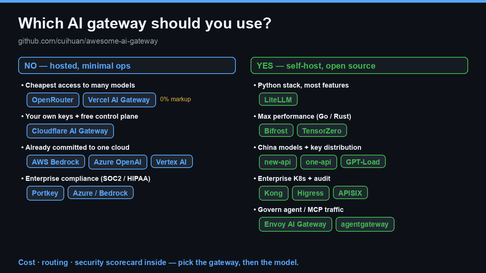

# Awesome AI Gateway [](https://awesome.re)

[](https://github.com/cuihuan/awesome-ai-gateway/stargazers)
[](BENCHMARKS.md)
[](.github/workflows/daily-update.yml)

> **Pick the right AI gateway for your need in ~10 seconds — then trust the answer.** A decision tree, a reproducible cost benchmark, and independent evidence for what we exclude. Organized by what you actually need, not by vendor.

_Built the hard way: **I burned $788 on AI coding in a single day** — one flagship model ate 78% of it, just because I'd defaulted everything to the priciest option. So I mapped the whole gateway landscape. → [the story](#why-this-exists)_

**Languages:** English · [简体中文](README.zh-CN.md)

<p align="center">
<a href="#which-gateway-should-i-use"><kbd> &nbsp; 🧭 Pick a gateway &nbsp; </kbd></a> &nbsp;
<a href="https://cuihuan.github.io/awesome-ai-gateway/"><kbd> &nbsp; 🚀 Live interactive site &nbsp; </kbd></a> &nbsp;
<a href="BENCHMARKS.md"><kbd> &nbsp; 📊 Cost & scorecard &nbsp; </kbd></a>
</p>

<details>
<summary>📑 <b>Full contents</b> — pick fast · browse by need · reference</summary>

[](CONTRIBUTING.md)
[](LICENSE)
[](https://github.com/cuihuan/awesome-ai-gateway/commits/main)

**Pick fast** · [Which gateway should I use?](#which-gateway-should-i-use) · [📊 Latest evaluations](#-latest-evaluations) · [Quick comparison](#quick-comparison)

**Browse by need** · [💰 Cost-first](#-cost-first-cheapest-multi-model-access) · [🔓 Self-hosted](#-self-hosted-open-source) · [🏢 Enterprise & compliance](#-enterprise--compliance) · [☁️ First-party clouds](#️-first-party-gateways-cloud--model-vendors) · [🇨🇳 China ecosystem](#-china-ecosystem) · [🤖 MCP & agent gateways](#-mcp--agent-gateways)

**Reference** · [📊 Evaluation set](BENCHMARKS.md) · [How to choose safely](#how-to-choose-safely) · [FAQ](#faq) · [📚 Essential reading](#-essential-reading) · [📰 What's new](#-whats-new) · [Glossary](#glossary) · [Why this exists](#why-this-exists) · [Contributing](#contributing)

</details>

## 📊 Latest evaluations

_A running digest of fresh model, pricing and gateway evals — **newest first, every entry dated and sourced.** This is the fast-moving signal layer; for our own **reproducible** cost tables and model scorecard, see the [full evaluation set](BENCHMARKS.md). Spotted a new eval worth tracking? [Add it](CONTRIBUTING.md)._

| Date | Category | Finding | Source |
|---|---|---|---|
| 2026-07-02 | 🛡️ Reliability | **Anthropic pulled Fable 5 & Mythos 5 offline globally** for ~3 weeks under a US export-control order, then restored them once Commerce lifted it (back on the Claude platform/Code by Jul 2) — a live reminder that single-provider stacks have no fallback, and multi-provider routing is the mitigation. | [CNBC](https://www.cnbc.com/2026/06/30/anthropic-says-trump-admin-has-lifted-export-controls-on-claude-fable-5-and-mythos-5.html) |
| 2026-06-23 | 🚀 Gateway | **Envoy AI Gateway reached v1.0** (production GA) — the CNCF/Envoy-backed, Kubernetes-native multi-provider data plane (provider failover, token rate-limiting, MCP support) graduates to stable. | [Envoy](https://aigateway.envoyproxy.io/blog/v1.0-release-announcement/) |
| 2026-06-21 | 💰 Pricing | The API pricing market now spans **123 models across 12 providers**, with a **>400× price spread** over the full input/output range — cheapest flagship **DeepSeek V4 Flash ($0.14/M input)** vs priciest **GPT-5.5 Pro ($30.00/M input)** is already ~214× on input alone. Tiering has hardened: top reasoning (o3) runs ~20× a nano-tier model on input, wider on output. | [aipricing.guru](https://aipricing.guru) |
| 2026-06 | 📈 Adoption | ChatGPT hit **~900M weekly active users** and **>2.5B queries/day** — demand scaling about as fast as the price spread. | [DemandSage](https://www.demandsage.com/chatgpt-statistics/) |

<details>
<summary>💸 <b>Same ¥100 (≈ $14.66) — how much can each model read?</b> The 400× spread, made concrete.</summary>

How many **input+output tokens** ¥100 buys, by model (blended estimate · snapshot **2026-06-21** · [aipricing.guru](https://aipricing.guru)):

| Tier | Model | Tokens / ¥100 | ≈ Chinese chars |
|---|---|---|---|
| 🥇 Rock-bottom | **DeepSeek V4 Flash** | 35.2M | ~26.4M |
| 🥇 Rock-bottom | GPT-4.1 nano | 29.6M | ~22.2M |
| 🥇 Rock-bottom | GPT-5.4 nano | 10.2M | ~7.7M |
| 💚 Value | GPT-5.4 mini | 2.83M | ~2.1M |
| 💚 Value | DeepSeek V4 Pro | 2.83M | ~2.1M |
| 🧠 Reasoning | o3 | 1.48M | ~1.1M |
| 🏁 Flagship | Gemini 2.5 Pro | 1.31M | ~0.98M |
| 🏁 Flagship | GPT-5.5 | 0.42M | ~0.32M |
| 🏁 Flagship | GPT-5.5 Pro | 0.07M | ~0.05M |

> **One line:** ¥100 reads **~26M Chinese characters** on DeepSeek V4 Flash — roughly **52× the _Three-Body_ trilogy** — but only **~50K** on GPT-5.5 Pro, about one short story. Choosing a model is choosing the scale factor on your money; the [Cost-first](#-cost-first-cheapest-multi-model-access) gateways exist to exploit exactly this spread.

</details>

## Which gateway should I use

<p align="center">
  
</p>

**⚡ Fast answer** — one sane default per need (alternatives in each linked section):

| I need… | Start with | Drill into |
|---|---|---|
| Cheapest access to many models, zero ops | **OpenRouter** | [Cost-first](#-cost-first-cheapest-multi-model-access) |
| Zero markup on my own keys | **Vercel** / **Cloudflare** | [Cost-first](#-cost-first-cheapest-multi-model-access) |
| Self-host, broadest features | **LiteLLM** | [Self-hosted](#-self-hosted-open-source) |
| Self-host, lowest overhead | **Bifrost** (Go) | [Self-hosted](#-self-hosted-open-source) |
| China models + team key billing | **new-api** | [China ecosystem](#-china-ecosystem) |
| Enterprise K8s + audit | **Kong** / **Higress** | [Enterprise](#-enterprise--compliance) |
| Strongest compliance (HIPAA/FedRAMP) | **Azure** / **Bedrock** | [First-party](#️-first-party-gateways-cloud--model-vendors) |
| Govern agents / MCP traffic | **agentgateway** | [MCP & agents](#-mcp--agent-gateways) |

<details>
<summary>📋 The full decision tree — every branch, copy-pasteable</summary>

```text
Do you want to self-host?
│
├─ NO — hosted, minimal ops
│   ├─ Cheapest access to many models ──────────▶ OpenRouter · Vercel AI Gateway (0% markup)
│   ├─ Free control plane over your own keys ───▶ Cloudflare AI Gateway
│   ├─ EU data residency matters ───────────────▶ Requesty · Eden AI · nexos.ai
│   └─ Already on one cloud ────────────────────▶ AWS Bedrock · Azure APIM · Vertex AI
│
└─ YES — self-hosted / open source
    ├─ Python stack, broadest features ─────────▶ LiteLLM
    ├─ Raw performance (Go/Rust/TS) ────────────▶ Bifrost · Portkey Gateway
    ├─ Built-in evals + observability ──────────▶ Helicone · Portkey Gateway
    ├─ Key distribution / billing / CN models ──▶ new-api · one-api · GPT-Load
    ├─ Enterprise K8s, audit, guardrails ───────▶ Kong · Higress · APISIX · Envoy AI Gateway
    └─ Governing AI agents & MCP traffic ───────▶ agentgateway · Lunar.dev
```

</details>

### ✅ Why trust this list
- **Independent — no vendor money, no affiliate links, CC0.** Unlike affiliate-driven relay "rankings," nobody pays to appear here.
- **Reproducible, not asserted.** Every cost cell is computed from [open pricing data](data/models.json) by a [unit-tested script](scripts/cost_calc.py); stars refresh daily via CI.
- **Honest about risk.** We disclose CVEs, label archived/stale projects, and [exclude gray-market relays](#how-to-choose-safely) — with the research to back it.

---

> **Why this matters:** the same task can cost **100× more** depending on the model behind your gateway. An **AI gateway** sits between your code and LLM providers — one endpoint, one key, many models — handling routing, failover, caching, rate limits, cost tracking and guardrails, so you change a `base_url` instead of rewriting your app. Pick the gateway here, then the [evaluation set](BENCHMARKS.md) shows which model to route to.

<p align="center">
  <a href="BENCHMARKS.md"></a>
</p>

⭐ **Found this useful? [Star it](https://github.com/cuihuan/awesome-ai-gateway)** — that's how the next engineer choosing a gateway finds it. CC0, no signup, no tracking, no vendor money.

## Quick comparison

Stars auto-refresh daily. ✅ built-in · ➕ via plugin/paid tier · ❌ not available.

| Project | Type | Stars | License | Multi-provider | Fallback / LB | Caching | Guardrails | Cost tracking |
|---|---|---|---|---|---|---|---|---|
| [LiteLLM](https://github.com/BerriAI/litellm) | OSS proxy + SDK | <!--s:BerriAI/litellm-->⭐ 52.3k<!--/s--> | MIT¹ | ✅ 100+ | ✅ | ✅ | ✅ | ✅ |
| [new-api](https://github.com/QuantumNous/new-api) | OSS relay/billing | <!--s:QuantumNous/new-api-->⭐ 40.8k<!--/s--> | AGPL-3.0 | ✅ | ✅ | ➕ | ➕ | ✅ |
| [one-api](https://github.com/songquanpeng/one-api) | OSS relay/billing | <!--s:songquanpeng/one-api-->⭐ 35.4k<!--/s--> | MIT | ✅ | ✅ | ❌ | ❌ | ✅ |
| [Kong AI Gateway](https://github.com/Kong/kong) | OSS API gateway | <!--s:Kong/kong-->⭐ 43.7k<!--/s--> | Apache-2.0 | ✅ | ✅ | ✅ semantic | ✅ | ✅ |
| [Apache APISIX](https://github.com/apache/apisix) | OSS API gateway | <!--s:apache/apisix-->⭐ 16.8k<!--/s--> | Apache-2.0 | ✅ | ✅ | ➕ | ➕ | ➕ |
| [Portkey Gateway](https://github.com/Portkey-AI/gateway) | OSS gateway + SaaS | <!--s:Portkey-AI/gateway-->⭐ 12.3k<!--/s--> | MIT | ✅ 1600+ | ✅ | ✅ | ✅ 50+ | ➕ SaaS |
| [TensorZero](https://github.com/tensorzero/tensorzero) | OSS LLMOps · ⚠️ archived '26 | <!--s:tensorzero/tensorzero-->⭐ 11.7k<!--/s--> | Apache-2.0 | ✅ | ✅ | ✅ | ➕ | ✅ |
| [Higress](https://github.com/higress-group/higress) | OSS AI-native gateway | <!--s:higress-group/higress-->⭐ 8.8k<!--/s--> | Apache-2.0 | ✅ | ✅ | ✅ | ✅ | ✅ |
| [GPT-Load](https://github.com/tbphp/gpt-load) | OSS key-pool proxy | <!--s:tbphp/gpt-load-->⭐ 6.2k<!--/s--> | MIT | ✅ | ✅ key rotation | ❌ | ❌ | ➕ |
| [Bifrost](https://github.com/maximhq/bifrost) | OSS gateway (Go) | <!--s:maximhq/bifrost-->⭐ 6.2k<!--/s--> | Apache-2.0 | ✅ | ✅ adaptive | ✅ | ✅ | ✅ |
| [Helicone](https://github.com/Helicone/helicone) | OSS observability + gateway | <!--s:Helicone/helicone-->⭐ 5.9k<!--/s--> | Apache-2.0 | ✅ | ✅ | ✅ | ➕ | ✅ |
| [Envoy AI Gateway](https://github.com/envoyproxy/ai-gateway) | OSS K8s gateway | <!--s:envoyproxy/ai-gateway-->⭐ 1.8k<!--/s--> | Apache-2.0 | ✅ | ✅ | ➕ | ➕ | ✅ |
| [OpenRouter](https://openrouter.ai) | SaaS marketplace | — | Commercial | ✅ 400+ | ✅ | ✅ | ➕ | ✅ |
| [Vercel AI Gateway](https://vercel.com/ai-gateway) | SaaS (0% markup) | — | Commercial | ✅ 100s | ✅ | ❌ | ❌ | ✅ |
| [Cloudflare AI Gateway](https://developers.cloudflare.com/ai-gateway/) | SaaS control plane | — | Commercial (free tier) | ✅ | ✅ dynamic | ✅ | ✅ | ✅ budgets |

¹ LiteLLM core is MIT; the repo contains a separately licensed enterprise directory.

> 📂 **Browse the raw data** (machine-readable, CC0): [models & pricing JSON](data/models.json) · [cost table CSV](data/cost_table.csv) · [gateway scorecard CSV](data/gateways_scorecard.csv). Every cost cell is regenerated from this data by a [unit-tested script](scripts/cost_calc.py).

<p align="center">
  
</p>

> _The full directory at a glance — browse the sections below by your need._

## 💰 Cost-first: cheapest multi-model access

_Pain point: "I want many models for the least money and zero ops."_

- [OpenRouter](https://openrouter.ai) — The dominant model marketplace: 400+ models behind one OpenAI-compatible API, pay-as-you-go with automatic failover; ~5.5% fee when buying credits. $113M Series B (May 2026), ~8M users.
- [Vercel AI Gateway](https://vercel.com/ai-gateway) — Hundreds of models at **provider list price (0% markup)**, $5/month free credits, zero-data-retention option; pairs naturally with the AI SDK.
- [Cloudflare AI Gateway](https://developers.cloudflare.com/ai-gateway/) — Free control plane in front of your own provider keys: caching, dynamic routing, unified billing, and dollar-denominated spend limits (2026 beta).
- [Requesty](https://requesty.ai) — EU-friendly OpenRouter alternative: 400+ models, sub-20ms failover, ~5% markup.
- [Eden AI](https://www.edenai.co) — Unified API for 500+ models plus vision/OCR/speech; EU-based, ~5.5% platform fee.
- [Helicone AI Gateway (cloud)](https://www.helicone.ai) — Passthrough billing at **0% markup** with observability bundled.
- [GPT-Load](https://github.com/tbphp/gpt-load) <!--s:tbphp/gpt-load-->⭐ 6.2k<!--/s--> — High-performance Go proxy that rotates pools of API keys across channels to maximize quota usage.
- [Loop Gateway](https://api.loopxxi.com) — OpenAI-compatible proxy that meters every request in Bitcoin sats instead of dollars. 311 models via OpenRouter at a 15% markup. No accounts, no email, no card; top up over Lightning, get a bearer token. Three auth rails (prepaid bearer, L402, Cashu). Hosted at [api.loopxxi.com](https://api.loopxxi.com). **New & unverified** (anonymous; its public GitHub repo has since been removed, so treat it as a closed hosted relay) — it resells frontier models _through the operator's own OpenRouter account_ at a 15% markup, and account-less + crypto-prepaid means no recourse if it swaps models or vanishes; confirm fidelity with [canary_check.py](scripts/canary_check.py) and only top up what you can afford to lose.
- [nullsink](https://nullsink.is) ([repo](https://github.com/nullsink/nullsink)) — Account-less, metered proxy for frontier-model APIs, paid in Monero or Bitcoin. No accounts, no email, no card; mint a bearer token, prepay on-chain, and point the official SDKs at one base URL. ~10% markup taken once at top-up; no IP logging, no request logs; payment and token kept unlinkable. Self-hostable single binary (TypeScript/Bun, AGPL-3.0), live at [nullsink.is](https://nullsink.is). **New & unverified** (repo created 2026-06, 4★) — account-less + crypto-prepaid + no logs means no recourse if it swaps models or vanishes; confirm fidelity with [canary_check.py](scripts/canary_check.py) and only top up what you can afford to lose.
- [AIMLAPI](https://aimlapi.com) — One OpenAI/Anthropic-compatible endpoint fronting 400+ models (chat, image, video, audio, embeddings); prepaid, OpenRouter-style aggregator.
- [Novita AI](https://novita.ai) — Unified API to 200+ open-source models (DeepSeek/Qwen/Llama…) with load balancing, autoscaling and failover; also a GPU cloud.
- [FlintAPI](https://flintapi.ai) ([repo](https://github.com/moozechen/flintapi)) — Hosted OpenAI-compatible gateway aggregating 25+ Chinese LLMs (DeepSeek, Qwen, Kimi, GLM, MiniMax) with $2 free credits. New and unverified — confirm model fidelity (e.g. with [canary_check.py](scripts/canary_check.py)) before relying on it in production.
- [FlowBar](https://flowbarai.com) — Hosted OpenAI-compatible relay reselling dozens of models (GPT, Claude, Gemini, DeepSeek, Qwen, GLM, Kimi) below OpenRouter, with USD/CNY/crypto payment. New and unverified — confirm model fidelity (e.g. with [canary_check.py](scripts/canary_check.py)) before relying on it in production.
- [Meshs One](https://api.meshs.one) — Hosted OpenAI-compatible relay fronting Chinese frontier models (DeepSeek-V4, Qwen3.7-Max, MiniMax-M3) under one key, per-token pay-as-you-go (its `/v1` endpoint returns a `new_api_error`, so it appears to run on [new-api](https://github.com/QuantumNous/new-api)). New & unverified — closed-source and brand-new; confirm model fidelity (e.g. with [canary_check.py](scripts/canary_check.py)) before relying on it in production.
- [lxg2it ModelRouter](https://api.lxg2it.com) ([repo](https://github.com/lxg2it/modelrouter-core)) — Solo-built, OpenAI-compatible router over 7+ providers (Anthropic, OpenAI, Google, Cerebras, Groq, Grok, GLM) with tiered automatic fallback that selects the cheapest available model. Free tier plus a paid tier advertised at 0% markup on Anthropic (a deposit fee may apply — verify current pricing). New and unverified — the public repo is a thin, unlicensed core stub still seeing fresh commits (routing logic lives in the closed hosted service; no license file) — confirm model fidelity (e.g. with [canary_check.py](scripts/canary_check.py)) before relying on it in production.
- [OpenPaths](https://openpaths.io) ([repo](https://github.com/lee101/openpaths)) — Hosted OpenAI-compatible router auto-routing across 15+ providers (OpenAI, Anthropic, Gemini, Groq, xAI, DeepSeek, Mistral) under one API, spanning chat, image, video, music, speech, embeddings and transcription. New & unverified — despite the "open source" framing the GitHub repo is a no-code, unlicensed marketing mirror (canonical code lives on the third-party [Codex Infinity](https://codex-infinity.com/lee101/openpaths) platform and is agent-maintained), so treat it as a closed hosted relay and confirm model fidelity (e.g. with [canary_check.py](scripts/canary_check.py)) before relying on it in production.
- [Glama Gateway](https://glama.ai/ai/gateway) — OpenAI-compatible gateway to 100+ models with consolidated billing, caching and logging (OSS core [glama-ai/lightport](https://github.com/glama-ai/lightport)).

> 💡 Squeeze more from any gateway: enable **semantic caching** (Kong, Bifrost, Zuplo), set **spend limits** (Cloudflare, Zuplo, Pydantic/Logfire), and route easy prompts to cheap models (see [Smart routing](#-smart-routing--model-selection)).

## 🔓 Self-hosted open source

_Pain point: "My keys, my infra, no per-token middleman fee."_

- [LiteLLM](https://github.com/BerriAI/litellm) <!--s:BerriAI/litellm-->⭐ 52.3k<!--/s--> — The default choice: Python SDK + proxy server speaking OpenAI format to 100+ providers, with virtual keys, budgets, load balancing and guardrails.
- [Portkey Gateway](https://github.com/Portkey-AI/gateway) <!--s:Portkey-AI/gateway-->⭐ 12.3k<!--/s--> — Fast TypeScript gateway (1,600+ models, 50+ guardrails) that also powers Portkey's commercial LLMOps platform.
- [CLIProxyAPI](https://github.com/router-for-me/CLIProxyAPI) <!--s:router-for-me/CLIProxyAPI-->⭐ 38.9k<!--/s--> — Go gateway that wraps coding-agent CLI subscriptions (Claude Code, Codex, Gemini, Grok, Antigravity) into OpenAI/Gemini/Claude/Codex-compatible APIs with multi-account pools, round-robin load balancing and a management API; one of the highest-starred OSS gateways in the space. BYO accounts — but routing OAuth coding-tier subscriptions through an API can violate provider ToS, so weigh account-ban risk.
- [9router](https://github.com/decolua/9router) <!--s:decolua/9router-->⭐ 19.4k<!--/s--> — MIT self-hosted BYOK local proxy that auto-routes across 40+ providers with subscription→cheap→free fallback, multi-account load balancing and token compression; cost-first and very popular, but its free/OAuth coding-tier routing (Claude Code, Codex, Kiro) carries provider-ToS/account-ban risk.
- [TensorZero](https://github.com/tensorzero/tensorzero) <!--s:tensorzero/tensorzero-->⭐ 11.7k<!--/s--> — ⚠️ **Archived June 2026** (company wound down; repo read-only, Apache-2.0 code + community forks remain). Rust gateway unified with observability, evals, experimentation and optimization.
- [Bifrost](https://github.com/maximhq/bifrost) <!--s:maximhq/bifrost-->⭐ 6.2k<!--/s--> — Go gateway from Maxim AI claiming ~50x LiteLLM throughput; adaptive load balancing, cluster mode, MCP support.
- [Helicone](https://github.com/Helicone/helicone) <!--s:Helicone/helicone-->⭐ 5.9k<!--/s--> — Observability-first platform (YC W23) with a Rust [ai-gateway](https://github.com/Helicone/ai-gateway) <!--s:Helicone/ai-gateway-->⭐ 606<!--/s-->.
- [Plano](https://github.com/katanemo/plano) <!--s:katanemo/plano-->⭐ 6.6k<!--/s--> — AI-native proxy and data plane for agents (formerly Arch Gateway / archgw).
- [AxonHub](https://github.com/looplj/axonhub) <!--s:looplj/axonhub-->⭐ 4.5k<!--/s--> — Go gateway: call 100+ LLMs from any SDK behind one OpenAI/Anthropic-compatible endpoint, with built-in failover, load balancing, cost control and end-to-end tracing. BYOK self-hosted.
- [LLM Gateway](https://github.com/theopenco/llmgateway) <!--s:theopenco/llmgateway-->⭐ 1.4k<!--/s--> — Open-source OpenRouter alternative: route, manage and analyze requests across providers.
- [APIPark](https://github.com/APIParkLab/APIPark) <!--s:APIParkLab/APIPark-->⭐ 1.8k<!--/s--> — Cloud-native LLM API management and distribution platform.
- [Pydantic AI Gateway](https://github.com/pydantic/pydantic-ai-gateway) <!--s:pydantic/pydantic-ai-gateway-->⭐ 191<!--/s--> — BYOK gateway with cost caps and OTel; ⚠️ repo archived, now folded into Pydantic Logfire.
- [OptiLLM](https://github.com/algorithmicsuperintelligence/optillm) <!--s:algorithmicsuperintelligence/optillm-->⭐ 4.2k<!--/s--> — Optimizing inference proxy that boosts accuracy via test-time compute techniques.
- [aisuite](https://github.com/andrewyng/aisuite) <!--s:andrewyng/aisuite-->⭐ 14.9k<!--/s--> — Andrew Ng's unified multi-provider client. A library rather than a deployable proxy — fits when you don't want network hops.
- [Shepherd Model Gateway (SMG)](https://github.com/lightseekorg/smg) <!--s:lightseekorg/smg-->⭐ 369<!--/s--> — Engine-agnostic gateway in Rust: one OpenAI/Anthropic-compatible endpoint over vLLM/SGLang/TRT-LLM + cloud providers, with KV-cache-aware routing and WASM plugins.
- [RelayPlane](https://github.com/RelayPlane/proxy) <!--s:RelayPlane/proxy-->⭐ 186<!--/s--> — MIT, local-first proxy (npm): 11 providers behind one endpoint with per-request cost attribution and hard daily/hourly budget caps.
- [SentryNode Gateway](https://github.com/nehadangwal/sentrynode-gateway) <!--s:nehadangwal/sentrynode-gateway-->⭐ 0<!--/s--> — Open-core (Apache-2.0) AI proxy for cost governance / FinOps routing: adaptive model routing, budget caps and audit logging. Early-stage; the public repo currently ships a demo scaffold.
- [GoModel](https://github.com/ENTERPILOT/GoModel) <!--s:ENTERPILOT/GoModel-->⭐ 978<!--/s--> — Lightweight single-binary Go gateway (open-source LiteLLM alternative) exposing one OpenAI/Anthropic-compatible API across 18+ providers with caching, guardrails and usage/cost tracking; fast-growing, though its throughput-vs-LiteLLM figures are vendor-run.
- [OpenGateLLM](https://github.com/etalab-ia/OpenGateLLM) <!--s:etalab-ia/OpenGateLLM-->⭐ 167<!--/s--> — Production-grade open-source GenAI gateway from France's **Etalab** (powers the government's "Albert" assistant): one OpenAI-compatible API over self-hosted + provider models, with auth, rate limits and usage tracking. Distinct public-sector / EU-sovereignty angle.
- ⚠️ Stale but historically notable: [BricksLLM](https://github.com/bricks-cloud/BricksLLM) <!--s:bricks-cloud/BricksLLM-->⭐ 1.2k<!--/s--> (PII masking, per-key limits; inactive since early 2025), [Glide](https://github.com/EinStack/glide) <!--s:EinStack/glide-->⭐ 161<!--/s--> (inactive since 2024).

## 🏢 Enterprise & compliance

_Pain point: "Audit logs, PII redaction, RBAC, on-prem, and the EU AI Act (enforceable Aug 2026)."_

- [Kong AI Gateway](https://github.com/Kong/kong) <!--s:Kong/kong-->⭐ 43.7k<!--/s--> — Mature API gateway with AI plugins: semantic caching/routing, prompt guard, token rate-limiting; Konnect for managed control plane.
- [Apache APISIX](https://github.com/apache/apisix) <!--s:apache/apisix-->⭐ 16.8k<!--/s--> — Cloud-native API + AI gateway with `ai-proxy` / `ai-proxy-multi` plugins.
- [Envoy AI Gateway](https://github.com/envoyproxy/ai-gateway) <!--s:envoyproxy/ai-gateway-->⭐ 1.8k<!--/s--> — CNCF-aligned GenAI access on Envoy Gateway, backed by Tetrate and Bloomberg.
- [kgateway](https://github.com/kgateway-dev/kgateway) <!--s:kgateway-dev/kgateway-->⭐ 5.6k<!--/s--> — CNCF API/AI gateway, the base of Solo.io's commercial [Gloo AI Gateway](https://www.solo.io).
- [TrueFoundry AI Gateway](https://www.truefoundry.com) — Enterprise gateway with routing, guardrails and RBAC, deployable into your K8s/VPC.
- [nexos.ai](https://nexos.ai) — Enterprise AI gateway/orchestration from the Nord Security founders (€30M Series A, Oct 2025).
- [Tyk AI Studio](https://tyk.io) — AI governance suite: budgets, model catalogs, guardrails on Tyk's gateway.
- [Gravitee Agent Mesh](https://www.gravitee.io) — LLM Proxy, MCP Proxy and A2A support inside Gravitee APIM.
- [WSO2 AI Gateway](https://wso2.com/api-manager/usecases/ai-gateway/) — Egress management for LLM traffic: model routing, semantic caching, guardrails.
- [F5 AI Gateway](https://www.f5.com) — Containerized AI traffic gateway; data-leakage detection via the LeakSignal acquisition (announced Jul 2025).
- [IBM API Connect AI Gateway](https://www.ibm.com) — Policy enforcement, masking and audit for LLM traffic.
- [MuleSoft AI / Omni Gateway](https://www.mulesoft.com/platform/ai-gateway) — Governs LLM, MCP and agent traffic alongside classic APIs.
- [Lunar.dev](https://github.com/TheLunarCompany/lunar) <!--s:TheLunarCompany/lunar-->⭐ 464<!--/s--> — Egress consumption gateway repositioned around MCP/agent governance.
- [KrakenD AI Gateway](https://www.krakend.io/docs/ai-gateway/) — High-performance, stateless Go API gateway ([krakend/krakend-ce](https://github.com/krakend/krakend-ce) <!--s:krakend/krakend-ce-->⭐ 2.6k<!--/s-->) with an AI proxy + prompt-security layer.
- [Broadcom Layer7 AI Gateway](https://www.broadcom.com/products/software/api-management) — LLM traffic governance, threat protection and quotas on the mature Layer7 API platform.
- [Cequence AI Gateway](https://www.cequence.ai) — API-security-first AI gateway: discovery, guardrails and threat protection for LLM/agent traffic.
- [Axway Amplify AI Gateway](https://www.axway.com/en/products/amplify-ai-gateway) — Centralized control plane on Axway's Amplify platform governing LLM/MCP/agent traffic with business-logic model routing, RBAC, spend caps, prompt-injection controls and RAG integration, from a 10× Gartner MQ API-management Leader.
- [Red Hat Connectivity Link](https://www.redhat.com/en/technologies/cloud-computing/connectivity-link) — Kubernetes-native gateway (built on the Kuadrant project, successor to 3scale) unifying AI gateway, API management and multicluster connectivity; powers OpenShift AI Models-as-a-Service as the front door governing external and self-hosted LLM endpoints.
- [Sensedia AI Gateway](https://www.sensedia.com/product/ai-gateway) — Gartner-recognized APIM vendor's agnostic AI gateway governing LLMs, MCP servers and AI agents with multi-model routing, guardrails, cost controls and observability across a multi-cloud control plane.
- [Ambassador Edge Stack](https://www.getambassador.io/products/edge-stack/api-gateway) — Envoy-based, Kubernetes-native API gateway (OSS core [emissary-ingress](https://github.com/emissary-ingress/emissary) <!--s:emissary-ingress/emissary-->⭐ 4.5k<!--/s-->) whose AI Gateway layer adds LLM-provider routing, token rate-limiting and fallback — a peer to Kong/Tyk/APISIX in the API-vendor cohort.

## ☁️ First-party gateways (cloud & model vendors)

_Pain point: "We're already committed to one cloud — give us the native path."_

- [AWS Bedrock](https://aws.amazon.com/bedrock/) — Multi-model access via the unified Converse API, cross-region inference, and AgentCore Gateway for tools/MCP.
- [Azure API Management — GenAI gateway](https://learn.microsoft.com/azure/api-management/genai-gateway-capabilities) — Token limits, semantic caching and load balancing in front of Azure OpenAI / AI Foundry.
- [Google Apigee + Vertex AI](https://cloud.google.com/apigee) — LLM gateway patterns on Apigee with Vertex Model Garden as the managed hub.
- [Cloudflare AI Gateway](https://developers.cloudflare.com/ai-gateway/) — See [Cost-first](#-cost-first-cheapest-multi-model-access); the strongest free first-party option.
- [Vercel AI Gateway](https://vercel.com/ai-gateway) — GA, 0% markup, ZDR option; the default for Next.js/AI SDK shops.
- [Databricks Unity AI Gateway](https://www.databricks.com) — Mosaic AI Gateway folded into Unity Catalog, adding agent + MCP governance.
- [Tencent Cloud AI Gateway](https://cloud.tencent.com/document/product/1364/127525) — Tencent's first-party cloud-native intelligent gateway bundling LLM + MCP + Agent gateways with protocol conversion, cost/performance-based routing, and unified access to Hunyuan + third-party models.

## 🇨🇳 China ecosystem

_Pain point: "Domestic models (Qwen/DeepSeek/GLM/Kimi), CNY payment, key distribution & billing for teams."_

- [new-api](https://github.com/QuantumNous/new-api) <!--s:QuantumNous/new-api-->⭐ 40.8k<!--/s--> — The most active one-api fork, now a "unified AI model hub": protocol conversion, billing, Rerank/Realtime endpoints. AGPL-3.0.
- [one-api](https://github.com/songquanpeng/one-api) <!--s:songquanpeng/one-api-->⭐ 35.4k<!--/s--> — The original LLM API management & distribution system (OpenAI/Azure/Claude/Gemini/DeepSeek/Doubao…); development has slowed.
- [Higress](https://github.com/higress-group/higress) <!--s:higress-group/higress-->⭐ 8.8k<!--/s--> — Alibaba's AI-native gateway on Envoy/Istio, first-class Tongyi/DeepSeek support; hosted version at higress.ai.
- [GPT-Load](https://github.com/tbphp/gpt-load) <!--s:tbphp/gpt-load-->⭐ 6.2k<!--/s--> — Smart API-key rotation multi-channel proxy in Go.
- [one-hub](https://github.com/MartialBE/one-hub) <!--s:MartialBE/one-hub-->⭐ 2.9k<!--/s--> — one-api fork with better non-OpenAI function calling and stats.
- [simple-one-api](https://github.com/fruitbars/simple-one-api) <!--s:fruitbars/simple-one-api-->⭐ 2.3k<!--/s--> — Single binary adapting Qianfan/Spark/Hunyuan/MiniMax/DeepSeek to the OpenAI interface.
- [Octopus](https://github.com/bestruirui/octopus) <!--s:bestruirui/octopus-->⭐ 2.3k<!--/s--> — Personal LLM API aggregation gateway unifying multiple providers behind one endpoint, with load balancing and OpenAI/Anthropic protocol conversion (Go + Next.js).
- [Veloera](https://github.com/Veloera/Veloera) <!--s:Veloera/Veloera-->⭐ 1.6k<!--/s--> — Newer relay platform in the one-api/new-api lineage.
- [uni-api](https://github.com/yym68686/uni-api) <!--s:yym68686/uni-api-->⭐ 1.2k<!--/s--> — Lightweight single-config unified API manager, no frontend.
- [APIPark](https://github.com/APIParkLab/APIPark) <!--s:APIParkLab/APIPark-->⭐ 1.8k<!--/s--> — China-origin, cloud-native AI & API gateway with an open developer portal.
- [VoAPI](https://github.com/VoAPI/VoAPI) <!--s:VoAPI/VoAPI-->⭐ 1.1k<!--/s--> — Polished new-api-lineage relay/billing panel (Go), focused on UI and operations.
- [done-hub](https://github.com/deanxv/done-hub) <!--s:deanxv/done-hub-->⭐ 785<!--/s--> — one-api/new-api fork with richer billing and channel management.
- [sub2api](https://github.com/Wei-Shaw/sub2api) <!--s:Wei-Shaw/sub2api-->⭐ 29.8k<!--/s--> — Go relay platform that pools Claude/OpenAI/Gemini/Antigravity subscription accounts (OAuth, session keys, API keys) behind one OpenAI/Anthropic-compatible endpoint, adding cost-sharing "carpool" billing (Stripe/Alipay/WeChat), key distribution and per-token rate limits. One of 2026's fastest-rising China-ecosystem relays — but account-pooling sits adjacent to the resold-relay category this list excludes; BYO accounts and vet before use.
- [AI Proxy](https://github.com/labring/aiproxy) <!--s:labring/aiproxy-->⭐ 495<!--/s--> — Self-hosted Go gateway from the Sealos team that accepts OpenAI/Claude/Gemini protocols, converts between them, and adds multi-channel routing, load balancing, rate limiting, multi-tenant isolation, and a caching/web-search/reasoning plugin layer.
- [metapi](https://github.com/cita-777/metapi) <!--s:cita-777/metapi-->⭐ 3k<!--/s--> — Self-hosted "router of routers": aggregates your accounts across new-api/one-api/OneHub/DoneHub/Veloera/AnyRouter/sub2api into one key, with cost/balance/utilization-weighted smart routing, channel cool-down/retry, model auto-discovery and OpenAI⇄Claude conversion (TypeScript, MIT). Routing software only — vet the upstream relays it points at.
- [Volcengine AI Gateway](https://www.volcengine.com/docs/6569/1356167) — ByteDance's cloud AI gateway: unified access, routing and governance for Doubao + third-party models.

> ⚠️ This list deliberately **excludes reverse-engineered / resold "free-api" relays** — and not on principle alone. Two 2026 measurement studies found systematic fraud across the relay population: [_Real Money, Fake Models_](https://arxiv.org/abs/2603.01919) measured model-identity failures in **45.8%** of fingerprint tests and output divergence up to **47%**; [_Your Agent Is Mine_](https://arxiv.org/abs/2604.08407) caught routers **injecting malicious code** and **exfiltrating planted API keys**. If you're forced to vet one anyway, use the canary-diff test in [How to choose safely](#how-to-choose-safely).

## 🤖 MCP & agent gateways

_Pain point: "Agents call tools now — govern MCP traffic like you govern APIs."_ The newest category (2025–2026).

- [agentgateway](https://github.com/agentgateway/agentgateway) <!--s:agentgateway/agentgateway-->⭐ 3.6k<!--/s--> — CNCF proxy for agentic traffic: MCP governance and agent-to-agent (A2A) communication.
- [Lunar.dev MCPX](https://github.com/TheLunarCompany/lunar) <!--s:TheLunarCompany/lunar-->⭐ 464<!--/s--> — Gateway for managing MCP server consumption.
- [Tetrate Agent Router Service](https://tetrate.io/products/tetrate-agent-router-service) — Managed Envoy AI Gateway fleet: LLM + MCP gateway with guardrails (~5% fee).
- [Zuplo AI Gateway](https://zuplo.com/ai-gateway) — Programmable policies: USD spend limits, prompt-injection detection, secret masking, MCP support.
- [NetFoundry MCP/LLM Gateways](https://netfoundry.io) — Zero-trust gateways for AI deployments (launched June 2026).
- [AWS AgentCore Gateway](https://aws.amazon.com/bedrock/) — Tool/MCP gateway inside Bedrock AgentCore.
- [IBM ContextForge](https://github.com/IBM/mcp-context-forge) <!--s:IBM/mcp-context-forge-->⭐ 4k<!--/s--> — MCP gateway/registry federating many MCP servers behind one endpoint with auth, rate limits and observability.
- [Docker MCP Gateway](https://github.com/docker/mcp-gateway) <!--s:docker/mcp-gateway-->⭐ 1.5k<!--/s--> — Docker-maintained `docker mcp` CLI plugin that runs and federates MCP servers as containers behind one endpoint, with secret management, call interception and per-tool access control.
- [MetaMCP](https://github.com/metatool-ai/metamcp) <!--s:metatool-ai/metamcp-->⭐ 2.5k<!--/s--> — Aggregates MCP servers into one endpoint with middleware (auth, filtering) and a management UI.
- [ToolHive](https://github.com/stacklok/toolhive) <!--s:stacklok/toolhive-->⭐ 1.9k<!--/s--> — Go platform that runs MCP servers in isolated containers and fronts them with a unified, secured gateway (access policies, "virtual MCP" aggregation).
- [Microsoft MCP Gateway](https://github.com/microsoft/mcp-gateway) <!--s:microsoft/mcp-gateway-->⭐ 725<!--/s--> — Microsoft-maintained reverse proxy + management layer for MCP servers: session-aware stateful routing and lifecycle management on Kubernetes.
- [1MCP](https://github.com/1mcp-app/agent) <!--s:1mcp-app/agent-->⭐ 458<!--/s--> — Unified MCP server (TypeScript) aggregating many MCP servers behind one endpoint, with HTTP access and CLI-based discovery for agents.
- [mcpproxy-go](https://github.com/smart-mcp-proxy/mcpproxy-go) <!--s:smart-mcp-proxy/mcpproxy-go-->⭐ 271<!--/s--> — Local Go MCP proxy that federates multiple MCP servers behind one endpoint, with BM25 tool-search filtering, token reduction, and auto-quarantine/security scanning of new servers.
- [MCPJungle](https://github.com/mcpjungle/MCPJungle) <!--s:mcpjungle/MCPJungle-->⭐ 1.1k<!--/s--> — Self-hosted MCP registry + gateway for central tool governance in enterprises.
- [Obot](https://github.com/obot-platform/obot) <!--s:obot-platform/obot-->⭐ 867<!--/s--> — Open-source agent platform with an MCP gateway for governing tool access.
- [Director](https://github.com/fdmtl/director) <!--s:fdmtl/director-->⭐ 480<!--/s--> — Middleware to run, secure and observe MCP servers behind one connection.
- [Lasso MCP Gateway](https://github.com/lasso-security/mcp-gateway) <!--s:lasso-security/mcp-gateway-->⭐ 377<!--/s--> — Security-first MCP gateway: plugin guardrails, secret masking, threat detection.
- [Armorer Guard](https://github.com/ArmorerLabs/Armorer-Guard) <!--s:ArmorerLabs/Armorer-Guard-->⭐ 40<!--/s--> — Local Rust MCP proxy that wraps stdio servers and inspects tool-call arguments for prompt injection, credential leakage, exfiltration, and risky actions.
- [fak](https://github.com/anthony-chaudhary/fak) <!--s:anthony-chaudhary/fak-->⭐ 8<!--/s--> — Security-first agent/MCP firewall: a single dependency-free Go binary (Apache-2.0) fronting any OpenAI/Anthropic/MCP backend, where a default-deny capability allow-list adjudicates every tool call and suspicious tool results are quarantined out of the model's context, plus bearer/`x-api-key` auth, an `X-Trace-Id` audit trail and Prometheus `/metrics`. New and early-stage.
- [Archestra](https://github.com/archestra-ai/archestra) <!--s:archestra-ai/archestra-->⭐ 3.9k<!--/s--> — Kubernetes-native MCP gateway with OAuth On-Behalf-Of user-delegated tool access, an A2A agent-to-agent gateway, and deterministic dual-LLM / "lethal trifecta" guardrails plus per-environment egress and cost limits, built for enterprise agent deployments ($13.5M funding).
- [Unla](https://github.com/AmoyLab/Unla) <!--s:AmoyLab/Unla-->⭐ 2.2k<!--/s--> — Lightweight Go MCP gateway that turns existing REST/gRPC APIs and MCP servers into standardized MCP endpoints with zero code changes, behind one gateway with multi-tenant sessions, OAuth, hot-reload config and a management UI.
- [Jarvis Registry](https://github.com/ascending-llc/jarvis-registry) <!--s:ascending-llc/jarvis-registry-->⭐ 1.8k<!--/s--> — Enterprise MCP/agent gateway fronting internal tools behind one authenticated MCP-over-SSE/HTTP endpoint with OAuth2/OIDC identity (Keycloak/Cognito/Entra), tool-level RBAC/ACL, agent orchestration, and OpenTelemetry/Prometheus observability.
- [MCP Gateway & Registry](https://github.com/agentic-community/mcp-gateway-registry) <!--s:agentic-community/mcp-gateway-registry-->⭐ 759<!--/s--> — Enterprise MCP gateway + registry centralizing access to many MCP servers behind one OAuth-protected endpoint, with virtual MCP servers, semantic tool discovery, A2A agent discovery and fine-grained governance/audit; AWS-aligned.
- [Nexus (Grafbase)](https://github.com/Nexus-Router/nexus) <!--s:Nexus-Router/nexus-->⭐ 434<!--/s--> — Rust AI router from Grafbase that aggregates MCP servers (STDIO/SSE/HTTP) and LLM providers behind one endpoint with context-aware fuzzy tool search, OAuth2/TLS security, rate limiting and OpenTelemetry.
- [Pomerium](https://github.com/pomerium/pomerium) <!--s:pomerium/pomerium-->⭐ 4.9k<!--/s--> — Identity-aware access proxy with MCP support: policy-based auth in front of MCP servers.

## 🔧 More by capability (cross-cutting)

_These cut across the need-based sections above — routing intelligence, observability, and Kubernetes infra that complement whichever gateway you picked._

### 🧠 Smart routing & model selection

_Pain point: "Send each prompt to the cheapest model that can handle it."_

- [Not Diamond](https://www.notdiamond.ai) — SOTA model-routing intelligence; powers OpenRouter's Auto router.
- [Martian](https://withmartian.com) — Pioneer commercial model router; Accenture partnership.
- [Inworld Router](https://inworld.ai/router) — One API for 200+ models with real-time complexity-based routing and **0% markup** (pass-through pricing); adds first-party realtime inference for open models. Research preview.
- [RouteLLM](https://github.com/lm-sys/RouteLLM) <!--s:lm-sys/RouteLLM-->⭐ 5.1k<!--/s--> — LMSYS's open router framework (research-grade; inactive since 2024 but still the canonical paper/code).
- [OpenRouter Auto](https://openrouter.ai) — One model id (`openrouter/auto`) that routes per-prompt.
- [Unify](https://unify.ai) — Early neural LLM router (company since pivoted to agents).
- [Bifrost adaptive load balancing](https://github.com/maximhq/bifrost) / [Cloudflare dynamic routing](https://developers.cloudflare.com/ai-gateway/) — routing built into gateways themselves.
- [Claude Code Router](https://github.com/musistudio/claude-code-router) <!--s:musistudio/claude-code-router-->⭐ 35.5k<!--/s--> — Route Claude Code (and other agent CLIs) to any model/provider — DeepSeek, Qwen, local — by request type.
- [ClawRouter](https://github.com/BlockRunAI/ClawRouter) <!--s:BlockRunAI/ClawRouter-->⭐ 6.6k<!--/s--> — Agent-native LLM router (TypeScript) with local sub-ms routing across 41+ models, built so autonomous agents can pay per call via x402/USDC with no signup or API key. The routing client is open-source — but its account-less hosted access (8 free models + crypto pay-per-use) is **resold access**: verify model fidelity with [canary_check.py](scripts/canary_check.py) and prefer your own keys in production.
- [RouterArena](https://github.com/RouteWorks/RouterArena) <!--s:RouteWorks/RouterArena-->⭐ 102<!--/s--> — Open evaluation framework + live leaderboard for LLM routers (standardized datasets, cost/quality metrics) — pick a router on data, in the spirit of this list's benchmarks.
- [vLLM Semantic Router](https://github.com/vllm-project/semantic-router) <!--s:vllm-project/semantic-router-->⭐ 4.7k<!--/s--> — Mixture-of-models router that picks a model per prompt by intent/complexity; a vLLM project.
- [NVIDIA LLM Router](https://github.com/NVIDIA-AI-Blueprints/llm-router) <!--s:NVIDIA-AI-Blueprints/llm-router-->⭐ 310<!--/s--> — NIM-based blueprint routing each prompt to the best model by task and complexity.
- [LLMRouter](https://github.com/ulab-uiuc/LLMRouter) <!--s:ulab-uiuc/LLMRouter-->⭐ 2k<!--/s--> — Research framework for graph/learned cost–quality model routing.
- [Orq.ai](https://orq.ai) — Hosted routing control plane: 500+ models across 30+ providers with retries, fallbacks, caching and governance (BYOK).
- [NadirClaw](https://github.com/NadirRouter/NadirClaw) <!--s:NadirRouter/NadirClaw-->⭐ 552<!--/s--> — Self-hosted, OpenAI-compatible router (Python) that sends simple prompts to cheap/local models and hard ones to premium, with a trained cascade verifier to cut API cost 40–70%.
- [ngrok AI Gateway](https://ngrok.com/docs/ai-gateway/overview) — Managed proxy routing to OpenAI/Anthropic/Google + local Ollama/vLLM/LM Studio, with automatic failover, key rotation, and CEL traffic-policy controls (PII redaction).

### 📊 Observability & cost tracking

_Pain point: "Who spent what, on which model, and why did quality drop?"_

> 🔎 **How to evaluate a gateway's observability** (table-stakes vs differentiating vs advanced, grounded in the OpenTelemetry GenAI conventions): see [BENCHMARKS → Part 6](BENCHMARKS.md#part-6--gateway-observability-the-factors-that-matter). For the **research landscape — theory, seminal papers, company writing, standards & open problems**: see the [observability survey](docs/observability-landscape.md).

- [Helicone](https://github.com/Helicone/helicone) <!--s:Helicone/helicone-->⭐ 5.9k<!--/s--> — Logs, costs, sessions, prompt experiments; one-line proxy integration.
- [TensorZero](https://github.com/tensorzero/tensorzero) <!--s:tensorzero/tensorzero-->⭐ 11.7k<!--/s--> — ⚠️ **Archived June 2026** (repo read-only; Apache-2.0 code + community forks remain). Gateway + observability + evals in one Rust binary, data stays in your ClickHouse.
- [Portkey](https://portkey.ai) — Full LLMOps suite over its OSS gateway: traces, budgets, prompt management.
- [vLLora (ex-LangDB)](https://github.com/vllora/vllora) <!--s:vllora/vllora-->⭐ 808<!--/s--> — Agent debugging and observability from the LangDB team.
- [Braintrust Proxy](https://github.com/braintrustdata/braintrust-proxy) <!--s:braintrustdata/braintrust-proxy-->⭐ 402<!--/s--> — Caching proxy wired into Braintrust evals.
- [MLflow AI Gateway](https://github.com/mlflow/mlflow) <!--s:mlflow/mlflow-->⭐ 26.8k<!--/s--> — Unified endpoints + governance inside the MLflow platform.
- [Respan](https://www.respan.ai/ai-gateway) (ex–Keywords AI) — One endpoint to 250+ models with routing/fallback/caching, plus built-in observability and evals.

### ☸️ Kubernetes-native & inference infra

_Pain point: "Routing to self-hosted models (vLLM/Ollama) inside the cluster, GPU-aware."_

- [Gateway API Inference Extension](https://github.com/kubernetes-sigs/gateway-api-inference-extension) <!--s:kubernetes-sigs/gateway-api-inference-extension-->⭐ 703<!--/s--> — The Kubernetes standard for inference-aware routing.
- [AIBrix](https://github.com/vllm-project/aibrix) <!--s:vllm-project/aibrix-->⭐ 4.9k<!--/s--> — Cost-efficient control plane for vLLM on K8s (ByteDance-origin).
- [llm-d](https://github.com/llm-d/llm-d) <!--s:llm-d/llm-d-->⭐ 3.6k<!--/s--> — K8s-native distributed inference serving (Red Hat/Google/IBM-backed).
- [Higress](https://github.com/higress-group/higress) <!--s:higress-group/higress-->⭐ 8.8k<!--/s--> / [Kong](https://github.com/Kong/kong) <!--s:Kong/kong-->⭐ 43.7k<!--/s--> / [Envoy AI Gateway](https://github.com/envoyproxy/ai-gateway) <!--s:envoyproxy/ai-gateway-->⭐ 1.8k<!--/s--> — all implement inference-extension-style routing.
- [Traefik Hub AI Gateway](https://traefik.io) — LLM routing/security in Traefik's commercial runtime.
- [Inference Gateway](https://github.com/inference-gateway/inference-gateway) <!--s:inference-gateway/inference-gateway-->⭐ 129<!--/s--> — Small cloud-native gateway unifying cloud + local (Ollama) providers.
- [Olla](https://github.com/thushan/olla) <!--s:thushan/olla-->⭐ 253<!--/s--> — Lightweight Go proxy + load balancer for LLM infra: intelligent routing and automatic failover across inference backends (Ollama, vLLM, LM Studio, OpenAI-compatible).
- [KServe](https://github.com/kserve/kserve) <!--s:kserve/kserve-->⭐ 5.6k<!--/s--> — The standard model-inference platform on K8s; LLM serving with an inference-gateway / OpenAI-compatible runtime.
- [GPUStack](https://github.com/gpustack/gpustack) <!--s:gpustack/gpustack-->⭐ 5.3k<!--/s--> — Manage GPU clusters and serve LLMs behind one OpenAI-compatible endpoint.
- [vLLM Production Stack](https://github.com/vllm-project/production-stack) <!--s:vllm-project/production-stack-->⭐ 2.4k<!--/s--> — Reference K8s stack to serve vLLM at scale with a KV-cache-aware routing layer.
- [NVIDIA Dynamo](https://github.com/ai-dynamo/dynamo) <!--s:ai-dynamo/dynamo-->⭐ 7.4k<!--/s--> — NVIDIA's datacenter-scale distributed inference framework whose Endpoint Picker (EPP) plugin for the Gateway API Inference Extension does KV-cache-aware, LLM-aware request routing at the gateway layer over vLLM/SGLang/TensorRT-LLM backends.
- [llmaz](https://github.com/InftyAI/llmaz) <!--s:InftyAI/llmaz-->⭐ 306<!--/s--> — K8s-native inference platform fronting heterogeneous backends (vLLM, SGLang, TGI, llama.cpp, TensorRT-LLM) with Envoy AI Gateway-based model routing and token rate-limiting, Gateway-API inference-pool routing, and LLM-metric HPA plus Karpenter autoscaling. Maintained but slower cadence (still v0.1.x).

## 📰 What's new

_Curated monthly. Last review: 2026-06-30._

- **2026-06** · **LiteLLM RCE added to CISA's KEV catalog** — CVE-2026-42271 (an MCP command-injection) chains with a Starlette auth-bypass into unauthenticated remote code execution that can reach master keys and provider credentials (KEV-listed Jun 8; further CVEs Jun 16–22). Distinct from March's PyPI supply-chain attack — patch and lock down the gateway control plane. ([CSA](https://labs.cloudsecurityalliance.org/research/csa-research-note-litellm-cve-2026-42271-ai-gateway-exploita/))
- **2026-06** · **Envoy AI Gateway hit v1.0** (Jun 23) — the first production-stable open-source AI gateway built on CNCF Envoy: one API across 16 providers plus a native MCP gateway (backed by Tetrate, Bloomberg, Nutanix, Tencent). ([release](https://aigateway.envoyproxy.io/blog/v1.0-release-announcement/))
- **2026-06** · **Hyperscalers converged on AI-gateway governance** — Databricks shipped **Unity AI Gateway** (smart routing + hard spend caps) at Data+AI Summit, Azure **API Management's AI-gateway** features reached GA at Build, and AWS extended **Bedrock AgentCore Gateway** at Summit NY. Runtime governance is now table stakes. ([Databricks](https://www.databricks.com/blog/ai-governance-data-ai-summit-2026-whats-new-unity-ai-gateway))
- **2026-06** · **Anthropic pulled Fable 5 & Mythos 5 offline globally** under a US export-control directive (Jun 12–13), then restored them after the Dept of Commerce lifted the controls (Jun 30) — Fable 5 was back on the Claude platform, Claude.ai and Claude Code by Jul 2. The canonical "this is why you keep multi-provider failover" event of the year. ([Fortune](https://fortune.com/2026/06/13/anthropic-disables-fable-mythos-export-controls-national-security-threat/), [CNBC](https://www.cnbc.com/2026/06/30/anthropic-says-trump-admin-has-lifted-export-controls-on-claude-fable-5-and-mythos-5.html))
- **2026-06** · **GLM-5.2 is the new leading open-weight model** — Z.ai's MIT-licensed 744B-param MoE (40B active, 1M context, open-weighted mid-June) tops the open-weight tier of the Artificial Analysis Intelligence Index (score 51), taking the crown from the previous open leaders. ([Artificial Analysis](https://artificialanalysis.ai/articles/glm-5-2-is-the-new-leading-open-weights-model-on-the-artificial-analysis-intelligence-index))
- **2026-02** · **OpenRouter hit two more outages (Feb 17 & 19)** — its caching layer dropped all DB connections, returning 401 "User not found" with request-failure rates up to ~80–90% (a DoS was ramping during the first). Even the dominant aggregator carries no SLA — a reason the cost-first picks here stay paired with self-host fallbacks. ([postmortem](https://openrouter.ai/blog/announcements/openrouter-outages-on-february-17-and-19-2026/))
- **2026-06** · **TensorZero shut down** — the VC-backed open-source LLMOps gateway ($7.3M seed) archived its repo on June 12, as first-party clouds ship native gateway/observability features and squeeze independents. ([byteiota](https://byteiota.com/tensorzero-shuts-down-what-oss-llmops-cant-survive/))
- **2026-03** · **Helicone acquired by Mintlify** (now maintenance mode); the same month **LiteLLM hit a PyPI supply-chain attack** — v1.82.7/1.82.8 were backdoored via a CI-token compromise and quarantined in ~3h, a sharp reminder to pin gateway versions. ([Mintlify](https://www.mintlify.com/blog/mintlify-acquires-helicone), [Trend Micro](https://www.trendmicro.com/en/research/26/c/inside-litellm-supply-chain-compromise.html))
- **2026-05** · **Palo Alto Networks completed its acquisition of Portkey** (announced Apr 30, closed May 29), making the AI gateway the control plane for its Prisma AIRS security platform — a sign gateways are becoming core security infrastructure. ([Palo Alto Networks](https://www.paloaltonetworks.com/company/press/2026/palo-alto-networks-completes-acquisition-of-portkey-to-secure-ai-agents))
- **2026-05** · OpenRouter raised a **$113M Series B** led by CapitalG at a $1.3B valuation — ~8M users, ~100T tokens/month. ([TechCrunch](https://techcrunch.com/2026/05/26/openrouter-more-than-doubles-valuation-to-1-3b-in-a-year/))
- **2026-06** · NetFoundry launched **zero-trust MCP and LLM gateways**; Cisco Investments joined its Series A. ([PR Newswire](https://www.prnewswire.com/news-releases/netfoundry-launches-enterprise-class-mcp-and-llm-gateways-bringing-zero-trust-to-ai-deployments-302789053.html))
- **2026** · Cloudflare AI Gateway shipped **dollar-denominated spend limits** (public beta) on top of dynamic routing and unified billing. ([Cloudflare blog](https://blog.cloudflare.com/ai-gateway-spend-limits/))
- **2025-11** · Pydantic AI Gateway went open beta and has since merged into **Logfire**. ([Pydantic Logfire](https://pydantic.dev/logfire))
- **Trend** · MCP gateways emerged as a distinct category; spend-limit enforcement became table stakes; the **EU AI Act (enforceable Aug 2026)** is driving the compliance bucket; **new-api overtook one-api** as the most active China-ecosystem relay; and an **independent-gateway shakeout** is underway — Portkey (→Palo Alto) and Helicone (→Mintlify) acquired, TensorZero shut down, and the consolidation kept going (Katanemo→DigitalOcean, TrueFoundry→Seldon, Langfuse→ClickHouse).

## 🚀 Recent releases (auto-updated)

<!-- RELEASES:START -->
- **2026-07-02** · [router-for-me/CLIProxyAPI v7.2.49](https://github.com/router-for-me/CLIProxyAPI/releases/tag/v7.2.49) — v7.2.49
- **2026-07-01** · [archestra-ai/archestra platform-v1.2.79](https://github.com/archestra-ai/archestra/releases/tag/platform-v1.2.79) — platform: v1.2.79
- **2026-07-01** · [1mcp-app/agent v0.34.0](https://github.com/1mcp-app/agent/releases/tag/v0.34.0) — Release v0.34.0
- **2026-07-01** · [musistudio/claude-code-router v3.0.5](https://github.com/musistudio/claude-code-router/releases/tag/v3.0.5) — v3.0.5
- **2026-07-01** · [stacklok/toolhive v0.33.0](https://github.com/stacklok/toolhive/releases/tag/v0.33.0) — v0.33.0
- **2026-07-01** · [maximhq/bifrost ent-v1.5.2-base](https://github.com/maximhq/bifrost/releases/tag/ent-v1.5.2-base) — Enterprise v1.5.2 base
- **2026-07-01** · [Wei-Shaw/sub2api v0.1.142](https://github.com/Wei-Shaw/sub2api/releases/tag/v0.1.142) — Sub2API 0.1.142
- **2026-07-01** · [yym68686/uni-api v1.7.158](https://github.com/yym68686/uni-api/releases/tag/v1.7.158) — Release 1.7.158
- **2026-06-30** · [ENTERPILOT/GoModel v0.1.47](https://github.com/ENTERPILOT/GoModel/releases/tag/v0.1.47) — v0.1.47
- **2026-06-29** · [lightseekorg/smg v1.7.0](https://github.com/lightseekorg/smg/releases/tag/v1.7.0) — v1.7.0
- **2026-06-29** · [theopenco/llmgateway v1.6.0](https://github.com/theopenco/llmgateway/releases/tag/v1.6.0) — v1.6.0
- **2026-06-29** · [labring/aiproxy v0.6.5](https://github.com/labring/aiproxy/releases/tag/v0.6.5) — Version 0.6.5
<!-- RELEASES:END -->

## Glossary

<details>
<summary>Key terms used in the tables above (click to expand)</summary>

- **AI gateway / LLM gateway** — a proxy between your app and LLM providers; one endpoint and key for many models.
- **LLM router** — the part that decides _which model_ serves each request (cheap vs flagship, by cost or quality).
- **Fallback** — automatically retry on another model/provider when the first fails or times out.
- **Load balancing (LB)** — spread traffic across keys/providers to dodge rate limits and outages.
- **Semantic caching** — return a cached answer when a _new_ prompt is semantically similar to a past one (not just identical).
- **Prompt / cached input** — providers bill reused prompt prefixes at a steep discount (≈0.1×); the gateway must not mangle the prefix or the cache misses.
- **Guardrails** — input/output checks: prompt-injection detection, PII redaction, content filtering, schema enforcement.
- **Virtual keys** — per-user/team keys the gateway issues in front of your real provider keys, with their own budgets and limits.
- **ZDR (zero data retention)** — provider/gateway contractually does not store your prompts or completions.
- **BYOK** — bring your own key: the gateway uses _your_ provider accounts rather than reselling tokens.
- **Markup** — the gateway's fee on top of provider token cost (0% to ~6%).
- **MCP gateway** — governs agent ↔ tool traffic (Model Context Protocol), the agentic counterpart to an LLM gateway.

</details>

## How to choose safely

**Start by matching the gateway's trust level to your data's sensitivity** — this one call decides most of the rest:

| Your data | Route it to | Don't |
|---|---|---|
| 🔴 **Secrets / regulated** (PII, PHI, financial, source code, keys) | First-party **direct + ZDR** (Azure / Bedrock / Vertex) or a gateway **self-hosted in your VPC** | …send it through _any_ third-party relay — full stop |
| 🟡 **Internal / business** | Compliant hosted (Cloudflare, Vercel, Portkey) **or** self-hosted (LiteLLM, Bifrost) | …use an unvetted relay; get ZDR in writing |
| 🟢 **Low-stakes / public / throwaway** (demos, scraped public text) | Cheapest wins — a gray relay can even be _economically_ rational here | …skip the [canary test](#how-to-choose-safely): assume model-swap + data-harvest until you've proven otherwise |

> The mistake is using one trust tier for all your traffic. Sensitive prompts through a $0.50/M relay is how keys leak; throwaway prompts through a FedRAMP endpoint is how you overpay 100×. **Match the tier to the data.**

Then, whatever tier you're in:

1. **Check the markup.** Marketplaces charge 0–6% — for high volume, self-hosting or 0%-markup gateways (Vercel, Helicone cloud) pay for themselves fast.
2. **Verify model fidelity (canary-diff test).** Some relays silently downgrade or quantize models. Send fixed "canary" prompts — a known-hard reasoning question plus a tokenizer/fingerprint probe — through the gateway _and_ direct to the provider, then **diff the outputs** — [`scripts/canary_check.py`](scripts/canary_check.py) automates exactly this (relay vs. official → a verdict you can attach to a [watch-list report](https://github.com/cuihuan/awesome-ai-gateway/issues/new?template=report-relay.yml)). 2026 research found model-identity failures in ~46% of audited relays ([arXiv:2603.01919](https://arxiv.org/abs/2603.01919)). Community monitors [apiranking.com](https://apiranking.com) and [rate.linux.do](https://rate.linux.do) (browser-only) track relay authenticity/stability — usable as _signal_ if you must vet one, but **listing there is not endorsement, and this list includes none of them.**
3. **Mind data flow.** Every gateway sees your prompts. For sensitive data: self-host, or require ZDR (zero data retention) in writing.
4. **License check before embedding.** new-api is AGPL-3.0; LiteLLM has an enterprise-licensed directory; "open core" ≠ everything free.
5. **Project health.** Star count ≠ maintenance. Check last release date — several once-popular gateways (BricksLLM, Glide, RouteLLM) are effectively unmaintained; this list labels them.
6. **Avoid gray-market relays** reselling reverse-engineered or stolen-quota access. Beyond account-ban risk, 2026 research caught relays serving poisoned models and exfiltrating planted secrets ([_Your Agent Is Mine_](https://arxiv.org/abs/2604.08407)) — and the most-visible relay "rankings" are often paid press releases or carry affiliate links. Account bans and data leaks are your risk, not theirs. **Caught one swapping models, harvesting data, or vanishing with your balance? [Report it — with evidence](https://github.com/cuihuan/awesome-ai-gateway/issues/new?template=report-relay.yml) — and we'll build the community watch list together.**

### 🧰 Companion tools — verify what you picked

This list tells you _which_ gateway to start with; these two open-source tools — **from this list's maintainer** (disclosed) — help you **prove it behaves** before trusting it in production:

- **[llm-gateway-bench](https://github.com/cuihuan/llm-gateway-bench)** ([live dashboard](https://cuihuan.github.io/llm-gateway-bench/)) — black-box benchmark for any OpenAI-compatible gateway/relay: TTFT & throughput, success rate, price multiple, plus fidelity probes (model-echo, fake-streaming, usage inflation, context truncation). Test your own gateway with your own key and compare it to the best.
- **[modelprobe](https://github.com/cuihuan/modelprobe)** — a tiny, dependency-free Go availability prober: point it at a base URL + key and it reports, per model, _is it up and how fast_. One static binary — drop it in CI or a cron on a $5 VM.

### Community relay watch-list

Built on **evidence, not hearsay.** Newer or unusually cheap relays we've _listed_ but **not yet independently fidelity-checked** sit here as "vet before use." Run the [canary-diff test](scripts/canary_check.py) and [report your verdict](https://github.com/cuihuan/awesome-ai-gateway/issues/new?template=report-relay.yml) to move an entry to ✅ verified or ⛔ confirmed-problematic. The script diffs across one or more models in a single pass (`--model a,b`) and adds a tokenizer/fingerprint probe — `system_fingerprint` mismatch and `prompt_tokens` divergence on identical prompts — an independent tell beyond text similarity. A passing canary from a project's own team is logged as _self-reported_ — reaching ✅ verified takes an **independent** reproduction by someone unaffiliated.

| Relay | Listed in | Status | Why it's here |
|---|---|---|---|
| [FlintAPI](https://flintapi.ai) ([repo](https://github.com/moozechen/flintapi)) | Cost-first | ⚠️ Unverified — vet before use | Aggregates 25+ Chinese LLMs (DeepSeek/Qwen/Kimi/GLM/MiniMax) with $2 free credits; model fidelity unconfirmed. |
| [FlowBar](https://flowbarai.com) | Cost-first | ⚠️ Unverified — vet before use | Resells frontier models (GPT/Claude/Gemini) below OpenRouter with crypto/CNY payment; model fidelity unconfirmed. |
| [lxg2it ModelRouter](https://api.lxg2it.com) ([repo](https://github.com/lxg2it/modelrouter-core)) | Cost-first | ⚠️ Unverified — [self-reported canary OK](https://github.com/cuihuan/awesome-ai-gateway/issues/8) (2026-06-22); needs independent repro | Solo-built router reselling Anthropic/OpenAI/Google frontier models at an advertised 0% markup (deposit fee may apply). A canary-diff posted by the project's own side passed (mean sim 1.0 on Opus 4.8); not yet independently reproduced. Public repo is a thin unlicensed stub (committed again in 2026-06) — routing is closed/hosted. |
| [Loop Gateway](https://api.loopxxi.com) | Cost-first | ⚠️ Unverified — vet before use | Anonymous closed relay (public GitHub repo since removed) reselling 311 frontier models _through its own OpenRouter account_ at a 15% markup, account-less + crypto-only; model fidelity unconfirmed. |
| [nullsink](https://nullsink.is) ([repo](https://github.com/nullsink/nullsink)) | Cost-first | ⚠️ Unverified — vet before use | Account-less, no-logs, Monero/Bitcoin-only relay proxying OpenAI/Anthropic _through the operator's own account_ at ~10% markup; repo 4★, model fidelity unconfirmed. |
| [Meshs One](https://api.meshs.one) | Cost-first | ⚠️ Unverified — vet before use | New hosted relay (appears new-api-based) reselling Chinese frontier models (DeepSeek/Qwen/MiniMax) per-token; closed-source, self-submitted, model fidelity unconfirmed. |
| [OpenPaths](https://openpaths.io) ([repo](https://github.com/lee101/openpaths)) | Cost-first | ⚠️ Unverified — vet before use | Hosted multi-provider router (15+ providers, multi-modal) with auto-routing; the "open-source" GitHub repo is a no-code, unlicensed marketing mirror pointing to a third-party platform, so treat as closed/hosted; model fidelity unconfirmed. |

_Nothing is ⛔ confirmed-problematic yet — that status needs a reproducible canary verdict or a documented incident, never hearsay._

## FAQ

**What is an AI gateway (LLM gateway)?**
A proxy between your code and LLM providers: one OpenAI-compatible endpoint and key for many models, adding routing, failover, caching, rate limits, cost tracking and guardrails. See the [intro](#which-gateway-should-i-use).

**AI gateway vs LLM router — what's the difference?**
A _router_ decides _which model_ gets each request (e.g. cheap vs flagship); a _gateway_ is the full proxy layer (auth, caching, observability, guardrails) that usually _includes_ routing. See [smart routing](#-smart-routing--model-selection).

**What's the best open-source AI gateway?**
[LiteLLM](https://github.com/BerriAI/litellm) is the default for breadth (Python, 100+ providers). For raw performance pick [Bifrost](https://github.com/maximhq/bifrost) (Go); for enterprise K8s pick [Kong](https://github.com/Kong/kong) or [Higress](https://github.com/higress-group/higress). Full list under [self-hosted](#-self-hosted-open-source).

**LiteLLM vs OpenRouter — which should I use?**
OpenRouter is hosted (zero ops, ~5.5% fee, 400+ models); LiteLLM is self-hosted (your keys, your infra, $0 markup). Hosted to start, self-host when volume justifies it. Cost math in the [evaluation set](BENCHMARKS.md#part-3--real-world-token-cost-computed).

**What's the cheapest way to call many LLMs?**
For zero ops: [Vercel AI Gateway](https://vercel.com/ai-gateway) or [Cloudflare AI Gateway](https://developers.cloudflare.com/ai-gateway/) (0% markup). For lowest token cost, route bulk work to cheap models — a 100K-token report runs **$0.03 on DeepSeek vs $3.01 on GPT-5.5**. See [cost-first](#-cost-first-cheapest-multi-model-access).

**Are AI gateways safe? Who sees my prompts?**
Every gateway sees your prompts. For sensitive data self-host or require zero-data-retention in writing; check the [gateway scorecard](BENCHMARKS.md#part-4--gateway-scorecard-compliance--price--security--stability) for compliance/security ratings and known CVEs.

## 📚 Essential reading

_A short, vetted shelf — every link below was HTTP-checked live (2026-06-15). These are the concepts the comparison tables assume; read them before you commit to a gateway._

**What an AI gateway actually is**
- [LLM Gateway: The One Decision That Removes 100 AI Engineering Decisions](https://www.latent.space/p/gateway) — Latent.Space (swyx), 2025-02 — why one gateway choice collapses routing, caching, observability and guardrails into a single control plane.
- [AI Gateway — overview](https://developers.cloudflare.com/ai-gateway/) — Cloudflare — first-party docs defining the pattern: one endpoint in front of many providers, with caching, rate limiting, analytics and cost tracking.
- [AI Gateway documentation](https://developer.konghq.com/ai-gateway/) — Kong — how gateway concerns (provider-agnostic routing, PII sanitization, token rate-limiting) map onto mature API-gateway infrastructure.

**Routing & fallback**
- [Routing & load balancing](https://docs.litellm.ai/docs/routing-load-balancing) — LiteLLM — cross-provider routing, weighted load balancing and tiered fallbacks from the most-deployed open-source gateway.
- [Router architecture (fallbacks & retries)](https://docs.litellm.ai/docs/router_architecture) — LiteLLM — how retries-within-group and cross-group fallbacks escalate on 429s and connection errors — the mechanics for judging reliability.
- [Load balancing](https://portkey.ai/docs/product/ai-gateway/load-balancing) — Portkey — weighted, sticky distribution across providers, models and keys so no single provider becomes a bottleneck.
- [FrugalGPT: Using LLMs While Reducing Cost and Improving Performance](https://arxiv.org/abs/2305.05176) — Chen, Zaharia & Zou (Stanford), 2023 — the foundational paper behind cost-aware routing: model cascades that try cheap-first and escalate only when needed.

**Semantic caching**
- [GPTCache documentation](https://gptcache.readthedocs.io/) — Zilliz — the de-facto open-source semantic cache: embedding + vector-similarity vs. exact-match.
- [GPTCache: An Open-Source Semantic Cache for LLM Applications](https://openreview.net/forum?id=ivwM8NwM4Z) — Fu Bang, EMNLP 2023 — the peer-reviewed case for similarity-matched caching to lift hit rates and cut cost/latency.

**Prompt caching (it's a prefix match)**
- [Prompt caching](https://docs.anthropic.com/en/docs/build-with-claude/prompt-caching) — Anthropic — the authoritative spec: cache key from exact bytes up to a breakpoint, write/read pricing, and TTLs.
- [Prompt caching](https://platform.openai.com/docs/guides/prompt-caching) — OpenAI — cache hits require an exact prefix; put static instructions first and variable content last to maximize reuse.

**Reasoning-token cost**
- [Building with extended thinking](https://platform.claude.com/docs/en/docs/build-with-claude/extended-thinking) — Anthropic — reasoning/thinking tokens are billed and consume the output budget — the economics to grasp before enabling reasoning models behind a gateway.

**Security & guardrails**
- [OWASP Top 10 for LLM Applications](https://owasp.org/www-project-top-10-for-large-language-model-applications/) — OWASP, 2025 — the standard risk taxonomy; prompt injection is LLM01, the checklist any gateway's guardrails must answer to.
- [Design patterns for securing LLM agents against prompt injection](https://simonwillison.net/2025/Jun/13/prompt-injection-design-patterns/) — Simon Willison, 2025-06 — six concrete architectural defenses (Dual LLM, Plan-Then-Execute, Action-Selector, …).
- [LLM Prompt Injection Prevention Cheat Sheet](https://cheatsheetseries.owasp.org/cheatsheets/LLM_Prompt_Injection_Prevention_Cheat_Sheet.html) — OWASP — a defense-in-depth checklist for what a gateway's guardrail layer should implement.

**MCP & agent gateways**
- [Model Context Protocol — specification](https://modelcontextprotocol.io/specification/2025-03-26) — the open standard any MCP gateway must speak and govern.
- [Building effective agents](https://www.anthropic.com/engineering/building-effective-agents) — Anthropic, 2024 — when to use workflows vs. agents and the composable patterns (routing, orchestrator-workers) the traffic flowing through an agent gateway is made of.
- [LLM Powered Autonomous Agents](https://lilianweng.github.io/posts/2023-06-23-agent/) — Lilian Weng, 2023 — the canonical map of agent architecture (planning, memory, tool use) — what an MCP/agent gateway sits in front of and governs.

**Observability**
- [AI Gateway observability](https://developers.cloudflare.com/ai-gateway/observability/) — Cloudflare — per-request logs, token usage, cost estimation and OpenTelemetry export across all providers.
- [How to monitor your LLM API costs](https://www.helicone.ai/blog/monitor-and-optimize-llm-costs) — Helicone — practical cost-per-query tracking and spotting caching / model-downgrade opportunities.
- [Your AI Product Needs Evals](https://hamel.dev/blog/posts/evals/) — Hamel Husain, 2024 — why systematic evals (not vibes) are how you actually catch quality regressions in the request/response data your gateway logs.

**Self-hosting economics**
- [Automatic prefix caching](https://docs.vllm.ai/en/stable/design/prefix_caching/) — vLLM — KV-block prefix caching (and per-request cache isolation), the mechanism behind the savings when you self-host behind your own gateway.

## Guides & comparisons

In-depth, data-backed comparisons for the questions people actually search:

- [**LiteLLM vs OpenRouter vs Portkey (2026)**](compare/litellm-vs-openrouter-vs-portkey-2026.md) — which AI gateway should you use?
- [**LiteLLM alternatives (2026)**](compare/litellm-alternatives-2026.md) — 8 gateways compared by cost, security & self-hosting
- [**OpenRouter alternatives (2026)**](compare/openrouter-alternatives-2026.md) — 0%-markup, EU-residency & self-hosted options compared
- [**Cloudflare vs Vercel AI Gateway (2026)**](compare/cloudflare-vs-vercel-ai-gateway-2026.md) — which 0%-markup hosted gateway?
- [**Best self-hosted AI gateway in 2026**](compare/best-self-hosted-ai-gateway-2026.md) — LiteLLM vs Bifrost vs Portkey vs Kong
- [**one-api vs new-api vs LiteLLM**](compare/one-api-vs-new-api-vs-litellm.zh-CN.md) — Choosing a China-market LLM API gateway (Chinese)

_More comparisons coming. Suggest one via an [issue](https://github.com/cuihuan/awesome-ai-gateway/issues)._

## Why this exists

On **June 10 I ran Claude Code hard for ~13 hours, and the bill came to ≈ $788.** One look at the per-model breakdown told the whole story: the flagship (Fable 5) alone was **$617 — 78% of the bill** — while the cheap model (Haiku) did 242 real tasks for **$1.70**. I hadn't done anything clever to rack that up; I'd done the opposite — defaulted every request to the most capable (and most expensive) model because I couldn't be bothered to set up routing.

<p align="center">
  
</p>

The fix wasn't "stop using good models." It was **route by task** — default to a cheap model, escalate to a flagship only when the work is genuinely hard. That's exactly what an AI gateway is for. While I was at it, I couldn't find a single gateway list organized by _what you actually need_, that scored the options honestly (CVEs and all), and shipped _reproducible_ cost numbers instead of vibes. So I built one — that's this repo.

No vendor money, no affiliate links, CC0. If it saves you one surprise bill, it did its job. ⭐ **[Star it](https://github.com/cuihuan/awesome-ai-gateway)** so the next person mid-$788-day finds it.

## Contributing

Contributions welcome! Please read [CONTRIBUTING.md](CONTRIBUTING.md) first. Inclusion criteria, in short: the project must be an actual gateway/proxy/router for LLM or agent traffic (not an SDK wrapper or chat UI), publicly available, and active within the last 12 months — or clearly labeled as stale.

## 🔗 Related lists

This list lives in the awesome-list ecosystem. If it doesn't have what you need, these well-maintained neighbors might — and the gateways here sit _between_ their tools and the models:

- [Awesome-LLMOps](https://github.com/tensorchord/Awesome-LLMOps) — the broader LLMOps landscape (serving, fine-tuning, observability) this list's gateways plug into.
- [Awesome-LLM](https://github.com/Hannibal046/Awesome-LLM) — models, papers and the wider LLM ecosystem.
- [awesome-langchain](https://github.com/kyrolabs/awesome-langchain) — LangChain tools and LLM app frameworks that call through these gateways.
- [awesome-mcp-servers](https://github.com/punkpeye/awesome-mcp-servers) — MCP servers to put _behind_ the [MCP & agent gateways](#-mcp--agent-gateways) here.

Maintain a related list and think this belongs in yours? [Open an issue](https://github.com/cuihuan/awesome-ai-gateway/issues) — cross-linking helps every list's readers.

## Star history

[](https://star-history.com/#cuihuan/awesome-ai-gateway&Date)

## License

[](https://creativecommons.org/publicdomain/zero/1.0/)

To the extent possible under law, the contributors have waived all copyright and related rights to this work.
