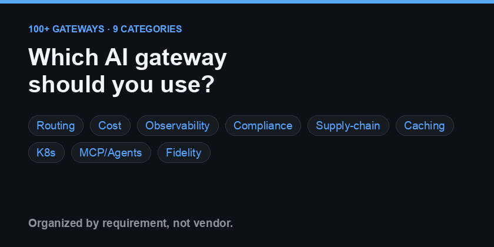
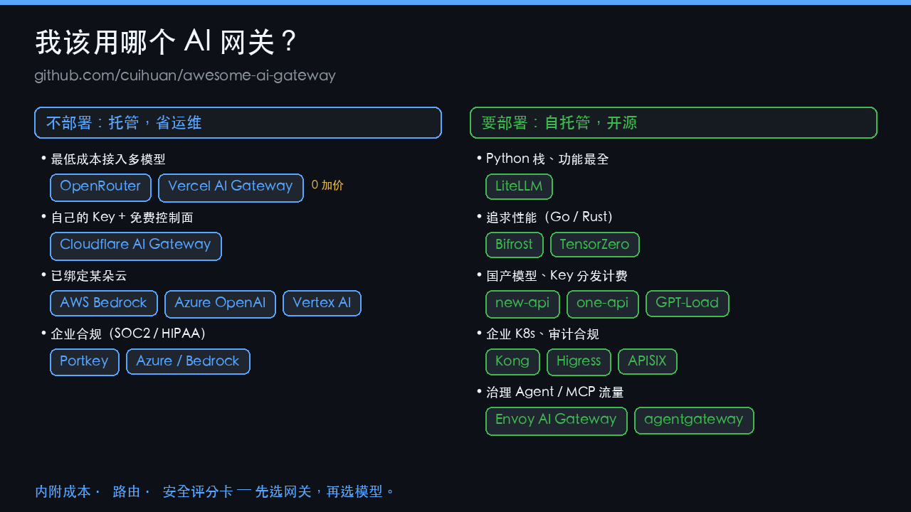

# Awesome AI Gateway [](https://awesome.re)

[](https://github.com/cuihuan/awesome-ai-gateway/stargazers)
[](BENCHMARKS.zh-CN.md)
[](.github/workflows/daily-update.yml) [](https://github.com/cuihuan/awesome-ai-gateway/actions/workflows/ci.yml)
[](CONTRIBUTING.md) [](LICENSE)

> **按你的诉求，约 10 秒选对 AI 网关——而且这个答案可信。** 一棵决策树、可复现的成本评测，外加我们排除灰产的独立证据。按真实诉求分类，而非按厂商罗列。

_这清单是被账单逼出来的：**我一天在 AI 写代码上烧了 $788**——一个旗舰模型就吃掉 78%，只因为我把所有请求都默认打给了最贵的那个。于是我把整个网关生态摸了一遍。→ [完整故事](#为什么做这个)_

**语言：** [English](README.md) · 简体中文

<p align="center">
<a href="#我该用哪个网关"><kbd> &nbsp; 🧭 选网关 &nbsp; </kbd></a> &nbsp;
<a href="https://cuihuan.github.io/awesome-ai-gateway/"><kbd> &nbsp; 🚀 在线交互页 &nbsp; </kbd></a> &nbsp;
<a href="BENCHMARKS.zh-CN.md"><kbd> &nbsp; 📊 成本与评分卡 &nbsp; </kbd></a>
</p>

<p align="center">
  <a href="#诉求速查表"></a>
</p>

## 目录

- [🔥 最高星网关（按 Star 排序）](#-最高星网关按-star-排序)
- **按需浏览**
  - [💰 性价比优先——最省钱的多模型接入](#-性价比优先) · [🆓 还活着的免费额度](#-哪些免费额度还活着-核实限额表)
  - [🔓 自托管开源](#-自托管开源)
  - [🏢 企业合规](#-企业合规)
  - [☁️ 原厂直连（云厂商/模型厂商）](#️-原厂直连云厂商模型厂商)
  - [🇨🇳 国内生态](#-国内生态)
  - [🤖 MCP 与 Agent 网关](#-mcp-与-agent-网关)
  - [🔧 更多按能力分](#-更多按能力分横切关注点) —— [路由](#-智能路由与模型选择) · [缓存](#-缓存过网关钱的问题) · [可观测](#-可观测与成本核算) · [K8s](#️-kubernetes-原生与推理基础设施)
- **选型与对比**
  - [我该用哪个网关](#我该用哪个网关) · [快速对比](#快速对比) · [诉求速查表](#诉求速查表)
  - [如何安全选型](#如何安全选型) —— [数据留存矩阵](#-谁看得到你的-prompt-数据留存矩阵) · [中转避雷观察名单](#社区中转避雷观察名单)
- **动态与参考**
  - [📊 评测速递](#-评测速递) · [📰 行业动态](#-行业动态) · [🚀 最新版本发布](#-最新版本发布自动更新)
  - [⚡ 10 秒答案](#-10-秒答案) · [📚 必读精选](#-必读精选) · [指南与对比](#指南与对比)
  - [常见问题 FAQ](#常见问题-faq) · [术语表](#术语表) · [为什么做这个](#为什么做这个) · [🔌 直接用数据](#-直接用数据它就是-api)

## 🔥 最高星网关（按 Star 排序）

清单里星标最高、最权威的项目——快速定位。Star 每天自动刷新；完整信息（功能、许可、注意事项）见各自所在小节。⚠️ 标记的项目，其订阅号/账号池路由可能触碰厂商 ToS 或封号风险。

| 网关 | Star | 是什么 | 跳转 |
|---|---|---|---|
| [LiteLLM](https://github.com/BerriAI/litellm) | <!--s:BerriAI/litellm-->⭐ 53.3k<!--/s--> | 事实标准的开源代理 + SDK，OpenAI 格式接 100+ 家 | [自托管](#-自托管开源) |
| [Kong](https://github.com/Kong/kong) | <!--s:Kong/kong-->⭐ 43.8k<!--/s--> | 成熟 API 网关 + AI 插件（语义缓存、护栏） | [企业](#-企业合规) |
| [new-api](https://github.com/QuantumNous/new-api) | <!--s:QuantumNous/new-api-->⭐ 41.9k<!--/s--> | 最活跃的中转/计费面板 | [国内](#-国内生态) |
| [CLIProxyAPI](https://github.com/router-for-me/CLIProxyAPI) ⚠️ | <!--s:router-for-me/CLIProxyAPI-->⭐ 40.1k<!--/s--> | 把编码 CLI 订阅（Claude Code、Codex…）包成 API | [自托管](#-自托管开源) |
| [Claude Code Router](https://github.com/musistudio/claude-code-router) | <!--s:musistudio/claude-code-router-->⭐ 35.7k<!--/s--> | 把 Claude Code 及各 Agent CLI 路由到任意模型 | [智能路由](#-智能路由与模型选择) |
| [one-api](https://github.com/songquanpeng/one-api) | <!--s:songquanpeng/one-api-->⭐ 35.6k<!--/s--> | 最早的 LLM API 管理/分发系统 | [国内](#-国内生态) |
| [sub2api](https://github.com/Wei-Shaw/sub2api) ⚠️ | <!--s:Wei-Shaw/sub2api-->⭐ 31.5k<!--/s--> | 把订阅账号拼车池化到一个端点 | [国内](#-国内生态) |
| [MLflow AI Gateway](https://github.com/mlflow/mlflow) | <!--s:mlflow/mlflow-->⭐ 27k<!--/s--> | MLflow 平台内的统一端点 + 治理 | [可观测](#-可观测与成本核算) |
| [9router](https://github.com/decolua/9router) ⚠️ | <!--s:decolua/9router-->⭐ 21.8k<!--/s--> | BYOK 本地代理，订阅→便宜→免费兜底 | [自托管](#-自托管开源) |
| [Apache APISIX](https://github.com/apache/apisix) | <!--s:apache/apisix-->⭐ 16.9k<!--/s--> | 云原生 API + AI 网关（ai-proxy 插件） | [企业](#-企业合规) |
| [aisuite](https://github.com/andrewyng/aisuite) | <!--s:andrewyng/aisuite-->⭐ 14.9k<!--/s--> | 吴恩达的统一多厂商客户端（是个库） | [自托管](#-自托管开源) |
| [OmniRoute](https://github.com/diegosouzapw/OmniRoute) ⚠️ | <!--s:diegosouzapw/OmniRoute-->⭐ 15.8k<!--/s--> | 编码 Agent 省 token，231+ 家上游 | [自托管](#-自托管开源) |
| [Portkey Gateway](https://github.com/Portkey-AI/gateway) | <!--s:Portkey-AI/gateway-->⭐ 12.4k<!--/s--> | 高性能 TypeScript 网关，1600+ 模型、50+ 护栏 | [自托管](#-自托管开源) |
| [Higress](https://github.com/higress-group/higress) | <!--s:higress-group/higress-->⭐ 8.8k<!--/s--> | 阿里的 AI 原生网关，基于 Envoy/Istio | [国内](#-国内生态) |
| [NVIDIA Dynamo](https://github.com/ai-dynamo/dynamo) | <!--s:ai-dynamo/dynamo-->⭐ 7.5k<!--/s--> | 数据中心级、KV-cache 感知的推理路由 | [K8s](#️-kubernetes-原生与推理基础设施) |
| [Bifrost](https://github.com/maximhq/bifrost) | <!--s:maximhq/bifrost-->⭐ 6.4k<!--/s--> | Go 网关，实测开销最低 | [自托管](#-自托管开源) |

> **托管型头部**（SaaS，无 GitHub star）：[OpenRouter](https://openrouter.ai)（400+ 模型，约 5.5% 费）· [Vercel AI Gateway](https://vercel.com/ai-gateway) 与 [Cloudflare AI Gateway](https://developers.cloudflare.com/ai-gateway/)（0 加价）→ [性价比优先](#-性价比优先)。
>
> _Star 衡量的是人气，不是它适不适合**你**的需求——后者交给下面的分类小节和有据可查的[评分卡](BENCHMARKS.md)。_

## 💰 性价比优先

*痛点："用最少的钱接入最多的模型，还不想搞运维。"*

- [OpenRouter](https://openrouter.ai) — 最大的模型市场：一个 OpenAI 兼容 API 背后 400+ 模型，按量付费、自动故障转移；充值约收 5.5% 手续费。2026 年 5 月完成 1.13 亿美元 B 轮，约 800 万用户。
- [Vercel AI Gateway](https://vercel.com/ai-gateway) — 数百模型按**厂商原价（0 加价）**计费，每月 $5 免费额度，可选零数据保留；与 AI SDK 天然搭配。
- [Cloudflare AI Gateway](https://developers.cloudflare.com/ai-gateway/) — 免费控制面套在你自己的厂商 Key 之上：缓存、动态路由、统一账单、美元计价的预算上限（2026 公测）。
- [Requesty](https://requesty.ai) — 面向欧盟的 OpenRouter 替代：400+ 模型、20ms 内故障转移、约 5% 加价。
- [Eden AI](https://www.edenai.co) — 统一 API 接入 500+ 模型及视觉/OCR/语音；欧盟公司，平台费约 5.5%。
- [Helicone AI Gateway（云版）](https://www.helicone.ai) — **0 加价**直通计费，可观测能力打包赠送。
- [GPT-Load](https://github.com/tbphp/gpt-load) <!--s:tbphp/gpt-load-->⭐ 6.2k<!--/s--> — Go 写的高性能多渠道密钥轮询代理，把每把 Key 的额度榨干。
- [Loop Gateway](https://api.loopxxi.com) — OpenAI 兼容代理，每个请求以比特币 sats（而非美元）计费。经 OpenRouter 接入 311 个模型、加价 15%。无需账号/邮箱/银行卡；用闪电网络充值即得 bearer token。三种鉴权（预付 bearer、L402、Cashu）。线上托管于 [api.loopxxi.com](https://api.loopxxi.com)。 **新且未经核实**（匿名；其公开 GitHub 仓库现已删除，按闭源托管中转看待）——它*通过运营者自己的 OpenRouter 账号*转售前沿模型并加价 15%，无账号+加密货币预付意味着一旦偷换模型或跑路都无从追索；投产前请用 [canary_check.py](scripts/canary_check.py) 验证保真度，且只充值你能承受损失的金额。
- [nullsink](https://nullsink.is) ([仓库](https://github.com/nullsink/nullsink)) — 无账号的前沿模型 API 计费代理，用门罗币（Monero）或比特币（Bitcoin）付费。无需账号/邮箱/银行卡；生成 bearer token、链上预付，改一个 base URL 即可用官方 SDK 调用。加价约 10%，仅在充值时收取一次；不记录 IP、不记录请求日志；付款与 token 不可关联。单文件可执行、可自托管（TypeScript/Bun，AGPL-3.0），线上服务 [nullsink.is](https://nullsink.is)。 **新且未经核实**（仓库 2026-06 新建、4★）——无账号+加密货币预付+无日志，一旦偷换模型或跑路都无从追索；投产前请用 [canary_check.py](scripts/canary_check.py) 验证保真度，且只充值你能承受损失的金额。
- [AIMLAPI](https://aimlapi.com) — 一个 OpenAI/Anthropic 兼容端点打通 400+ 模型（对话/图像/视频/音频/向量）；预付费，OpenRouter 式聚合器。
- [KeepRouter](https://keeprouter.com) — OpenAI 与 Anthropic 双兼容网关：一个密钥聚合 50+ 模型（Claude、GPT、Gemini、Mistral、Qwen、Kimi、GLM、DeepSeek、MiMo、MiniMax）。原生 /v1/messages，可直接用于 Claude Code 和 Anthropic SDK，不止 OpenAI SDK。预付费按量计费、按成本 **0% token 加价**（充值费 8%+$0.35）；含一个真正 $0 的免费模型，新账户另有试用额度。中英双语，收单方 Paddle；中国大陆不可用。**新服务，尚未验证** — 投产前请用 [canary_check.py](scripts/canary_check.py) 核实真伪。
- [AI快站 (aifast.club)](https://www.aifast.club) — 面向国内开发者的 OpenAI/Anthropic 兼容中转：一个 Key 接入 572 个模型（Claude Sonnet 5、GPT-5.5、Gemini 3、DeepSeek V4、Qwen 3、Kimi、GLM-5.2、MiniMax、Grok、Flux、Stable Diffusion、ElevenLabs 等 16+ 厂商），支持支付宝/微信充值，香港/新加坡边缘节点，大陆延迟低于 100ms。提供 Cursor / Claude Code / Codex / OpenClaw / Dify 集成文档。**新服务，尚未验证** — 投产前请用 [canary_check.py](scripts/canary_check.py) 核实真伪。
- [Novita AI](https://novita.ai) — 统一 API 接入 200+ 开源模型（DeepSeek/Qwen/Llama…），自带负载均衡、弹性扩缩与故障转移；另有 GPU 云。
- [FlintAPI](https://flintapi.ai) ([仓库](https://github.com/moozechen/flintapi)) — 托管 OpenAI 兼容网关，聚合 25+ 国产大模型（DeepSeek、Qwen、Kimi、GLM、MiniMax），赠 $2 体验额度。较新且未经核实——投产前请先验证模型保真度（可用 [canary_check.py](scripts/canary_check.py)）。
- [FlowBar](https://flowbarai.com) — 托管 OpenAI 兼容中转，转售数十个模型（GPT、Claude、Gemini、DeepSeek、Qwen、GLM、Kimi），定价低于 OpenRouter，支持美元/人民币/加密支付。较新且未经核实——投产前请先验证模型保真度（可用 [canary_check.py](scripts/canary_check.py)）。
- [Meshs One](https://api.meshs.one) — 托管 OpenAI 兼容中转，一个 key 接入国产前沿模型（DeepSeek-V4、Qwen3.7-Max、MiniMax-M3），按 token 计费（其 `/v1` 端点返回 `new_api_error`，疑似基于 [new-api](https://github.com/QuantumNous/new-api)）。较新且未经核实——闭源、刚上线；投产前请先验证模型保真度（可用 [canary_check.py](scripts/canary_check.py)）。
- [CoderPlan](https://coderplan.ai) — 托管 OpenAI 兼容中转，面向国内开发者，一个 key 接入 Claude/GPT/Gemini/DeepSeek/Grok，按 token 计费、¥10 起充，支持支付宝/微信；香港/新加坡节点（API 基址 `api.coderplan.ai/v1`，返回 `new_api_error`，疑似基于 [new-api](https://github.com/QuantumNous/new-api)）。较新且未经核实——投产前请先验证模型保真度（可用 [canary_check.py](scripts/canary_check.py)）。
- [lxg2it ModelRouter](https://api.lxg2it.com) ([repo](https://github.com/lxg2it/modelrouter-core)) — 个人开发者打造的 OpenAI 兼容路由，覆盖 7+ 厂商（Anthropic、OpenAI、Google、Cerebras、Groq、Grok、GLM），分层自动回退、自动选用当前最便宜的可用模型。提供免费档与付费档，自称对 Anthropic 模型 0% 加价（可能另收充值手续费——请核实当前定价）。较新且未经核实——其公开仓库是一个精简、无协议的核心占位，2026-06 仍有新提交（路由逻辑在闭源托管服务里；无协议文件）——投产前请先验证模型保真度（可用 [canary_check.py](scripts/canary_check.py)）。
- [OpenPaths](https://openpaths.io) ([仓库](https://github.com/lee101/openpaths)) — 托管 OpenAI 兼容路由，一个 API 跨 15+ 厂商（OpenAI、Anthropic、Gemini、Groq、xAI、DeepSeek、Mistral）自动路由，覆盖对话、图像、视频、音乐、语音、向量与转写。较新且未经核实——尽管自称"开源"，其 GitHub 仓库实为无代码、无协议的展示镜像（真正的源码托管在第三方平台 [Codex Infinity](https://codex-infinity.com/lee101/openpaths) 且由 AI agent 维护），故应视作闭源托管中转；投产前请先验证模型保真度（可用 [canary_check.py](scripts/canary_check.py)）。
- [Glama Gateway](https://glama.ai/ai/gateway) — OpenAI 兼容网关，接入 100+ 模型，统一账单、缓存与日志（开源内核 [glama-ai/lightport](https://github.com/glama-ai/lightport)）。
- [RouterPlex](https://routerplex.com) — 托管 OpenAI 兼容网关，一个密钥接入 11 家厂商的 25+ 模型（GPT、Claude、Gemini、DeepSeek、Qwen、Kimi 等）；预付费，按官方厂商标价逐 token 计费，无订阅。新账户赠送 $5 免费额度。较新且未经核实，闭源——投产前请先验证模型保真度（可用 [canary_check.py](scripts/canary_check.py)）。
- [TierUp](https://tierup.ai) — 托管的 OpenAI 兼容网关，用四个固定性能档位（tier-1…tier-4）取代模型名，每个档位在服务端映射到当前性价比最高的模型；底层通过 OpenRouter 路由，定价约为底层模型零售价的 50%，在早期产品市场契合阶段内透明补贴（个人开发、生产用户约为零、tier 1 目前免费）。较新且未经核实——投产前请先验证模型保真度（可用 [canary_check.py](scripts/canary_check.py)）。

> 💡 任何网关都能再省一笔：开**语义缓存**（Kong、Bifrost、Zuplo），设**消费上限**（Cloudflare、Zuplo、Pydantic/Logfire），简单请求路由到便宜模型（见[智能路由](#-智能路由与模型选择)）。

### 🆓 哪些免费额度还活着？—— 核实限额表

_生态里被问得最多的问题之一，而网上的答案大多已过期。下表每一行都对照厂商**自己的**文档重新核实（[机器可读](data/free_tiers.json)，2026-07-09 核验，CI 强制 ≤30 天复审）。标注"未公开"表示厂商已把数字藏进登录后台——我们如实说明，而不是转抄三手数字。_

| 厂商 | 免费内容（核实限额） | 代表性免费模型 | 要卡？ | 代价 |
|---|---|---|---|---|
| [OpenRouter `:free`](https://openrouter.ai/docs/api-reference/limits) | **50 次/天**（累计充值 <$10）→ **1,000 次/天**（一次性充 $10+）；所有 `:free` 模型共享 20 次/分 | 轮换的 `:free` 池 | ❌ | 免费线路打到的第三方**可能拿你的数据训练**（按各家政策——检查免费/付费路由设置） |
| [Google Gemini API](https://ai.google.dev/gemini-api/docs/rate-limits) | Flash 系列免费；逐模型 RPM/RPD 自 2026 起**未公开**（登录 AI Studio 才可见）；每日配额太平洋时间午夜重置 | Gemini 3.5 Flash · 3.1 Flash-Lite · 2.5 Flash · Gemma 4 | ❌ | 免费档内容_"用于改进我们的产品"_（定价页原话） |
| [Groq](https://console.groq.com/docs/rate-limits) | 逐模型：Llama-3.3-70B **30 次/分 / 1K 次/天 / 10 万 token/天** · GPT-OSS-120B 30 RPM / 1K RPD / 20 万 TPD · Llama-3.1-8B 14.4K RPD / 50 万 TPD | GPT-OSS-120B/20B · Llama-4-Scout · Llama-3.3-70B · Qwen3-32B | ❌（升级才要卡） | 70B+ 模型的每日 token 上限烧得很快；限额按组织计 |
| [Cerebras](https://inference-docs.cerebras.ai/support/rate-limits) | **5 次/分 / 3 万 TPM / 每天 100 万 token**，全模型统一 | GPT-OSS-120B · GLM-4.7 · Gemma-4-31B | ❔ 未说明 | 5 RPM 只够单人交互；宣传"全部模型"但限额表上只有 3 个 |
| [GitHub Models](https://docs.github.com/en/github-models/use-github-models/prototyping-with-ai-models) | 任意 GitHub 账号：低档模型 **15 次/分 / 150 次/天**，高档 **10 次/分 / 50 次/天**；单请求 8K 进 / 4K 出 | GPT-5 · o4-mini · Llama 4 · Phi-4 · DeepSeek-R1 | ❌ | 官方明说仅供实验；单请求 8K/4K 上限用不了长上下文 |
| [Cloudflare Workers AI](https://developers.cloudflare.com/workers-ai/platform/pricing/) | **每天 10,000 neurons**（按官方费率折算：Llama-3.2-1B 约 400 万输入 token/天，GPT-OSS-120B 约 31.4 万——除法是我们做的） | Llama-3.3-70B · GPT-OSS-120B/20B · DeepSeek-R1-distill | ❔ 未说明 | neurons 按算力计——输出比输入烧得快 5–10 倍 |
| [Mistral](https://docs.mistral.ai/getting-started/quickstarts/studio/activate-and-generate-api-key) | 免费 Experiment 模式；具体限额**未公开**（按账号，Admin Console 可见） | Large · Small · Codestral（第三方报告） | ❌ | **默认拿你的数据训练**——免费用户必须手动关掉开关 |
| [Cohere](https://docs.cohere.com/docs/rate-limits) | 试用 key：**每月 1,000 次调用**；Chat 20 次/分 | Command A · Command R+ | ❌ | 只够评估用 |
| [SambaNova](https://docs.sambanova.ai/docs/en/models/rate-limits) | **20 次/分 / 每天 20 次 / 每天 20 万 token** | DeepSeek-V3.1 · Llama-3.3-70B · GPT-OSS-120B | ❌ | 每天 20 次 = 只够演示（推理速度倒是很快） |
| [Hugging Face](https://huggingface.co/docs/inference-providers/en/pricing) | **每月 $0.10** 的透传额度（PRO：$2/月） | 200+ 路由模型（DeepSeek-V3 …） | ❌ | $0.10 ≈ 大模型几次请求 |
| [Z.ai（GLM）](https://docs.z.ai/guides/overview/pricing) | GLM Flash 系列**输入输出全 $0**；限流未公开（按 key，登录可见） | GLM-4.7-Flash · GLM-4.5-Flash · GLM-4.6V-Flash | ❔ 未说明 | 并发限制不透明且多变；中国大陆厂商——自行权衡数据敏感度 |

**试用额度 ≠ 免费档**（会过期）：NVIDIA [build.nvidia.com](https://docs.api.nvidia.com/nim/docs/faq)（注册送 1,000 次请求，企业邮箱 +4,000——数字来自官方论坛员工答复；仅限原型用途）、阿里云 [Model Studio 国际版](https://www.alibabacloud.com/help/en/model-studio/new-free-quota)（逐模型额度，激活后 90 天硬性过期，仅新加坡区）。**近期已取消——别信过期榜单：** Together AI 已下线全部 `-free` 模型（现在最低预充 $5，官方原话 _"does not currently offer free trials"_），Moonshot/Kimi 需先充 $1 才能用，xAI 广为流传的数据共享额度已从所有公开页面消失。逐行证据：[`data/free_tiers.json`](data/free_tiers.json)。发现哪行过期了？[提 issue](https://github.com/cuihuan/awesome-ai-gateway/issues/new)。

## 🔓 自托管开源

*痛点："Key 在我手里、跑在我机器上，不交按量过路费。"*

- [LiteLLM](https://github.com/BerriAI/litellm) <!--s:BerriAI/litellm-->⭐ 53.3k<!--/s--> — 默认之选：Python SDK + 代理服务，以 OpenAI 格式打通 100+ 厂商，带虚拟 Key、预算、负载均衡与护栏。
- [Portkey Gateway](https://github.com/Portkey-AI/gateway) <!--s:Portkey-AI/gateway-->⭐ 12.4k<!--/s--> — 高速 TypeScript 网关（1600+ 模型、50+ 护栏），同时是 Portkey 商业 LLMOps 平台的底座。
- [CLIProxyAPI](https://github.com/router-for-me/CLIProxyAPI) <!--s:router-for-me/CLIProxyAPI-->⭐ 40.1k<!--/s--> — Go 网关，把各家编码 Agent 的 CLI 订阅（Claude Code、Codex、Gemini、Grok、Antigravity）包装成 OpenAI/Gemini/Claude/Codex 兼容 API，带多账号池、轮询负载均衡与管理 API；本领域星数最高的开源网关之一。自带账号——但把 OAuth 编码订阅档通过 API 转发可能违反厂商 ToS，需权衡封号风险。
- [9router](https://github.com/decolua/9router) <!--s:decolua/9router-->⭐ 21.8k<!--/s--> — MIT 自托管 BYOK 本地代理，在 40+ 厂商间按「订阅→便宜→免费」自动回退路由，带多账号负载均衡与 token 压缩；性价比优先、非常热门，但其免费/OAuth 编码档路由（Claude Code、Codex、Kiro）存在厂商 ToS/封号风险。
- [OmniRoute](https://github.com/diegosouzapw/OmniRoute) <!--s:diegosouzapw/OmniRoute-->⭐ 15.8k<!--/s--> — MIT 自托管 TypeScript 网关：一个端点接入 231+ 厂商（50+ 免费），把 Claude Code / Codex / Cursor / Cline / Copilot 接到免费的 Claude/GPT/Gemini，叠加 token 压缩（省 15–95%）、17 种路由策略、智能自动回退与 MCP/A2A。2026 编码 Agent「省 token」浪潮的黑马——是真实代码（非中转农场），但其免费/OAuth 编码档路由存在厂商 ToS/封号风险。
- [Chat Nio (CoAI)](https://github.com/coaidev/coai) <!--s:coaidev/coai-->⭐ 9.2k<!--/s--> — 多租户「一站式」网关，内置管理后台 + 积分/订阅计费面板，聚合 200+ 模型 / 35+ 厂商，带优先级负载均衡与模型缓存——与本清单已收录的 new-api / one-api / VoAPI 属同一商业面板品类。
- [TensorZero](https://github.com/tensorzero/tensorzero) <!--s:tensorzero/tensorzero-->⭐ 11.7k<!--/s--> — ⚠️ **2026 年 6 月已归档**（公司关停；仓库只读，Apache-2.0 代码与社区分支尚存）。Rust 网关 + 可观测 + 评测 + 实验优化一体。
- [Bifrost](https://github.com/maximhq/bifrost) <!--s:maximhq/bifrost-->⭐ 6.4k<!--/s--> — Maxim AI 出品的 Go 网关，号称比 LiteLLM 快约 50 倍；自适应负载均衡、集群模式、支持 MCP。
- [Traceloop Hub](https://github.com/traceloop/hub) <!--s:traceloop/hub-->⭐ 218<!--/s--> — [Traceloop](https://www.traceloop.com/) 团队（OpenLLMetry / LLM 版 OTel）出品的 Rust 高并发网关，内置 OpenTelemetry 原生可观测性。
- [Helicone](https://github.com/Helicone/helicone) <!--s:Helicone/helicone-->⭐ 5.9k<!--/s--> — 可观测优先的平台（YC W23），配套 Rust [ai-gateway](https://github.com/Helicone/ai-gateway) <!--s:Helicone/ai-gateway-->⭐ 612<!--/s-->。
- [Plano](https://github.com/katanemo/plano) <!--s:katanemo/plano-->⭐ 6.7k<!--/s--> — 面向 Agent 的 AI 原生代理/数据面（原名 Arch Gateway / archgw）。
- [AxonHub](https://github.com/looplj/axonhub) <!--s:looplj/axonhub-->⭐ 4.7k<!--/s--> — Go 网关：用任意 SDK 通过一个 OpenAI/Anthropic 兼容端点调用 100+ 大模型，内置故障转移、负载均衡、成本控制与端到端追踪。自带 Key 自托管。
- [Manifest](https://github.com/mnfst/manifest) <!--s:mnfst/manifest-->⭐ 7.2k<!--/s--> — 自托管 TypeScript 路由器（MIT）：一个 OpenAI 兼容的 `/auto` 端点（外加给 Anthropic 客户端的 `/v1/messages`）接入 300+ 模型 / 31+ 厂商，可混用 API Key、本地模型（Ollama/LM Studio）与订阅号，按复杂度/请求头路由，带成本追踪、预算与故障转移。自带账号——把 OAuth 订阅号经 API 路由可能触碰厂商 ToS 风险。
- [LLM Gateway](https://github.com/theopenco/llmgateway) <!--s:theopenco/llmgateway-->⭐ 1.4k<!--/s--> — 开源版 OpenRouter：跨厂商路由、管理与分析。
- [APIPark](https://github.com/APIParkLab/APIPark) <!--s:APIParkLab/APIPark-->⭐ 1.8k<!--/s--> — 云原生 LLM API 管理与分发平台。
- [Pydantic AI Gateway](https://github.com/pydantic/pydantic-ai-gateway) <!--s:pydantic/pydantic-ai-gateway-->⭐ 192<!--/s--> — BYOK 网关，带成本上限与 OTel；⚠️ 仓库已归档，现已并入 Pydantic Logfire。
- [OptiLLM](https://github.com/algorithmicsuperintelligence/optillm) <!--s:algorithmicsuperintelligence/optillm-->⭐ 4.2k<!--/s--> — 优化型推理代理，用测试时计算技术提升准确率。
- [aisuite](https://github.com/andrewyng/aisuite) <!--s:andrewyng/aisuite-->⭐ 14.9k<!--/s--> — 吴恩达的统一多厂商客户端。是库而非代理服务，适合不想加网络一跳的场景。
- [Shepherd Model Gateway (SMG)](https://github.com/lightseekorg/smg) <!--s:lightseekorg/smg-->⭐ 386<!--/s--> — Rust 写的引擎无关网关：一个 OpenAI/Anthropic 兼容端点统管 vLLM/SGLang/TRT-LLM 与云厂商，带 KV 缓存感知路由与 WASM 插件。
- [RelayPlane](https://github.com/RelayPlane/proxy) <!--s:RelayPlane/proxy-->⭐ 189<!--/s--> — MIT、本地优先的代理（npm）：11 家厂商一个端点，逐请求成本归因 + 硬性日/时预算上限。
- [SentryNode Gateway](https://github.com/nehadangwal/sentrynode-gateway) <!--s:nehadangwal/sentrynode-gateway-->⭐ 0<!--/s--> — 开放内核（Apache-2.0）的 AI 代理，主打成本治理 / FinOps 路由：自适应路由、预算上限与审计日志。早期项目，公开仓库目前为演示脚手架。
- [GoModel](https://github.com/ENTERPILOT/GoModel) <!--s:ENTERPILOT/GoModel-->⭐ 992<!--/s--> — 轻量单文件 Go 网关（开源 LiteLLM 替代品），用一个 OpenAI/Anthropic 兼容 API 打通 18+ 厂商，带缓存、护栏与用量/成本追踪；增长迅速，但其「比 LiteLLM 快」的吞吐数据为厂商自测。
- [OpenGateLLM](https://github.com/etalab-ia/OpenGateLLM) <!--s:etalab-ia/OpenGateLLM-->⭐ 168<!--/s--> — 法国 **Etalab**（政府数字化机构）出品的生产级开源 GenAI 网关（驱动政府的「Albert」助手）：一个 OpenAI 兼容 API 打通自托管 + 厂商模型，带鉴权、限流与用量追踪。公共部门 / 欧盟数据主权角度独特。
- ⚠️ 已停滞但有历史意义：[BricksLLM](https://github.com/bricks-cloud/BricksLLM) <!--s:bricks-cloud/BricksLLM-->⭐ 1.2k<!--/s-->（PII 脱敏、按 Key 限额；2025 年初起不再活跃）、[Glide](https://github.com/EinStack/glide) <!--s:EinStack/glide-->⭐ 160<!--/s-->（2024 年起停更）。

## 🏢 企业合规

*痛点："审计日志、PII 脱敏、RBAC、私有化部署，外加 2026 年 8 月生效的欧盟 AI 法案。"*

- [Kong AI Gateway](https://github.com/Kong/kong) <!--s:Kong/kong-->⭐ 43.8k<!--/s--> — 成熟 API 网关 + AI 插件：语义缓存/路由、Prompt 防护、token 限流；Konnect 提供托管控制面。
- [Apache APISIX](https://github.com/apache/apisix) <!--s:apache/apisix-->⭐ 16.9k<!--/s--> — 云原生 API + AI 网关，`ai-proxy` / `ai-proxy-multi` 插件。
- [Envoy AI Gateway](https://github.com/envoyproxy/ai-gateway) <!--s:envoyproxy/ai-gateway-->⭐ 1.8k<!--/s--> — 基于 Envoy Gateway 的 CNCF 系 GenAI 接入层，Tetrate 与彭博背书。
- [kgateway](https://github.com/kgateway-dev/kgateway) <!--s:kgateway-dev/kgateway-->⭐ 5.6k<!--/s--> — CNCF API/AI 网关，Solo.io 商业版 [Gloo AI Gateway](https://www.solo.io) 的底座。
- [TrueFoundry AI Gateway](https://www.truefoundry.com) — 企业网关：路由、护栏、RBAC，可部署进你的 K8s/VPC。
- [nexos.ai](https://nexos.ai) — Nord Security 创始团队的企业 AI 网关/编排（2025 年 10 月 €3000 万 A 轮）。
- [Tyk AI Studio](https://tyk.io) — AI 治理套件：预算、模型目录、护栏。
- [Gravitee Agent Mesh](https://www.gravitee.io) — APIM 内置 LLM Proxy、MCP Proxy 与 A2A。
- [WSO2 AI Gateway](https://wso2.com/api-manager/usecases/ai-gateway/) — LLM 出口流量管理：模型路由、语义缓存、护栏。
- [F5 AI Gateway](https://www.f5.com) — 容器化 AI 流量网关；通过收购 LeakSignal 增加数据泄露检测（2025-07 公布）。
- [IBM API Connect AI Gateway](https://www.ibm.com) — LLM 流量的策略执行、脱敏与审计。
- [MuleSoft AI / Omni Gateway](https://www.mulesoft.com/platform/ai-gateway) — 把 LLM、MCP、Agent 流量与传统 API 一起治理。
- [Lunar.dev](https://github.com/TheLunarCompany/lunar) <!--s:TheLunarCompany/lunar-->⭐ 468<!--/s--> — 出口消费网关，已转向 MCP/Agent 治理。
- [KrakenD AI Gateway](https://www.krakend.io/docs/ai-gateway/) — 高性能、无状态的 Go API 网关（[krakend/krakend-ce](https://github.com/krakend/krakend-ce) <!--s:krakend/krakend-ce-->⭐ 2.6k<!--/s-->），带 AI 代理 + Prompt 安全层。
- [Broadcom Layer7 AI Gateway](https://www.broadcom.com/products/software/api-management) — 在成熟的 Layer7 API 平台上做 LLM 流量治理、威胁防护与配额。
- [Cequence AI Gateway](https://www.cequence.ai) — 以 API 安全为先的 AI 网关：发现、护栏、LLM/Agent 流量威胁防护。
- [Axway Amplify AI Gateway](https://www.axway.com/en/products/amplify-ai-gateway) — Axway Amplify 平台上的集中式控制面，以业务逻辑驱动模型路由治理 LLM/MCP/Agent 流量，带 RBAC、消费上限、提示注入防护与 RAG 集成；出自 10 次入选 Gartner API 管理魔力象限的 Leader。
- [Red Hat Connectivity Link](https://www.redhat.com/en/technologies/cloud-computing/connectivity-link) — 基于 Kuadrant 项目（3scale 的继任者）的 Kubernetes 原生网关，统一 AI 网关、API 管理与多集群连接；作为 OpenShift AI「模型即服务」的前门，治理外部与自托管 LLM 端点。
- [Sensedia AI Gateway](https://www.sensedia.com/product/ai-gateway) — Gartner 认可的 APIM 厂商出品的中立 AI 网关，以多模型路由、护栏、成本控制与可观测治理 LLM、MCP server 与 AI Agent，构成多云控制面。
- [Ambassador Edge Stack](https://www.getambassador.io/products/edge-stack/api-gateway) — 基于 Envoy 的 Kubernetes 原生 API 网关（开源内核 [emissary-ingress](https://github.com/emissary-ingress/emissary) <!--s:emissary-ingress/emissary-->⭐ 4.5k<!--/s-->），其 AI Gateway 层增加 LLM 厂商路由、token 限流与兜底——API 厂商阵营里 Kong/Tyk/APISIX 的同类。

## ☁️ 原厂直连（云厂商/模型厂商）

*痛点："已经绑定某朵云，要官方原生方案。"*

- [AWS Bedrock](https://aws.amazon.com/bedrock/) — 统一 Converse API 多模型接入、跨区域推理、AgentCore Gateway 管工具/MCP。
- [Azure API Management — GenAI gateway](https://learn.microsoft.com/azure/api-management/genai-gateway-capabilities) — 在 Azure OpenAI / AI Foundry 前做 token 限额、语义缓存与负载均衡。
- [Google Apigee + Vertex AI](https://cloud.google.com/apigee) — Apigee 的 LLM 网关模式 + Vertex Model Garden 托管模型库。
- [Cloudflare AI Gateway](https://developers.cloudflare.com/ai-gateway/) — 见[性价比优先](#-性价比优先)；最强的免费原厂选项。
- [Vercel AI Gateway](https://vercel.com/ai-gateway) — 已 GA，0 加价，可选零数据保留；Next.js / AI SDK 团队的默认选择。
- [Databricks Unity AI Gateway](https://www.databricks.com) — Mosaic AI Gateway 并入 Unity Catalog，增加 Agent + MCP 治理。
- [Tencent Cloud AI Gateway](https://cloud.tencent.com/document/product/1364/127525) — 腾讯云原生智能网关，集大模型网关 + MCP 网关 + Agent 网关于一体，带协议转换、按成本/性能路由，统一接入混元 + 第三方模型。

## 🇨🇳 国内生态

*痛点："国产模型（通义/DeepSeek/GLM/Kimi）、人民币支付、团队 Key 分发与计费。"*

- [new-api](https://github.com/QuantumNous/new-api) <!--s:QuantumNous/new-api-->⭐ 41.9k<!--/s--> — 最活跃的 one-api 分支，已是"统一 AI 模型枢纽"：协议转换、计费、Rerank/Realtime 端点。AGPL-3.0。
- [one-api](https://github.com/songquanpeng/one-api) <!--s:songquanpeng/one-api-->⭐ 35.6k<!--/s--> — 元祖级 LLM API 管理&分发系统（OpenAI/Azure/Claude/Gemini/DeepSeek/豆包…）；开发节奏已放缓。
- [Higress](https://github.com/higress-group/higress) <!--s:higress-group/higress-->⭐ 8.8k<!--/s--> — 阿里开源、基于 Envoy/Istio 的 AI 原生网关，通义/DeepSeek 一等公民；云版 higress.ai。
- [GPT-Load](https://github.com/tbphp/gpt-load) <!--s:tbphp/gpt-load-->⭐ 6.2k<!--/s--> — 智能密钥轮询的多渠道代理（Go）。
- [one-hub](https://github.com/MartialBE/one-hub) <!--s:MartialBE/one-hub-->⭐ 2.9k<!--/s--> — one-api 分支：更好的非 OpenAI 函数调用与统计页面。
- [simple-one-api](https://github.com/fruitbars/simple-one-api) <!--s:fruitbars/simple-one-api-->⭐ 2.3k<!--/s--> — 单二进制，把千帆/星火/混元/MiniMax/DeepSeek 适配为 OpenAI 接口。
- [Octopus](https://github.com/bestruirui/octopus) <!--s:bestruirui/octopus-->⭐ 2.3k<!--/s--> — 个人向 LLM API 聚合网关，把多家供应商收口到一个端点，带负载均衡与 OpenAI/Anthropic 协议转换（Go 后端 + Next.js 前端）。
- [Veloera](https://github.com/Veloera/Veloera) <!--s:Veloera/Veloera-->⭐ 1.6k<!--/s--> — one-api/new-api 系新晋中转平台。
- [uni-api](https://github.com/yym68686/uni-api) <!--s:yym68686/uni-api-->⭐ 1.2k<!--/s--> — 轻量级单配置文件统一 API 管理，无前端。
- [APIPark](https://github.com/APIParkLab/APIPark) <!--s:APIParkLab/APIPark-->⭐ 1.8k<!--/s--> — 国产云原生 AI & API 网关，带开放开发者门户。
- [VoAPI](https://github.com/VoAPI/VoAPI) <!--s:VoAPI/VoAPI-->⭐ 1.1k<!--/s--> — new-api 系的精致中转/计费面板（Go），偏重 UI 与运营。
- [done-hub](https://github.com/deanxv/done-hub) <!--s:deanxv/done-hub-->⭐ 789<!--/s--> — one-api/new-api 分支，计费与渠道管理更丰富。
- [sub2api](https://github.com/Wei-Shaw/sub2api) <!--s:Wei-Shaw/sub2api-->⭐ 31.5k<!--/s--> — Go 中转平台，把 Claude/OpenAI/Gemini/Antigravity 的订阅账号（OAuth、session key、API key）汇聚到一个 OpenAI/Anthropic 兼容端点，并加上「拼车」分摊计费（Stripe/支付宝/微信）、key 分发与按 token 限流。2026 年增长最快的国内生态中转之一——但账号拼池与本清单排除的「转售中转」类别相邻；请自带账号并先行验证。
- [AI Proxy](https://github.com/labring/aiproxy) <!--s:labring/aiproxy-->⭐ 504<!--/s--> — Sealos 团队出品的自托管 Go 网关，接受 OpenAI/Claude/Gemini 协议并互转，加上多渠道路由、负载均衡、限流、多租户隔离，以及缓存/联网搜索/推理的插件层。
- [metapi](https://github.com/cita-777/metapi) <!--s:cita-777/metapi-->⭐ 3.1k<!--/s--> — 自托管的「中转之中转」：把你在 new-api/one-api/OneHub/DoneHub/Veloera/AnyRouter/sub2api 上的账号聚合成一个 key，按成本/余额/利用率加权智能路由，带渠道冷却重试、模型自动发现与 OpenAI⇄Claude 互转（TypeScript，MIT）。仅为路由软件——请自行核验它指向的上游中转。
- [Volcengine AI Gateway](https://www.volcengine.com/docs/6569/1356167) — 火山引擎（字节）云 AI 网关：豆包 + 第三方模型的统一接入、路由与治理。

> ⚠️ 本清单刻意**不收录逆向 / 转售的"free-api"类中转**——而且不只是出于原则。2026 年两篇测量研究发现中转群体存在系统性欺诈：[*Real Money, Fake Models*](https://arxiv.org/abs/2603.01919) 测得 **45.8%** 的指纹测试出现模型身份不符、输出偏离最高达 **47%**；[*Your Agent Is Mine*](https://arxiv.org/abs/2604.08407) 抓到中转**注入恶意代码**并**窃取预埋的 API key**。若你不得不甄别某一家，用[如何安全选型](#如何安全选型)里的 canary 对比测试。

## 🤖 MCP 与 Agent 网关

*痛点："Agent 开始调工具了——像治理 API 一样治理 MCP 流量。"* 2025–2026 最新品类。

- [agentgateway](https://github.com/agentgateway/agentgateway) <!--s:agentgateway/agentgateway-->⭐ 3.8k<!--/s--> — CNCF Agent 流量代理：MCP 治理与 Agent 间（A2A）通信。
- [Lunar.dev MCPX](https://github.com/TheLunarCompany/lunar) <!--s:TheLunarCompany/lunar-->⭐ 468<!--/s--> — 管理 MCP server 消费的网关。
- [Tetrate Agent Router Service](https://tetrate.io/products/tetrate-agent-router-service) — 托管 Envoy AI Gateway 集群：LLM + MCP 网关与护栏（约 5% 费率）。
- [Zuplo AI Gateway](https://zuplo.com/ai-gateway) — 可编程策略：美元消费上限、Prompt 注入检测、密钥脱敏、MCP 支持。
- [NetFoundry MCP/LLM Gateways](https://netfoundry.io) — 零信任 AI 网关（2026 年 6 月发布）。
- [AWS AgentCore Gateway](https://aws.amazon.com/bedrock/) — Bedrock AgentCore 内的工具/MCP 网关。
- [IBM ContextForge](https://github.com/IBM/mcp-context-forge) <!--s:IBM/mcp-context-forge-->⭐ 4.1k<!--/s--> — MCP 网关/注册中心，把多个 MCP server 聚合到一个端点，带鉴权、限流与可观测。
- [Docker MCP Gateway](https://github.com/docker/mcp-gateway) <!--s:docker/mcp-gateway-->⭐ 1.5k<!--/s--> — Docker 官方维护的 `docker mcp` CLI 插件：把 MCP server 以容器方式运行并聚合到一个端点之后，带密钥管理、调用拦截与按工具的访问控制。
- [MetaMCP](https://github.com/metatool-ai/metamcp) <!--s:metatool-ai/metamcp-->⭐ 2.5k<!--/s--> — 把多个 MCP server 聚合成一个端点，带中间件（鉴权、过滤）与管理界面。
- [ToolHive](https://github.com/stacklok/toolhive) <!--s:stacklok/toolhive-->⭐ 1.9k<!--/s--> — Go 平台，把多个 MCP server 跑在隔离容器里，并以统一、加固的网关收口（访问策略、"虚拟 MCP"聚合）。
- [Microsoft MCP Gateway](https://github.com/microsoft/mcp-gateway) <!--s:microsoft/mcp-gateway-->⭐ 738<!--/s--> — 微软维护的 MCP 反向代理 + 管理层：会话感知的有状态路由与生命周期管理，运行在 Kubernetes 上。
- [1MCP](https://github.com/1mcp-app/agent) <!--s:1mcp-app/agent-->⭐ 471<!--/s--> — 统一 MCP server（TypeScript），把多个 MCP server 聚合到一个端点，带 HTTP 访问与面向 Agent 的 CLI 发现。
- [mcpproxy-go](https://github.com/smart-mcp-proxy/mcpproxy-go) <!--s:smart-mcp-proxy/mcpproxy-go-->⭐ 285<!--/s--> — 本地 Go MCP 代理，把多个 MCP server 聚合到一个端点，带 BM25 工具检索过滤、token 压缩，以及对新接入 server 的自动隔离/安全扫描。
- [MCPJungle](https://github.com/mcpjungle/MCPJungle) <!--s:mcpjungle/MCPJungle-->⭐ 1.1k<!--/s--> — 自托管 MCP 注册中心 + 网关，面向企业的工具集中治理。
- [Obot](https://github.com/obot-platform/obot) <!--s:obot-platform/obot-->⭐ 883<!--/s--> — 开源 Agent 平台，自带 MCP 网关管控工具访问。
- [Director](https://github.com/fdmtl/director) <!--s:fdmtl/director-->⭐ 480<!--/s--> — 中间件：在一个连接后运行、加固并观测 MCP server。
- [Lasso MCP Gateway](https://github.com/lasso-security/mcp-gateway) <!--s:lasso-security/mcp-gateway-->⭐ 378<!--/s--> — 安全优先的 MCP 网关：插件式护栏、密钥脱敏、威胁检测。
- [Armorer Guard](https://github.com/ArmorerLabs/Armorer-Guard) <!--s:ArmorerLabs/Armorer-Guard-->⭐ 40<!--/s--> — 本地 Rust MCP 代理，可包装 stdio server，并在执行前检查工具调用参数中的 Prompt 注入、凭据泄露、外传请求与高风险操作。
- [fak](https://github.com/anthony-chaudhary/fak) <!--s:anthony-chaudhary/fak-->⭐ 12<!--/s--> — 安全优先的 Agent/MCP 防火墙：单个零依赖 Go 二进制（Apache-2.0），挡在任意 OpenAI/Anthropic/MCP 后端前；默认拒绝的能力白名单逐次裁决每个工具调用，可疑的工具结果被隔离在模型上下文之外，另有 bearer/`x-api-key` 鉴权、`X-Trace-Id` 审计链路与 Prometheus `/metrics`。较新、早期阶段。
- [Archestra](https://github.com/archestra-ai/archestra) <!--s:archestra-ai/archestra-->⭐ 4k<!--/s--> — Kubernetes 原生 MCP 网关，带 OAuth On-Behalf-Of 用户委托式工具访问、A2A Agent 间网关，以及确定性的双 LLM /「致命三连」护栏与按环境的出口和成本上限，面向企业级 Agent 部署（融资 1350 万美元）。
- [Unla](https://github.com/AmoyLab/Unla) <!--s:AmoyLab/Unla-->⭐ 2.2k<!--/s--> — 轻量 Go MCP 网关，零改代码即可把现有 REST/gRPC API 与 MCP server 转成标准 MCP 端点，统一置于一个网关之后，带多租户会话、OAuth、热重载配置与管理 UI。
- [Jarvis Registry](https://github.com/ascending-llc/jarvis-registry) <!--s:ascending-llc/jarvis-registry-->⭐ 2k<!--/s--> — 企业级 MCP/Agent 网关，把内部工具置于一个带鉴权的 MCP-over-SSE/HTTP 端点之后，带 OAuth2/OIDC 身份（Keycloak/Cognito/Entra）、工具级 RBAC/ACL、Agent 编排与 OpenTelemetry/Prometheus 可观测。
- [MCP Gateway & Registry](https://github.com/agentic-community/mcp-gateway-registry) <!--s:agentic-community/mcp-gateway-registry-->⭐ 786<!--/s--> — 企业级 MCP 网关 + 注册中心，把众多 MCP server 集中到一个受 OAuth 保护的端点之后，带虚拟 MCP server、语义化工具发现、A2A Agent 发现与细粒度治理/审计；与 AWS 生态对齐。
- [Nexus (Grafbase)](https://github.com/Nexus-Router/nexus) <!--s:Nexus-Router/nexus-->⭐ 436<!--/s--> — Grafbase 出品的 Rust AI 路由器，把 MCP server（STDIO/SSE/HTTP）与 LLM 厂商聚合到一个端点之后，带上下文感知的模糊工具搜索、OAuth2/TLS 安全、限流与 OpenTelemetry。
- [Pomerium](https://github.com/pomerium/pomerium) <!--s:pomerium/pomerium-->⭐ 4.9k<!--/s--> — 身份感知访问代理，新增 MCP 支持：在 MCP server 前做基于策略的鉴权。

## 🔧 更多按能力分（横切关注点）

*这些横跨上面按需求分的分区——路由智能、可观测、Kubernetes 基础设施，与你选的网关互补。*

### 🧠 智能路由与模型选择

*痛点："每条 prompt 都路由到能胜任的最便宜模型。"*

> ⚠️ **网关最常见的故障不是路由，是翻译。** 纵观 2025–26 各家 issue 区，每个主流网关最大的 bug 类别都是**工具调用 / thinking 块 / 流式翻译损坏**：Portkey 评论最多的 issue（[#980](https://github.com/Portkey-AI/gateway/issues/980)，tool_use id 丢失）、OpenRouter AI-SDK 的 thinking 模式三度报修（[#245](https://github.com/OpenRouterTeam/ai-sdk-provider/issues/245)）、Claude Code 过 LiteLLM 报错（[#13373](https://github.com/BerriAI/litellm/issues/13373)）、过 new-api 报错（[#1854](https://github.com/QuantumNous/new-api/issues/1854)）——2025 年以来 **413 个 LiteLLM issue 提到 "claude code"**。"OpenAI 兼容"是个光谱，不是复选框（[LangChain 自己的兼容性 issue](https://github.com/langchain-ai/langchain/issues/34328)）。**上生产前：拿你真实的 Agent（带工具调用 + 流式 + thinking）过一遍网关，别只测 hello-world。**

- [Not Diamond](https://www.notdiamond.ai) — SOTA 模型路由智能，OpenRouter Auto 的幕后引擎。
- [Martian](https://withmartian.com) — 模型路由商业先驱，与埃森哲合作。
- [Inworld Router](https://inworld.ai/router) — 一个 API 打通 200+ 模型，按查询复杂度实时路由，**0 加价**（直通定价）；另提供开源模型的一方实时推理。研究预览中。
- [RouteLLM](https://github.com/lm-sys/RouteLLM) <!--s:lm-sys/RouteLLM-->⭐ 5.2k<!--/s--> — LMSYS 开源路由框架（研究级；2024 年后停更，但仍是经典论文+代码）。
- [OpenRouter Auto](https://openrouter.ai) — 一个模型 ID（`openrouter/auto`）按 prompt 自动路由。
- [Unify](https://unify.ai) — 早期神经网络 LLM 路由（公司已转向 Agent 方向）。
- [Bifrost 自适应负载均衡](https://github.com/maximhq/bifrost) / [Cloudflare 动态路由](https://developers.cloudflare.com/ai-gateway/) — 网关内置的路由能力。
- [Claude Code Router](https://github.com/musistudio/claude-code-router) <!--s:musistudio/claude-code-router-->⭐ 35.7k<!--/s--> — 让 Claude Code（及其它 Agent CLI）按请求类型路由到任意模型/厂商——DeepSeek、Qwen、本地模型。
- [ClawRouter](https://github.com/BlockRunAI/ClawRouter) <!--s:BlockRunAI/ClawRouter-->⭐ 6.6k<!--/s--> — Agent 原生 LLM 路由（TypeScript），本地亚毫秒级在 41+ 模型间路由，专为自主 Agent 设计：通过 x402/USDC 按次付费，无需注册或 API key。路由客户端开源——但其无账号托管访问（8 个免费模型 + 加密货币按量付费）属**转售访问**：请用 [canary_check.py](scripts/canary_check.py) 验证模型保真度，生产环境优先用自己的 key。
- [workweave/router](https://github.com/workweave/router) <!--s:workweave/router-->⭐ 838<!--/s--> — 面向 Agent 系统的 Go 路由：在一个 OpenAI 兼容端点后 <50ms 把每个 prompt 路由到合适的模型，号称仅换端点即可省 40–70% 成本。
- [UncommonRoute](https://github.com/CommonstackAI/UncommonRoute) <!--s:CommonstackAI/UncommonRoute-->⭐ 679<!--/s--> — MIT 直插式 OpenAI 代理，按 prompt 难度路由；主打硬指标（约省 82% 成本、准确率 79.4%、通过率 93.4%），可接入 Claude Code / Cursor / Codex。
- [OrcaRouter Lite](https://github.com/Continuum-AI-Corp/OrcaRouter-Lite) <!--s:Continuum-AI-Corp/OrcaRouter-Lite-->⭐ 511<!--/s--> — Continuum AI 出品的 MIT 自托管单工作区路由（BYOK、OpenAI 兼容），提供托管升级路径；在 [RouterArena](https://github.com/RouteWorks/RouterArena) 榜单名列前茅。
- [RouterArena](https://github.com/RouteWorks/RouterArena) <!--s:RouteWorks/RouterArena-->⭐ 108<!--/s--> — 面向 LLM 路由器的开源评测框架 + 实时榜单（标准化数据集、成本/质量指标）——用数据来挑路由器，契合本清单的 benchmark 精神。
- [vLLM Semantic Router](https://github.com/vllm-project/semantic-router) <!--s:vllm-project/semantic-router-->⭐ 4.9k<!--/s--> — 按意图/复杂度为每条 prompt 选模型的"模型混合"路由器；vLLM 项目。
- [NVIDIA LLM Router](https://github.com/NVIDIA-AI-Blueprints/llm-router) <!--s:NVIDIA-AI-Blueprints/llm-router-->⭐ 320<!--/s--> — 基于 NIM 的蓝图，按任务与复杂度把每条 prompt 路由到最合适的模型。
- [LLMRouter](https://github.com/ulab-uiuc/LLMRouter) <!--s:ulab-uiuc/LLMRouter-->⭐ 2.1k<!--/s--> — 图/学习式成本-质量模型路由的研究框架。
- [Orq.ai](https://orq.ai) — 托管路由控制面：30+ 厂商 500+ 模型，带重试、兜底、缓存与治理（BYOK）。
- [NadirClaw](https://github.com/NadirRouter/NadirClaw) <!--s:NadirRouter/NadirClaw-->⭐ 575<!--/s--> — 自托管、OpenAI 兼容的路由器（Python）：简单 prompt 走便宜/本地模型、复杂的走高端，配训练过的级联校验器，省 40–70% API 成本。
- [ngrok AI Gateway](https://ngrok.com/docs/ai-gateway/overview) — 托管代理，路由到 OpenAI/Anthropic/Google 及本地 Ollama/vLLM/LM Studio，带自动兜底、密钥轮换与 CEL 流量策略（PII 脱敏）。

### 💾 缓存过网关——钱的问题

_痛点："Anthropic/OpenAI 的缓存折扣有 75–90%——过一层路由之后还拿得到吗？"_

**经常拿不到，而且失败是无声的。** 这是生态里问得最多、答得最差的问题之一——用户反复发现折扣在中转途中消失：Zed 里经 OpenRouter `native_tokens_cached` 恒为 0（[zed#52576](https://github.com/zed-industries/zed/issues/52576)）、OpenRouter 官方 AI-SDK 的缓存选项失效（[ai-sdk-provider#35](https://github.com/OpenRouterTeam/ai-sdk-provider/issues/35)）、还有一长串"[缓存不生效](https://www.reddit.com/r/ChatGPTCoding/comments/1j4f45r/)"的帖子——有时其实生效了，只是路由不*回报*。生产尺度上，[仅 28% 的 LLM 调用有任何缓存命中，而系统提示词占输入 token 的 69%](https://www.datadoghq.com/state-of-ai-engineering/)——多数 AI 账单里最大的一笔没领的折扣。

**30 秒自测——别信感觉：** 同一个长系统提示词请求发两次，对比 usage 字段：

```
OpenAI 系：    usage.prompt_tokens_details.cached_tokens   第二次 > 0 吗？
Anthropic 系： usage.cache_read_input_tokens               第二次 > 0 吗？
```

第二次还是 0 = 你在付全价——换路由（直连厂商，或换成会透传 `cache_control` 的网关）再测。

**两种"缓存"，可以叠加：**
1. **厂商提示词缓存**（上面 75–90% 的折扣）——网关必须*透传*缓存头/参数并*回报* usage 字段。LiteLLM 支持 Anthropic `cache_control` 透传；任何网关都用上面的自测法验证。
2. **网关侧响应缓存**（精确或语义）——Kong、Bifrost、Zuplo、Cloudflare AI Gateway 用*自己的*缓存以 ~$0 服务重复/相似请求；与厂商缓存叠加。见[快速对比](#快速对比)缓存列。

### 📊 可观测与成本核算

*痛点："谁在哪个模型上花了多少钱？质量为什么降了？"*

> 🔎 **怎么评估一个网关的可观测性**（必备/加分/进阶分级，依据 OpenTelemetry GenAI 约定）：见 [BENCHMARKS → 第六部分](BENCHMARKS.zh-CN.md#第六部分--网关可观测性真正该看的因素)。想了解**研究全景——经典理论、奠基论文、各公司文章、标准与开放问题**：见[可观测性研究综述](docs/observability-landscape.zh-CN.md)。

- [Helicone](https://github.com/Helicone/helicone) <!--s:Helicone/helicone-->⭐ 5.9k<!--/s--> — 日志、成本、会话、Prompt 实验；一行代码接入。
- [TensorZero](https://github.com/tensorzero/tensorzero) <!--s:tensorzero/tensorzero-->⭐ 11.7k<!--/s--> — ⚠️ **2026 年 6 月已归档**（仓库只读，Apache-2.0 代码与社区分支尚存）。网关+可观测+评测一体（Rust），数据留在你自己的 ClickHouse。
- [Portkey](https://portkey.ai) — 基于其开源网关的完整 LLMOps：链路追踪、预算、Prompt 管理。
- [vLLora（原 LangDB）](https://github.com/vllora/vllora) <!--s:vllora/vllora-->⭐ 809<!--/s--> — LangDB 团队的 Agent 调试与可观测工具。
- [Braintrust Proxy](https://github.com/braintrustdata/braintrust-proxy) <!--s:braintrustdata/braintrust-proxy-->⭐ 404<!--/s--> — 带缓存的代理，与 Braintrust 评测打通。
- [MLflow AI Gateway](https://github.com/mlflow/mlflow) <!--s:mlflow/mlflow-->⭐ 27k<!--/s--> — MLflow 平台内的统一端点与治理组件。
- [Respan](https://www.respan.ai/ai-gateway)（原 Keywords AI）— 一个端点接入 250+ 模型，带路由/兜底/缓存，外加内置可观测与 evals。

### ☸️ Kubernetes 原生与推理基础设施

*痛点："集群内路由到自托管模型（vLLM/Ollama），还要懂 GPU。"*

- [Gateway API Inference Extension](https://github.com/kubernetes-sigs/gateway-api-inference-extension) <!--s:kubernetes-sigs/gateway-api-inference-extension-->⭐ 710<!--/s--> — Kubernetes 推理感知路由标准。
- [AIBrix](https://github.com/vllm-project/aibrix) <!--s:vllm-project/aibrix-->⭐ 5k<!--/s--> — vLLM on K8s 的低成本控制面（字节跳动发起）。
- [llm-d](https://github.com/llm-d/llm-d) <!--s:llm-d/llm-d-->⭐ 3.8k<!--/s--> — K8s 原生分布式推理服务（红帽/谷歌/IBM 背书）。
- [Higress](https://github.com/higress-group/higress) <!--s:higress-group/higress-->⭐ 8.8k<!--/s--> / [Kong](https://github.com/Kong/kong) <!--s:Kong/kong-->⭐ 43.8k<!--/s--> / [Envoy AI Gateway](https://github.com/envoyproxy/ai-gateway) <!--s:envoyproxy/ai-gateway-->⭐ 1.8k<!--/s--> — 均已实现 inference-extension 式路由。
- [Traefik Hub AI Gateway](https://traefik.io) — Traefik 商业运行时内的 LLM 路由/安全。
- [Inference Gateway](https://github.com/inference-gateway/inference-gateway) <!--s:inference-gateway/inference-gateway-->⭐ 131<!--/s--> — 统一云端 + 本地（Ollama）模型的小型云原生网关。
- [Olla](https://github.com/thushan/olla) <!--s:thushan/olla-->⭐ 254<!--/s--> — 轻量级 Go 代理与负载均衡，在多个推理后端（Ollama、vLLM、LM Studio、OpenAI 兼容）间做智能路由与自动兜底。
- [KServe](https://github.com/kserve/kserve) <!--s:kserve/kserve-->⭐ 5.7k<!--/s--> — K8s 上的标准模型推理平台；LLM 服务带推理网关 / OpenAI 兼容运行时。
- [GPUStack](https://github.com/gpustack/gpustack) <!--s:gpustack/gpustack-->⭐ 5.3k<!--/s--> — 管理 GPU 集群并把 LLM 服务收口到一个 OpenAI 兼容端点。
- [vLLM Production Stack](https://github.com/vllm-project/production-stack) <!--s:vllm-project/production-stack-->⭐ 2.4k<!--/s--> — 规模化部署 vLLM 的参考 K8s 栈，带 KV 缓存感知的路由层。
- [NVIDIA Dynamo](https://github.com/ai-dynamo/dynamo) <!--s:ai-dynamo/dynamo-->⭐ 7.5k<!--/s--> — NVIDIA 数据中心级分布式推理框架，其 Endpoint Picker（EPP）插件对接 Gateway API Inference Extension，在网关层对 vLLM/SGLang/TensorRT-LLM 后端做 KV 缓存感知、LLM 感知的请求路由。
- [llmaz](https://github.com/InftyAI/llmaz) <!--s:InftyAI/llmaz-->⭐ 307<!--/s--> — K8s 原生推理平台，统一管理异构后端（vLLM、SGLang、TGI、llama.cpp、TensorRT-LLM），带基于 Envoy AI Gateway 的模型路由与 token 限流、Gateway-API 推理池路由，以及 LLM 指标 HPA 与 Karpenter 自动扩缩。维护中但节奏较慢（仍为 v0.1.x）。

## 我该用哪个网关？

<p align="center">
  
</p>

**⚡ 快速答案** —— 每个需求一个稳妥默认项（备选见各分区链接）：

| 我要… | 首选 | 细读 |
|---|---|---|
| 最低成本接入多模型、零运维 | **OpenRouter** | [性价比优先](#-性价比优先) |
| 用自己的 Key、0 加价 | **Vercel** / **Cloudflare** | [性价比优先](#-性价比优先) |
| 自托管、功能最全 | **LiteLLM** | [自托管开源](#-自托管开源) |
| 自托管、开销最低 | **Bifrost**（Go） | [自托管开源](#-自托管开源) |
| 国产模型 + 团队 Key 计费 | **new-api** | [国内生态](#-国内生态) |
| 企业 K8s + 审计 | **Kong** / **Higress** | [企业合规](#-企业合规) |
| 最强合规（HIPAA/FedRAMP） | **Azure** / **Bedrock** | [原厂直连](#️-原厂直连云厂商模型厂商) |
| 治理 Agent / MCP 流量 | **agentgateway** | [MCP 与 Agent](#-mcp-与-agent-网关) |

<details>
<summary>📋 完整决策树 —— 每条分支、可复制</summary>

```text
要不要自己部署？
│
├─ 不部署 — 托管服务，省运维
│   ├─ 最低成本接入多模型 ──────────▶ OpenRouter · Vercel AI Gateway（0 加价）
│   ├─ 用自己的 Key + 免费控制面 ───▶ Cloudflare AI Gateway
│   ├─ 在意欧盟数据合规 ────────────▶ Requesty · Eden AI · nexos.ai
│   └─ 已绑定某朵云 ────────────────▶ AWS Bedrock · Azure APIM · Vertex AI
│
└─ 要部署 — 自托管 / 开源
    ├─ Python 技术栈、功能最全 ─────▶ LiteLLM
    ├─ 追求极致性能（Go/Rust/TS）──▶ Bifrost · Portkey Gateway
    ├─ 自带评测 + 可观测 ───────────▶ Helicone · LiteLLM · Bifrost
    ├─ 国产模型、Key 分发/计费 ─────▶ new-api · one-api · GPT-Load
    ├─ 企业 K8s、审计、护栏 ────────▶ Kong · Higress · APISIX · Envoy AI Gateway
    └─ 治理 Agent / MCP 流量 ───────▶ agentgateway · Lunar.dev
```

</details>

### ✅ 为什么可信
- **独立——不收厂商钱、无返利链接、CC0。** 不像那些靠返利的中转"榜单"，这里没人花钱就能上榜。
- **可复现，而非口说。** 每个成本数字都由[带单测的脚本](scripts/cost_calc.py)从[公开定价数据](data/models.json)算出；星数由 CI 每日刷新。
- **对风险诚实。** 我们披露 CVE、标注已归档/停更项目、并[排除灰产中转](#如何安全选型)——且有研究佐证。

---

> **为什么重要：** 同一个任务，取决于网关背后用哪个模型，成本能差 **100 倍**。**AI 网关**位于你的代码与大模型厂商之间——一个端点、一把 Key、打通所有模型——负责路由、故障转移、缓存、限流、成本核算与护栏，你只需改一个 `base_url`，而非为每家厂商重写应用。先在这里选对网关，[评测集](BENCHMARKS.zh-CN.md)再告诉你该路由到哪个模型。

<p align="center">
  <a href="BENCHMARKS.zh-CN.md"></a>
</p>

⭐ **觉得有用就点个 [Star](https://github.com/cuihuan/awesome-ai-gateway)** —— 下一个在选网关的工程师就是这样找到它的。CC0 授权，无需注册、无追踪、不收厂商一分钱。

## 快速对比

星数每日自动刷新。✅ 内置 · ➕ 插件/付费版 · ❌ 不支持。

| 项目 | 类型 | 星数 | 协议 | 多厂商 | 故障转移/负载均衡 | 缓存 | 护栏 | 成本核算 |
|---|---|---|---|---|---|---|---|---|
| [LiteLLM](https://github.com/BerriAI/litellm) | 开源代理 + SDK | <!--s:BerriAI/litellm-->⭐ 53.3k<!--/s--> | MIT¹ | ✅ 100+ | ✅ | ✅ | ✅ | ✅ |
| [new-api](https://github.com/QuantumNous/new-api) | 开源中转/计费 | <!--s:QuantumNous/new-api-->⭐ 41.9k<!--/s--> | AGPL-3.0 | ✅ | ✅ | ➕ | ➕ | ✅ |
| [one-api](https://github.com/songquanpeng/one-api) | 开源中转/计费 | <!--s:songquanpeng/one-api-->⭐ 35.6k<!--/s--> | MIT | ✅ | ✅ | ❌ | ❌ | ✅ |
| [Kong AI Gateway](https://github.com/Kong/kong) | 开源 API 网关 | <!--s:Kong/kong-->⭐ 43.8k<!--/s--> | Apache-2.0 | ✅ | ✅ | ✅ 语义缓存 | ✅ | ✅ |
| [Apache APISIX](https://github.com/apache/apisix) | 开源 API 网关 | <!--s:apache/apisix-->⭐ 16.9k<!--/s--> | Apache-2.0 | ✅ | ✅ | ➕ | ➕ | ➕ |
| [Portkey Gateway](https://github.com/Portkey-AI/gateway) | 开源网关 + SaaS | <!--s:Portkey-AI/gateway-->⭐ 12.4k<!--/s--> | MIT | ✅ 1600+ | ✅ | ✅ | ✅ 50+ | ➕ SaaS |
| [TensorZero](https://github.com/tensorzero/tensorzero) | 开源 LLMOps · ⚠️ 已归档'26 | <!--s:tensorzero/tensorzero-->⭐ 11.7k<!--/s--> | Apache-2.0 | ✅ | ✅ | ✅ | ➕ | ✅ |
| [Higress](https://github.com/higress-group/higress) | 开源 AI 原生网关 | <!--s:higress-group/higress-->⭐ 8.8k<!--/s--> | Apache-2.0 | ✅ | ✅ | ✅ | ✅ | ✅ |
| [GPT-Load](https://github.com/tbphp/gpt-load) | 开源密钥池代理 | <!--s:tbphp/gpt-load-->⭐ 6.2k<!--/s--> | MIT | ✅ | ✅ 密钥轮询 | ❌ | ❌ | ➕ |
| [Bifrost](https://github.com/maximhq/bifrost) | 开源网关（Go） | <!--s:maximhq/bifrost-->⭐ 6.4k<!--/s--> | Apache-2.0 | ✅ | ✅ 自适应 | ✅ | ✅ | ✅ |
| [Helicone](https://github.com/Helicone/helicone) | 开源可观测 + 网关 | <!--s:Helicone/helicone-->⭐ 5.9k<!--/s--> | Apache-2.0 | ✅ | ✅ | ✅ | ➕ | ✅ |
| [Envoy AI Gateway](https://github.com/envoyproxy/ai-gateway) | 开源 K8s 网关 | <!--s:envoyproxy/ai-gateway-->⭐ 1.8k<!--/s--> | Apache-2.0 | ✅ | ✅ | ➕ | ➕ | ✅ |
| [OpenRouter](https://openrouter.ai) | SaaS 模型市场 | — | 商业 | ✅ 400+ | ✅ | ✅ | ➕ | ✅ |
| [Vercel AI Gateway](https://vercel.com/ai-gateway) | SaaS（0 加价） | — | 商业 | ✅ 数百 | ✅ | ❌ | ❌ | ✅ |
| [Cloudflare AI Gateway](https://developers.cloudflare.com/ai-gateway/) | SaaS 控制面 | — | 商业（免费档） | ✅ | ✅ 动态路由 | ✅ | ✅ | ✅ 预算 |

¹ LiteLLM 核心为 MIT，仓库内含单独授权的企业版目录。

> 📂 **浏览原始数据**（机器可读，CC0）：[模型与价格 JSON](data/models.json) · [成本表 CSV](data/cost_table.csv) · [网关评分卡 CSV](data/gateways_scorecard.csv)。每个成本数字都由[带单测的脚本](scripts/cost_calc.py)从这些数据重新生成。

<p align="center">
  
</p>

> _全景速览 —— 按你的需求浏览下面的分区。_

## 诉求速查表

网关被买单，本质上是为了**八件不同的事**。找到你的那件，直达证据：

| 你的诉求 | 它回答的问题 | 去哪看 |
|---|---|---|
| 🔀 **路由与故障转移** | "一家厂商挂了——我的应用挂了吗？" | [快速对比](#快速对比) · [智能路由](#-智能路由与模型选择) |
| 💰 **成本控制** | "谁能花多少钱，花到哪里会被拦住？" | [性价比优先](#-性价比优先) · [成本表](BENCHMARKS.zh-CN.md) · [计算器](https://cuihuan.github.io/awesome-ai-gateway/cost-calculator.zh-CN.html) |
| 📊 **可观测性** | "哪个 key、哪个模型、哪条 prompt——质量为什么掉了？" | [可观测章节](#-可观测与成本核算) · [该测什么](BENCHMARKS.zh-CN.md) · [研究综述](docs/observability-landscape.zh-CN.md) |
| 🛡️ **安全与合规** | "能向审计员证明 prompt 都去了哪里吗？" | [企业合规](#-企业合规) · [评分卡](BENCHMARKS.zh-CN.md) |
| 📦 **供应链可信** | "网关本身跑起来安全吗？" | [如何安全选型](#如何安全选型)（第 8 条） |
| ⚡ **缓存与限流** | "别为同一个答案付两次钱；扛住 429" | [快速对比](#快速对比) 缓存列 |
| ☸️ **自托管模型 / K8s** | "把请求路由到集群里的 vLLM/Ollama，感知 GPU" | [Kubernetes 原生与推理基础设施](#️-kubernetes-原生与推理基础设施) |
| 🤖 **Agent 与 MCP 治理** | "我的 Agent 在调工具——谁在看这些流量？" | [MCP 与 Agent 网关](#-mcp-与-agent-网关) |
| 🔍 **模型保真 / 中转可信** | "我拿到的真是我付钱买的那个模型吗？" | [canary_check.py](scripts/canary_check.py) · [观察名单](#社区中转避雷观察名单) |

> **每件事有多普遍？有调研背书。** 据 [Amplify Partners《2026 AI 工程报告》](https://www.amplifypartners.com/blog-posts/the-2026-ai-engineering-report)（联合 Notion 与 Vercel，调研 1,000+ 工程师）：**87% 的人在同时使用多个模型**——多模型路由已是默认架构而非边缘场景（44% 按任务类型路由、11% 按成本路由）。**75% 的人因为成本在调整 AI 的使用力度**（40% 表示成本_经常_左右野心），且**成本是生产环境第二大被监控指标**（仅次于质量）——这正是[可观测维度](BENCHMARKS.zh-CN.md)以「按 key 归集成本」为核心的原因。**89% 跑 Agent 的团队已给出写权限**而护栏仍然原始——这就是 [Agent/MCP 治理](#-mcp-与-agent-网关)的必要性。还有一个值得读两遍的数字：只有 **20%** 的人把可靠性放进选型前三——但同行评审的状态页测量显示，OpenAI 与 Anthropic 的 API **约每 2 天故障一次**（中位 MTBF 1.99 / 2.09 天）、中位恢复约 1 小时，且仅 6.15% 的事故有复盘（[ICPE 2025](https://arxiv.org/abs/2501.12469)）；生产流量里，仅限流一项就占了 **LLM 错误的约 ⅓**（[Datadog，2026-03](https://www.datadoghq.com/state-of-ai-engineering/)）。工程师系统性低估故障转移，直到 [2026 年 6 月 Fable 5 下线事件](#-行业动态)让单厂商架构停摆三周。多厂商路由是便宜的保险，_恰恰因为_它被低估了。

## 如何安全选型

**先把网关的信任级别和你数据的敏感度对上**——这一刀基本决定了后面大部分：

| 你的数据 | 走这个 | 别 |
|---|---|---|
| 🔴 **机密 / 受监管**（PII、医疗、财务、源码、密钥） | 原厂**直连 + ZDR**（Azure / Bedrock / Vertex），或**自托管在你自己 VPC** 里的网关 | …走*任何*第三方中转——没得商量 |
| 🟡 **内部 / 业务** | 合规托管（Cloudflare、Vercel、Portkey）**或**自托管（LiteLLM、Bifrost） | …用没核验过的中转；要书面 ZDR |
| 🟢 **不重要 / 公开 / 一次性**（demo、公开抓取的文本） | 便宜的赢——这种场景下用灰产中转甚至*经济上合理* | …不做 [canary 验真](#如何安全选型) 就用：在你证明之前，默认它在换模型 + 收数据 |

> 错误是对所有流量用同一个信任档。敏感 prompt 走 $0.50/M 的中转，就是密钥泄露的方式；一次性 prompt 走 FedRAMP 端点，就是多付 100× 的方式。**按数据匹配档位。**

然后，不管你在哪一档：

1. **看加价。** 模型市场收 0–6% 不等——量大时，自托管或 0 加价网关（Vercel、Helicone 云版）很快回本。
2. **验模型真伪（canary 对比测试）。** 部分中转会偷偷降智或量化——而且量化差异在主流基础设施上就是常态：OpenRouter 官方文档列出同一个开源权重模型可能被厂商以**八档量化（int4 → fp32）**提供（`quantizations` 过滤器因此存在）；Moonshot 官方的 [K2-Vendor-Verifier](https://github.com/MoonshotAI/K2-Vendor-Verifier) 实测*同一个* K2 模型的工具调用 schema 准确率，从**官方 API 的 100% 到第三方托管的约 83%** 不等。把固定的"canary"prompt——一道已知高难推理题 + 一个 tokenizer/指纹探针——同时走网关*和*官方直连，再**对比（diff）输出**——[`scripts/canary_check.py`](scripts/canary_check.py) 帮你自动跑完并给判定（可附进[避雷举报](https://github.com/cuihuan/awesome-ai-gateway/issues/new?template=report-relay.yml)）。2026 年研究发现约 46% 的受测中转出现模型身份不符（[arXiv:2603.01919](https://arxiv.org/abs/2603.01919)）。社区监测站 [apiranking.com](https://apiranking.com) 与 [rate.linux.do](https://rate.linux.do)（需浏览器打开）追踪中转的真伪与稳定性——不得不甄别时可作*信号*，但**列在那里不等于背书，本清单一个都不收录。**
3. **盯数据流向。** 所有网关都看得到你的 prompt。敏感数据：自托管，或拿到书面零数据保留（ZDR）承诺。
4. **嵌入前查协议。** new-api 是 AGPL-3.0；LiteLLM 含企业授权目录；"open core" ≠ 全部免费。
5. **看项目健康度。** 星数 ≠ 维护。看最近 release 日期——几个曾经热门的网关（BricksLLM、Glide、RouteLLM）实际已停更，本清单都打了标。
6. **远离灰产中转**（逆向接口、盗刷额度转售）。除封号风险外，2026 年研究还抓到中转投放被投毒的模型、窃取预埋密钥（[*Your Agent Is Mine*](https://arxiv.org/abs/2604.08407)）——而且最显眼的中转"榜单"往往是付费稿或带返利链接。封号和数据泄露的风险在你，不在它。**抓到哪家在换模型、收数据、或卷款跑路？[带证据来举报](https://github.com/cuihuan/awesome-ai-gateway/issues/new?template=report-relay.yml)——我们一起把社区避雷板建起来。**
7. **当心 2026 年的新钓法："无限量"套餐暗中限速。** 套路话术已经升级——从假中转变成_官方但便宜的订阅套餐_，被悄悄限速到没法用："实际上确实无限量，因为慢到你根本花不完额度……按量付费的 API 比订阅快几个数量级"（[r/ClaudeCode 谈 Z.ai GLM 编码套餐](https://www.reddit.com/r/ClaudeCode/comments/1qijtjx/)，[另一帖](https://www.reddit.com/r/ClaudeCode/comments/1q3sssl/)印证）。买任何包月套餐前：拿它的_吞吐_对比同厂商按量付费 API——差 10 倍速度就是信号。
8. **把网关本身当作供应链来审。** 它看得到你的每条 prompt、拿着你所有厂商密钥，所以它自己的安全水位就是选型标准：**2026 年 3 月** LiteLLM 的 PyPI 发布 v1.82.7/.8 因 CI token 失窃被植入后门（约 3 小时下架）；**2026 年 6 月** 一条 LiteLLM RCE 利用链（[CVE-2026-42271](https://labs.cloudsecurityalliance.org/research/csa-research-note-litellm-cve-2026-42271-ai-gateway-exploita/)）进入 CISA KEV 名录——一个季度内、在部署量最大的开源网关上，出现两种完全不同的失效模式。实操卫生：**锁定精确版本**（别用 `latest`）、盯项目安全公告 + KEV、控制面快速打补丁、管理后台不暴露公网，接第三方中转前先用 [api-relay-audit](https://github.com/toby-bridges/api-relay-audit) <!--s:toby-bridges/api-relay-audit-->⭐ 752<!--/s--> 这类审计工具过一遍（检查 prompt 注入、模型偷换、工具调用改写、SSE 异常）。

### 🔒 谁看得到你的 prompt？—— 数据留存矩阵

_第一大信任问题，而全网没有一份中立的跨厂商答案。这里有一份，全部来自一手来源（[机器可读](data/data_retention.json)，2026-07-08 核验）。自托管网关不列——数据面你自己掌控。_

| 托管网关 | 默认记录正文 | ZDR / 无日志 | 训练你的 prompt | 默认留存 |
|---|---|---|---|---|
| [Vercel AI Gateway](https://vercel.com/docs/ai-gateway/security-and-compliance/zdr) | ❌ 否 | ✅ **默认**（自身层） | ❌ 否（自身）；上游需开过滤 | 0 天（自身层） |
| [Eden AI](https://www.edenai.co/privacy) | ❌ 否 | ✅ **默认** | ❌ 否（自身） | 处理后不留存 |
| [Requesty](https://www.requesty.ai/security) | ❌ 否（正文） | ✅ **默认** | ❌ 否（自身）；上游需开 | 0 天（开日志则欧盟 30 天） |
| [OpenRouter](https://openrouter.ai/privacy) | ❌ 否 | ✅ 可选开（`zdr:true`，全局/单请求） | ❌ 否（自身）；⚠️ **看上游**（免费线路可能训练） | 0 天，除非你开日志 |
| [Cloudflare AI Gateway](https://developers.cloudflare.com/ai-gateway/observability/logging/) | ✅ **是** | ⚠️ 仅可关（无正式 ZDR） | ❔ 未说明 | 按存储上限 |
| [Portkey（云）](https://portkey.ai/docs/introduction/what-is-portkey) | ✅ **是** | ⚠️ 可选开关（完整"不存"需销售开通） | ❔ 未说明 | 免费 3 天 · 生产 30 天 |
| [Helicone（云）](https://docs.helicone.ai/features/advanced-usage/omit-logs) | ✅ **是**（日志代理） | ⚠️ 仅 omit 头，无品牌 ZDR | ❔ 未说明（2023-24 法律文件未涉及） | 免费 7 天 → 可配 |
| [Martian](https://www.withmartian.com/terms-of-service) | ❔ 未说明 | ❌ **未说明** | 🔴 **是——按 ToS**（授权用你的 Input Data 训练其模型） | 未说明 |

| 原厂云 | 默认记录正文 | ZDR | 训练你的 prompt | 默认留存 |
|---|---|---|---|---|
| [AWS Bedrock](https://docs.aws.amazon.com/bedrock/latest/userguide/data-retention.html) | ❌ 否（默认关） | ✅ 可配（`data_retention_mode: none`） | ❌ 否（除非开 `provider_data_share`） | 0 天 |
| [Azure OpenAI](https://learn.microsoft.com/en-us/azure/ai-foundry/responsible-ai/openai/data-privacy) | ⚙️ 仅人工复核标记内容 | ⚠️ 需审批（Limited Access 申请） | ❌ 否 | 有条件（⚠️ 旧的"30 天"表述已于 2025-10 移除） |
| [Google Vertex AI](https://cloud.google.com/vertex-ai/generative-ai/docs/data-governance) | ⚙️ 可配——⚠️ **非发票制标准账号会被记录** | ⚠️ 可选开/企业级（关缓存 + 发票制计费） | ❌ 否 | 滥用日志 90 天 · 缓存 24 小时 · 全 ZDR 下 0 天 |
| [OpenAI（直连 API）](https://developers.openai.com/api/docs/guides/your-data) | ✅ **是**（30 天滥用监控） | ⚠️ 需审批（走销售） | ❌ 否（API，自 2023 起） | 30 天——⚠️ **但受 NYT 法院保全令**，尽管承诺 30 天删除，API 内容正被强制保留 |

> **所有人都漏掉的两点：** (1) **在任何路由上，你的真实暴露面取决于你路由到的_上游_，而非路由自身的政策**——"默认 ZDR"的路由，只要不开 ZDR-only / 禁训练过滤，照样会打到会留存（或训练）的上游。(2) **"30 天后删除"未必有约束力**——OpenAI 的 API 删除当前被法院保全令覆盖，Azure 也悄悄撤掉了 30 天承诺。真要紧时，把 ZDR 写进_合同_，并读你具体上游端点的政策，而不是看门面营销。逐行证据 + 来源链接见 [`data/data_retention.json`](data/data_retention.json)。

### 🧰 配套工具——验证你选的网关

这份清单告诉你*该从哪个*网关入手;下面两个开源工具(**由本清单维护者出品**,已披露)帮你在投产前**用行为证明它靠谱**:

- **[llm-gateway-bench](https://github.com/cuihuan/llm-gateway-bench)**([在线榜单](https://cuihuan.github.io/llm-gateway-bench/))——黑盒拨测任意 OpenAI 兼容网关/中转:TTFT 与吞吐、成功率、价格倍率,外加保真度探针(模型回显、假流式、虚报 usage、上下文截断)。用你自己的 key 测自己的网关,并和"最好的"逐维对比。
- **[modelprobe](https://github.com/cuihuan/modelprobe)**——一个零依赖的 Go 可用性拨测小工具:给它 base URL + key,逐模型告诉你*在不在线、有多快*。单个静态二进制——丢进 CI 或 $5 VM 的 cron 即可。

### 社区中转避雷观察名单

**只认证据，不认传闻。** 那些较新或异常便宜、我们*已收录但尚未独立验真*的中转放在这里，标为"用前自测"。跑一遍 [canary 对比测试](scripts/canary_check.py) 并 [提交你的判定](https://github.com/cuihuan/awesome-ai-gateway/issues/new?template=report-relay.yml)，即可把条目移到 ✅ 已验真 或 ⛔ 确认有问题。脚本支持一次跑多个模型（`--model a,b`），并附带 tokenizer/指纹探针——比对 `system_fingerprint` 是否一致、相同 prompt 下 `prompt_tokens` 是否偏离，作为文本相似度之外的独立佐证。项目方自己跑出的通过结果只记为*自报*（self-reported）——升级到 ✅ 已验真，需由无利益相关的第三方**独立复现**。

| 中转 | 收录于 | 状态 | 为何在此 |
|---|---|---|---|
| [FlintAPI](https://flintapi.ai) | 性价比优先 | ⚠️ 未验证——用前自测 | 聚合 25+ 国产大模型（DeepSeek/Qwen/Kimi/GLM/MiniMax），赠 $2 体验额度；模型保真度未经核实。 |
| [FlowBar](https://flowbarai.com) | 性价比优先 | ⚠️ 未验证——用前自测 | 转售前沿模型（GPT/Claude/Gemini），定价低于 OpenRouter，支持加密/人民币支付；模型保真度未经核实。 |
| [lxg2it ModelRouter](https://api.lxg2it.com) ([repo](https://github.com/lxg2it/modelrouter-core)) | 性价比优先 | ⚠️ 未验证——[自报 canary 通过](https://github.com/cuihuan/awesome-ai-gateway/issues/8)（2026-06-22）；待独立复现 | 个人开发者打造、转售 Anthropic/OpenAI/Google 前沿模型、自称 0% 加价（可能另收充值手续费）。项目方自己跑的 canary 对比通过（Opus 4.8 平均相似度 1.0）；尚未由第三方独立复现。公开仓库为精简无协议占位（2026-06 又有提交）——路由已闭源托管。 |
| [Loop Gateway](https://api.loopxxi.com) | 性价比优先 | ⚠️ 未验证——用前自测 | 匿名闭源中转（公开 GitHub 仓库已删除），*通过自己的 OpenRouter 账号*转售 311 个前沿模型并加价 15%，无账号 + 仅加密货币；模型保真度未经核实。 |
| [nullsink](https://nullsink.is) ([仓库](https://github.com/nullsink/nullsink)) | 性价比优先 | ⚠️ 未验证——用前自测 | 无账号、无日志、仅门罗币/比特币的中转，*通过运营者自己的账号*代理 OpenAI/Anthropic 并加价约 10%；仓库 4★，模型保真度未经核实。 |
| [Meshs One](https://api.meshs.one) | 性价比优先 | ⚠️ 未验证——用前自测 | 新的托管中转（疑似基于 new-api），按 token 转售国产前沿模型（DeepSeek/Qwen/MiniMax）；闭源、由关联方自荐，模型保真度未经核实。 |
| [CoderPlan](https://coderplan.ai) | 性价比优先 | ⚠️ 未验证——用前自测 | 面向国内、按 token 转售 Claude/GPT/Gemini/DeepSeek/Grok；API 基址 `api.coderplan.ai/v1` 返回 `new_api_error`（基于 new-api）、闭源；模型保真度未经核实。 |
| [KeepRouter](https://keeprouter.com) | 性价比优先 | ⚠️ 未验证——用前自测 | 托管 OpenAI+Anthropic 双兼容网关（原生 `/v1/messages`），聚合 50+ 模型、按成本 0% 加价（充值费 8%+$0.35）；`/v1/models` 端点在线（OpenAI 格式）；模型保真度未经核实。 |
| [RouterPlex](https://routerplex.com) | 性价比优先 | ⚠️ 未验证——用前自测 | 托管中转，按厂商标价接入 11 家 25+ 模型；`api.routerplex.com/v1` 在线（LiteLLM 式鉴权错误，疑似基于 LiteLLM）；闭源、自荐，模型保真度未经核实。 |
| [AI快站 (aifast.club)](https://www.aifast.club) | 性价比优先 | ⚠️ 未验证——用前自测 | 面向国内的中转（572 模型、支付宝/微信），OpenAI+Anthropic 双兼容；`/v1` 在线（new-api 错误签名）；延迟数据为运营方自述；闭源、自荐，模型保真度未经核实。 |
| [TierUp](https://tierup.ai) | 性价比优先 | ⚠️ 未验证——用前自测 | 档位制中转，经 OpenRouter 转售、约零售价 50%（透明补贴、个人开发、生产用户约零——均为自我披露）；`api.tierup.ai/v1` 在线（OpenAI 格式）；转售访问，模型保真度未经核实。 |
| [OpenPaths](https://openpaths.io) ([仓库](https://github.com/lee101/openpaths)) | 性价比优先 | ⚠️ 未验证——用前自测 | 托管的多厂商路由（15+ 厂商、多模态）带自动路由；其"开源"GitHub 仓库实为无代码、无协议的展示镜像，指向第三方平台，应视作闭源托管；模型保真度未经核实。 |

*目前没有 ⛔ 确认有问题 的条目——该状态需要可复现的 canary 判定或有据可查的事故，绝不凭传闻。*

## 📊 评测速递

*持续更新的模型 / 定价 / 网关评测摘要——**最新在前，每条都标注日期与来源。** 这是变化最快的「信号层」；想要我们自己**可复现**的成本表与模型评分卡，见[完整评测集](BENCHMARKS.zh-CN.md)。发现值得收录的新评测？[来提交](CONTRIBUTING.md)。*

| 日期 | 分类 | 结论 | 来源 |
|---|---|---|---|
| 2026-07-10 | 🔌 跨格式 | **最难的路径，横跨 3 个网关实测**——Anthropic 客户端（如 Claude Code）路由到 OpenAI 模型，被报最多的"工具调用坏了"。中立 CI 跑机：**LiteLLM v1.91.1 — 3/3 · Bifrost — 3/3 · Portkey OSS — 不提供该路径**（其 `/v1/messages` 只认 anthropic provider）。LiteLLM 与 Bifrost 都能干净翻译；Portkey OSS 在 header 自托管配置下不暴露这条路。版本提醒：LiteLLM 的 `/v1/messages` 传输路径变过（≤1.57.x 走 Chat Completions → ≥~1.9x 与 Bifrost 都走 OpenAI **Responses API**，指向只支持 chat-completions 的上游会 `KeyError('created_at')`）——**务必锁版本**。可复现：`node probe/xformat.mjs`。 | [xformat.json](https://github.com/cuihuan/llm-gateway-bench/blob/main/data/xformat.json) |
| 2026-07-09 | 🆓 免费额度 | **11 家厂商免费额度逐行审计，全部对照厂商自己的文档核实**：Google 已把 Gemini 免费档限额藏进登录后台；Mistral 免费模式**默认拿你的数据训练**（需手动关闭）；Together AI 的 `-free` 模型**已全部下线**（最低预充 $5）；Kimi 从来不免费（先充 $1）。机器可读，CI 强制 ≤30 天复审。 | [free_tiers.json](data/free_tiers.json) |
| 2026-07 | 🔌 保真度 | **首个独立协议保真度测试**——网关能否完整转发工具调用/流式/usage（第一大真实故障）？**LiteLLM 3/3 · Bifrost 3/3 · Portkey OSS 1/3**——Portkey OSS 的 custom-host 流式在干净 CI 跑机上抛内部错误（非流式正常；托管产品未测）。可复现：`node probe/fidelity.mjs`。 | [llm-gateway-bench](https://github.com/cuihuan/llm-gateway-bench/blob/main/data/fidelity.json) |
| 2026-07 | ⏱️ 性能 | **首个独立网关开销横评**（同一中立 CI 跑机、mock 上游、不含厂商宣传）：每请求增加 **Bifrost 0.56ms** · **Portkey OSS 2.69ms** · **LiteLLM 5.41ms**。Bifrost「最快」方向属实（比 LiteLLM 低 ~10×，而非宣传的 50×）；Portkey「<1ms」在共享 CI 硬件上未复现。`node probe/overhead.mjs` 可复现；欢迎 PR 加测。 | [llm-gateway-bench](https://github.com/cuihuan/llm-gateway-bench/blob/main/data/overhead.json) |
| 2026-07 | 📈 采用 | **多模型已是默认架构**——1,000+ 受访 AI 工程师中 **87% 在同时使用多个模型**（44% 按任务类型路由、11% 按成本），**75% 因成本调整用量**，成本是生产环境**第二大被监控指标**（仅次于质量）。只有 20% 把可靠性放进选型前三——故障转移仍被低估。 | [Amplify Partners](https://www.amplifypartners.com/blog-posts/the-2026-ai-engineering-report) |
| 2026-07-02 | 🛡️ 可靠性 | **Anthropic 曾依出口管制令全球下线 Fable 5 与 Mythos 5** 约 3 周，商务部撤销管制后恢复（7 月 2 日回到 Claude 平台/Code）——单厂商架构没有退路、多厂商路由才是对冲，这是最鲜活的提醒。 | [CNBC](https://www.cnbc.com/2026/06/30/anthropic-says-trump-admin-has-lifted-export-controls-on-claude-fable-5-and-mythos-5.html) |
| 2026-06-23 | 🚀 网关 | **Envoy AI Gateway 发布 v1.0**（生产 GA）——CNCF/Envoy 生态、Kubernetes 原生的多厂商数据面（厂商故障转移、token 限流、MCP 支持）正式转入稳定版。 | [Envoy](https://aigateway.envoyproxy.io/blog/v1.0-release-announcement/) |
| 2026-06-21 | 💰 定价 | API 定价市场已覆盖 **12 家供应商、123 个模型**，全区间**价差超 400×**——最便宜旗舰 **DeepSeek V4 Flash（$0.14/百万输入）** vs 最贵 **GPT-5.5 Pro（$30.00/百万输入）**，仅输入端就已 ~214×。分层固化：顶级推理（o3）输入价约为 nano 档的 20×，输出端差距更大。 | [aipricing.guru](https://aipricing.guru) |
| 2026-06 | 📈 采用 | ChatGPT 周活已达 **~9 亿**、日处理 **>25 亿次查询**——需求扩张与价差几乎同速。 | [DemandSage](https://www.demandsage.com/chatgpt-statistics/) |
| 2026-04 | 📡 遥测 | **生产遥测印证了调研结论**——基于 1,000+ 企业的真实 LLM 流量：**>70% 在用 3+ 个模型**，OpenAI 份额一年内 **75% → 63%**（Gemini +20pp、Claude +23pp），3 月**限流占全部 LLM 错误约 ⅓**（840 万次），且**仅 28% 的调用有缓存命中**、系统提示词吃掉 69% 的输入 token——路由、故障转移和缓存被可测量地低配了。 | [Datadog](https://www.datadoghq.com/state-of-ai-engineering/) |
| 2026-01 | 📡 遥测 | **100 万亿 token 真实网关流量研究**（OpenRouter × a16z）：开源权重模型已占 **~⅓ token 量**；没有单个开源模型能长期占 20–25% 以上（快速轮替）；降价 10% 只带来 ~0.5–0.7% 用量增长——**驱动换模型的是质量，不是价格**。 | [arXiv](https://arxiv.org/abs/2601.10088) |
| 2025-12 | 💰 支出 | **企业 LLM API 支出在持续换厂商**——Anthropic 40% · OpenAI 27%（2023 年曾 50%）· Google 21%（$125 亿企业模型 API 支出，n=495；披露：Menlo 是 Anthropic 投资方）。这种规模的厂商轮替，就是别把单一厂商写死的商业理由。 | [Menlo Ventures](https://menlovc.com/perspective/2025-the-state-of-generative-ai-in-the-enterprise/) |

<details>
<summary>💸 <b>同样 ¥100（≈ $14.66），各模型能读多少？</b> 把 400× 价差讲具体。</summary>

¥100 能买到的**输入+输出 token** 量，按模型（混合估算 · 数据快照 **2026-06-21** · [aipricing.guru](https://aipricing.guru)）：

| 级别 | 模型 | ¥100 能买 token | ≈ 中文字数 |
|---|---|---|---|
| 🥇 极致省钱 | **DeepSeek V4 Flash** | 3521 万 | ~2639 万 |
| 🥇 极致省钱 | GPT-4.1 nano | 2958 万 | ~2218 万 |
| 🥇 极致省钱 | GPT-5.4 nano | 1020 万 | ~765 万 |
| 💚 性价比 | GPT-5.4 mini | 283 万 | ~212 万 |
| 💚 性价比 | DeepSeek V4 Pro | 283 万 | ~212 万 |
| 🧠 推理 | o3 | 148 万 | ~111 万 |
| 🏁 旗舰 | Gemini 2.5 Pro | 131 万 | ~98 万 |
| 🏁 旗舰 | GPT-5.5 | 42 万 | ~32 万 |
| 🏁 旗舰 | GPT-5.5 Pro | 7 万 | ~5 万 |

> **一句话：** ¥100 在 DeepSeek V4 Flash 上能读 **~2639 万字**（约 **52 套《三体》**），在 GPT-5.5 Pro 上只够 **~5 万字**（一篇短篇小说）。选模型就是选「钱的缩放比例」——[性价比优先](#-性价比优先)那一档的网关，存在的意义正是吃下这个价差。

</details>

## 📰 行业动态

*人工每月更新。最近审阅：2026-06-30。*

- **2026-06** · **LiteLLM 的 RCE 被列入 CISA KEV 目录** —— CVE-2026-42271（MCP 命令注入）与 Starlette 鉴权绕过串联成免鉴权远程代码执行，可触及主密钥与各厂商凭证（6 月 8 日入列，6 月 16–22 日又披露多枚 CVE）。这与 3 月的 PyPI 供应链投毒是两回事——请打补丁并收紧网关控制面。（[CSA](https://labs.cloudsecurityalliance.org/research/csa-research-note-litellm-cve-2026-42271-ai-gateway-exploita/)）
- **2026-06** · **Envoy AI Gateway 发布 v1.0**（6 月 23 日）—— 首个基于 CNCF Envoy 的生产级稳定开源 AI 网关：一套 API 打通 16 家供应商，并内置原生 MCP 网关（Tetrate、彭博、Nutanix、腾讯背书）。（[发布公告](https://aigateway.envoyproxy.io/blog/v1.0-release-announcement/)）
- **2026-06** · **云厂商齐齐押注 AI 网关治理** —— Databricks 在 Data+AI Summit 上线 **Unity AI Gateway**（智能路由 + 硬性消费上限），Azure **API Management 的 AI 网关**能力在 Build 上转正 GA，AWS 在纽约峰会扩展 **Bedrock AgentCore Gateway**。运行时治理已成标配。（[Databricks](https://www.databricks.com/blog/ai-governance-data-ai-summit-2026-whats-new-unity-ai-gateway)）
- **2026-06** · **Anthropic 依美国出口管制指令全球下线 Fable 5 与 Mythos 5**（6 月 12–13 日），后于商务部撤销管制后恢复（6 月 30 日）——Fable 5 已于 7 月 2 日重新上线 Claude 平台、Claude.ai 与 Claude Code。今年最典型的"这就是为什么要保留多供应商故障转移"事件。（[Fortune](https://fortune.com/2026/06/13/anthropic-disables-fable-mythos-export-controls-national-security-threat/)、[CNBC](https://www.cnbc.com/2026/06/30/anthropic-says-trump-admin-has-lifted-export-controls-on-claude-fable-5-and-mythos-5.html)）
- **2026-06** · **GLM-5.2 成为最强开源权重模型** —— 智谱 Z.ai 的 MIT 许可 744B 参数 MoE（40B 激活，1M 上下文，6 月中旬开源）在 Artificial Analysis 智能指数的开源档位登顶（得分 51），接棒此前的开源领跑者。（[Artificial Analysis](https://artificialanalysis.ai/articles/glm-5-2-is-the-new-leading-open-weights-model-on-the-artificial-analysis-intelligence-index)）
- **2026-02** · **OpenRouter 再遇两次宕机（2 月 17、19 日）** —— 缓存层把数据库连接全部打满，返回 401 "User not found"，请求失败率一度升至 ~80–90%（首次宕机期间还伴随 DoS）。即便最主流的聚合器也没有 SLA——这正是本页性价比首选始终搭配自托管兜底的原因。（[复盘](https://openrouter.ai/blog/announcements/openrouter-outages-on-february-17-and-19-2026/)）
- **2026-06** · **TensorZero 关停** —— 这家 VC 支持的开源 LLMOps 网关（730 万美元种子轮）于 6 月 12 日归档仓库；原厂云纷纷内置网关/可观测能力，挤压独立玩家。（[byteiota](https://byteiota.com/tensorzero-shuts-down-what-oss-llmops-cant-survive/)）
- **2026-03** · **Helicone 被 Mintlify 收购**（转入维护模式）；同月 **LiteLLM 遭 PyPI 供应链投毒** —— v1.82.7/1.82.8 经 CI 令牌被窃植入后门、约 3 小时内被隔离，提醒务必锁定网关版本。（[Mintlify](https://www.mintlify.com/blog/mintlify-acquires-helicone)、[Trend Micro](https://www.trendmicro.com/en/research/26/c/inside-litellm-supply-chain-compromise.html)）
- **2026-05** · **Palo Alto Networks 完成对 Portkey 的收购**（4/30 宣布、5/29 完成），将这个 AI 网关作为其 Prisma AIRS 安全平台的控制面——标志着网关正成为核心安全基础设施。（[Palo Alto Networks](https://www.paloaltonetworks.com/company/press/2026/palo-alto-networks-completes-acquisition-of-portkey-to-secure-ai-agents)）
- **2026-05** · OpenRouter 完成 CapitalG 领投的 **1.13 亿美元 B 轮**，估值 13 亿美元——约 800 万用户、月均 ~100 万亿 token。（[TechCrunch](https://techcrunch.com/2026/05/26/openrouter-more-than-doubles-valuation-to-1-3b-in-a-year/)）
- **2026-06** · NetFoundry 发布**零信任 MCP 与 LLM 网关**，思科投资部跟投其 A 轮。（[PR Newswire](https://www.prnewswire.com/news-releases/netfoundry-launches-enterprise-class-mcp-and-llm-gateways-bringing-zero-trust-to-ai-deployments-302789053.html)）
- **2026** · Cloudflare AI Gateway 上线**美元计价消费上限**（公测），叠加动态路由与统一账单。（[Cloudflare 博客](https://blog.cloudflare.com/ai-gateway-spend-limits/)）
- **2025-11** · Pydantic AI Gateway 开放公测，随后并入 **Logfire**。（[Pydantic Logfire](https://pydantic.dev/logfire)）
- **趋势** · MCP 网关成为独立品类；消费上限成为标配；**欧盟 AI 法案（2026 年 8 月起强制执行）**推高合规需求；**new-api 星数反超 one-api**，成为国内最活跃的中转系统；同时**独立网关洗牌**正在发生——Portkey（→Palo Alto）、Helicone（→Mintlify）被收购，TensorZero 关停，且整合仍在继续（Katanemo→DigitalOcean、TrueFoundry→Seldon、Langfuse→ClickHouse）。

## 🚀 最新版本发布（自动更新）

<!-- RELEASES:START -->
- **2026-07-12** · [BerriAI/litellm v1.92.0](https://github.com/BerriAI/litellm/releases/tag/v1.92.0) — v1.92.0
- **2026-07-11** · [router-for-me/CLIProxyAPI v7.2.67](https://github.com/router-for-me/CLIProxyAPI/releases/tag/v7.2.67) — v7.2.67
- **2026-07-11** · [QuantumNous/new-api v1.0.0-rc.21](https://github.com/QuantumNous/new-api/releases/tag/v1.0.0-rc.21) — v1.0.0-rc.21
- **2026-07-11** · [looplj/axonhub v1.0.0-beta5](https://github.com/looplj/axonhub/releases/tag/v1.0.0-beta5) — v1.0.0-beta5
- **2026-07-10** · [ENTERPILOT/GoModel v0.1.51](https://github.com/ENTERPILOT/GoModel/releases/tag/v0.1.51) — v0.1.51
- **2026-07-10** · [ascending-llc/jarvis-registry asc0.5.2](https://github.com/ascending-llc/jarvis-registry/releases/tag/asc0.5.2) — Jarvis Registry asc0.5.2
- **2026-07-10** · [archestra-ai/archestra platform-v1.3.8](https://github.com/archestra-ai/archestra/releases/tag/platform-v1.3.8) — platform: v1.3.8
- **2026-07-10** · [musistudio/claude-code-router v3.0.11](https://github.com/musistudio/claude-code-router/releases/tag/v3.0.11) — v3.0.11
- **2026-07-10** · [mnfst/manifest manifest@6.15.0](https://github.com/mnfst/manifest/releases/tag/manifest%406.15.0) — manifest v6.15.0
- **2026-07-10** · [Wei-Shaw/sub2api v0.1.151](https://github.com/Wei-Shaw/sub2api/releases/tag/v0.1.151) — Sub2API 0.1.151
- **2026-07-10** · [smart-mcp-proxy/mcpproxy-go v0.48.1](https://github.com/smart-mcp-proxy/mcpproxy-go/releases/tag/v0.48.1) — v0.48.1
- **2026-07-10** · [yym68686/uni-api v1.7.169](https://github.com/yym68686/uni-api/releases/tag/v1.7.169) — Release 1.7.169
<!-- RELEASES:END -->

## ⚡ 10 秒答案

大家真正在问的问题（[出处见真实帖子](#-必读精选)）——先回答：

| 你在问… | 答案 |
|---|---|
| "现在最便宜地打通一堆模型？" | **OpenRouter**（~5.5% 充值费、~340 模型）——或**自己的 key 0 加价**：Vercel / Cloudflare AI Gateway → [性价比优先](#-性价比优先) |
| "哪些免费额度还活着，真实限流是多少？" | OpenRouter `:free`：**50 次/天**（充值 <$10）或 **1,000 次/天**（充值 $10+），共享 20 次/分钟（[官方限流文档](https://openrouter.ai/docs/api-reference/limits)）。11 家厂商逐行核实见[免费额度表](#-哪些免费额度还活着-核实限额表)。"免费"的代价：你的 prompt 可能被拿去训练——看清条款 |
| "选*模型*到底差多少钱？" | **106×**——同一份 10 万 token 报告，DeepSeek $0.03 vs GPT-5.5 $3.01 → [脚本算的表](BENCHMARKS.zh-CN.md) · [计算器](https://cuihuan.github.io/awesome-ai-gateway/cost-calculator.zh-CN.html) |
| "网关本身加多少延迟？" | **独立实测**（全网仅此一家）：每请求 Bifrost **0.56ms** · Portkey OSS **2.69ms** · LiteLLM **5.41ms** → [数据](https://github.com/cuihuan/llm-gateway-bench/blob/main/data/overhead.json) |
| "缓存折扣过了网关还在吗？" | **经常不在——而且悄无声息。** 多数账单里最大的一笔没领的折扣 → [缓存过网关](#-缓存过网关钱的问题) |
| "谁看得到我的 prompt？" | 网关永远看得到——而且路由从**默认 ZDR**到**按 ToS 拿去训练**都有。见[数据留存矩阵](#-谁看得到你的-prompt-数据留存矩阵) |
| "受够 LiteLLM 了，还有啥？" | [LiteLLM 替代品诚实对比](compare/litellm-alternatives-2026.md)（开销实测：它比 Bifrost 重 10×） |
| "会不会弄坏我的 Claude Code / Codex / Cursor？" | **2025–26 各网关 issue 区的头号故障**——工具调用/thinking 块翻译损坏。先拿你的 Agent 实测再上 → [编码 Agent 路由](#-智能路由与模型选择) |

## 📚 必读精选

*一张短而经过核验的书单——下列每个链接都在 2026-06-15 做过实时 HTTP 检查。这些是对比表默认你已掌握的概念，定网关前先读。*

**AI 网关到底是什么**
- [The 2026 AI Engineering Report](https://www.amplifypartners.com/blog-posts/the-2026-ai-engineering-report) — Amplify Partners（联合 Notion 与 Vercel），2026 — 本清单默认前提背后的调研数据：1,000+ 工程师中 87% 多模型并用、75% 受成本约束、成本是生产第二大监控指标、推理层是全栈中最倾向「买而非造」的一层。
- [State of AI Engineering](https://www.datadoghq.com/state-of-ai-engineering/) — Datadog，2026-04 — 把调研结论「量」出来：1,000+ 企业真实遥测（>70% 用 3+ 模型、限流 ≈ LLM 错误的 ⅓、仅 28% 调用有缓存、系统提示词占 69% 输入 token）。是遥测不是观点——并自我披露了客户群偏差。
- [State of AI: An Empirical 100-Trillion-Token Study](https://arxiv.org/abs/2601.10088) — OpenRouter × a16z，2026-01 — 两年真实多厂商网关流量：开源权重占 ~⅓ token、模型快速轮替、价格弹性近乎为零（换模型靠质量）。规模化路由实际行为的一手数据集。
- [LLM Gateway: The One Decision That Removes 100 AI Engineering Decisions](https://www.latent.space/p/gateway) — Latent.Space（swyx），2025-02 — 为什么一个网关选择，就把路由、缓存、可观测与护栏收敛进同一个控制面。
- [AI Gateway — overview](https://developers.cloudflare.com/ai-gateway/) — Cloudflare — 一方文档定义这一范式：在众多供应商前架一个统一端点，叠加缓存、限流、分析与成本核算。
- [AI Gateway documentation](https://developer.konghq.com/ai-gateway/) — Kong — 网关的关注点（供应商无关路由、PII 脱敏、token 限流）如何映射到成熟的 API 网关基础设施。

**路由与故障转移**
- [Routing & load balancing](https://docs.litellm.ai/docs/routing-load-balancing) — LiteLLM — 部署最广的开源网关给出的跨供应商路由、加权负载均衡与分级故障转移。
- [Router architecture (fallbacks & retries)](https://docs.litellm.ai/docs/router_architecture) — LiteLLM — 组内重试与跨组故障转移在遇到 429/连接错误时如何逐级升级——评估可靠性的核心机制。
- [Load balancing](https://portkey.ai/docs/product/ai-gateway/load-balancing) — Portkey — 在供应商、模型与 key 间做加权、粘性分发，让任一供应商都不成为瓶颈。
- [FrugalGPT: Using LLMs While Reducing Cost and Improving Performance](https://arxiv.org/abs/2305.05176) — Chen、Zaharia、Zou（斯坦福），2023 — 成本感知路由的奠基论文：模型级联，先试便宜的、必要时才升级。
- [An Empirical Characterization of Outages and Incidents in Public Services for LLMs](https://arxiv.org/abs/2501.12469) — Chu 等（阿姆斯特丹自由大学），ICPE 2025 — 故障转移的同行评审论据：8 个 LLM 服务里，每个 API 约每 2 天故障一次（中位 MTBF 1.99–2.09 天）、中位恢复约 1 小时、仅 6.15% 事故有复盘。论文结论：把故障当作常态运行流程来设计。
- [LLM inference prices have fallen rapidly but unequally across tasks](https://epoch.ai/data-insights/llm-inference-price-trends) — Epoch AI，2025-03 — 让路由在经济上成立的数据：同等能力的价格每年下降 9×–900×（中位 50×）——昨天的旗舰任务，今天就该走便宜档路由。

**语义缓存**
- [GPTCache documentation](https://gptcache.readthedocs.io/) — Zilliz — 事实标准的开源语义缓存：embedding + 向量相似度 vs 精确匹配。
- [GPTCache: An Open-Source Semantic Cache for LLM Applications](https://openreview.net/forum?id=ivwM8NwM4Z) — Fu Bang，EMNLP 2023 — 经同行评审，论证相似度匹配缓存如何提升命中率、降低成本与延迟。

**Prompt 缓存（本质是前缀匹配）**
- [Prompt caching](https://docs.anthropic.com/en/docs/build-with-claude/prompt-caching) — Anthropic — 权威规范：缓存键由断点前的精确字节派生、读写定价与 TTL。
- [Prompt caching](https://platform.openai.com/docs/guides/prompt-caching) — OpenAI — 缓存命中需前缀精确匹配；静态指令在前、可变内容在后以最大化复用。

**推理 token 成本**
- [Building with extended thinking](https://platform.claude.com/docs/en/docs/build-with-claude/extended-thinking) — Anthropic — 推理/思考 token 同样计费且占用输出预算——在网关后启用推理模型前要懂的经济学。

**安全与护栏**
- [OWASP Top 10 for LLM Applications](https://owasp.org/www-project-top-10-for-large-language-model-applications/) — OWASP，2025 — 业界标准风险分类，prompt injection 为 LLM01，任何网关护栏都要对照。
- [Design patterns for securing LLM agents against prompt injection](https://simonwillison.net/2025/Jun/13/prompt-injection-design-patterns/) — Simon Willison，2025-06 — 六种具体架构防御（Dual LLM、Plan-Then-Execute、Action-Selector…）。
- [LLM Prompt Injection Prevention Cheat Sheet](https://cheatsheetseries.owasp.org/cheatsheets/LLM_Prompt_Injection_Prevention_Cheat_Sheet.html) — OWASP — 网关护栏层该实现的纵深防御清单。

**MCP 与 Agent 网关**
- [Model Context Protocol — specification](https://modelcontextprotocol.io/specification/2025-03-26) — 任何 MCP 网关都必须理解并治理的开放标准。
- [Building effective agents](https://www.anthropic.com/engineering/building-effective-agents) — Anthropic，2024 — 何时用 workflow、何时用 agent，以及可组合的模式（路由、orchestrator-workers）——这正是 Agent 网关要治理的流量。
- [LLM Powered Autonomous Agents](https://lilianweng.github.io/posts/2023-06-23-agent/) — Lilian Weng，2023 — agent 架构（规划、记忆、工具调用）的经典全景——MCP/Agent 网关所守护的对象。

**可观测性**
- [AI Gateway observability](https://developers.cloudflare.com/ai-gateway/observability/) — Cloudflare — 逐请求日志、token 用量、成本估算与跨供应商的 OpenTelemetry 导出。
- [How to monitor your LLM API costs](https://www.helicone.ai/blog/monitor-and-optimize-llm-costs) — Helicone — 单次查询成本追踪，以及发现缓存/模型降级机会的实操。
- [Your AI Product Needs Evals](https://hamel.dev/blog/posts/evals/) — Hamel Husain，2024 — 为什么系统化的 evals（而非凭感觉）才是从网关记录的请求/响应数据里真正抓出质量回退的办法。

**自托管经济学**
- [Automatic prefix caching](https://docs.vllm.ai/en/stable/design/prefix_caching/) — vLLM — KV-block 前缀缓存（及逐请求缓存隔离），自托管时省钱的底层机制。

## 指南与对比

针对大家真实搜索的问题,做了数据支撑的深度对比:

- [**one-api vs new-api vs LiteLLM**](compare/one-api-vs-new-api-vs-litellm.zh-CN.md) — 国内大模型 API 中转/网关怎么选(2026)
- [**LiteLLM vs OpenRouter vs Portkey (2026)**](compare/litellm-vs-openrouter-vs-portkey-2026.md) — 该用哪个 AI 网关?(英文)
- [**LiteLLM alternatives (2026)**](compare/litellm-alternatives-2026.md) — LiteLLM 替代方案:8 个网关按成本/安全/自托管对比(英文)
- [**OpenRouter alternatives (2026)**](compare/openrouter-alternatives-2026.md) — OpenRouter 替代方案:0 加价/欧盟合规/自托管选项对比(英文)
- [**Cloudflare vs Vercel AI Gateway (2026)**](compare/cloudflare-vs-vercel-ai-gateway-2026.md) — 两个 0 加价托管网关怎么选(英文)
- [**Best self-hosted AI gateway 2026**](compare/best-self-hosted-ai-gateway-2026.md) — 自托管网关对比(英文)

*更多对比陆续更新。想看哪个对比?提个 [issue](https://github.com/cuihuan/awesome-ai-gateway/issues)。*

## 常见问题 FAQ

**什么是 AI 网关（LLM 网关）？**
位于你的代码与大模型厂商之间的代理：用一个 OpenAI 兼容端点和一把 Key 打通多个模型，附带路由、故障转移、缓存、限流、成本核算与护栏。见[开头介绍](#我该用哪个网关)。

**AI 网关和 LLM 路由有什么区别？**
*路由*决定每个请求*走哪个模型*（如便宜款 vs 旗舰款）；*网关*是完整的代理层（鉴权、缓存、可观测、护栏），通常*包含*路由。见[智能路由](#-智能路由与模型选择)。

**最好的开源 AI 网关是哪个？**
[LiteLLM](https://github.com/BerriAI/litellm) 功能最全（Python，100+ 厂商）；追求性能选 [Bifrost](https://github.com/maximhq/bifrost)（Go）；企业 K8s 选 [Kong](https://github.com/Kong/kong) 或 [Higress](https://github.com/higress-group/higress)。完整列表见[自托管开源](#-自托管开源)。

**LiteLLM 和 OpenRouter 怎么选？**
OpenRouter 是托管（零运维、约 5.5% 手续费、400+ 模型）；LiteLLM 是自托管（Key 在你手里、零加价）。先用托管，量大了再自托管。成本对比见[评测集](BENCHMARKS.zh-CN.md#第三部分--真实-token-成本实测脚本计算)。

**接入多个大模型最省钱的方式？**
零运维：[Vercel AI Gateway](https://vercel.com/ai-gateway) 或 [Cloudflare AI Gateway](https://developers.cloudflare.com/ai-gateway/)（0 加价）。论 token 成本，把批量任务路由到便宜模型——一份 10 万 token 报告 **DeepSeek 花 $0.03，GPT-5.5 花 $3.01**。见[性价比优先](#-性价比优先)。

**AI 网关安全吗？谁能看到我的 Prompt？**
所有网关都看得到你的 Prompt。敏感数据请自托管或要求书面零数据保留；合规/安全评分和已知 CVE 见[网关评分卡](BENCHMARKS.zh-CN.md#第四部分--网关五维评分合规价格安全稳定可观测)。

## 术语表

<details>
<summary>上面表格里用到的关键术语（点击展开）</summary>

- **AI 网关 / LLM 网关** — 应用与大模型厂商之间的代理；一个端点、一把 Key 打通多模型。
- **LLM 路由** — 决定*每个请求走哪个模型*的部分（便宜款 vs 旗舰款，按成本或质量）。
- **故障转移（Fallback）** — 首选模型/厂商失败或超时时，自动改用另一个重试。
- **负载均衡（LB）** — 把流量分散到多个 Key/厂商，规避限流和宕机。
- **语义缓存** — 当*新* prompt 与历史 prompt 语义相近（而非完全相同）时返回缓存答案。
- **Prompt / 缓存输入** — 厂商对复用的 prompt 前缀大幅打折（约 0.1×）；网关若改动前缀会导致缓存失效。
- **护栏（Guardrails）** — 输入/输出检查：Prompt 注入检测、PII 脱敏、内容过滤、结构化校验。
- **虚拟 Key** — 网关在你真实厂商 Key 前面发放的按用户/团队的 Key，各带预算与限额。
- **ZDR（零数据保留）** — 厂商/网关以合约形式承诺不存储你的 prompt 和回复。
- **BYOK** — 自带 Key：网关用*你自己*的厂商账号，而非转售 token。
- **Markup（加价）** — 网关在厂商 token 成本之上收的费（0% 到约 6%）。
- **MCP 网关** — 治理 Agent ↔ 工具流量（Model Context Protocol），是 LLM 网关在智能体侧的对应物。

</details>

## 为什么做这个

**6 月 10 日，我重度用 Claude Code 写了约 13 小时代码，账单结算 ≈ $788。** 分模型一拆，问题一目了然：旗舰模型（Fable 5）一个就吃掉 **$617——占 78%**，而便宜的 Haiku 干了 242 次活只花了 **$1.70**。我没干什么"骚操作"把它刷这么高，恰恰相反——我把每个请求都默认丢给了最强（也最贵）的模型，纯粹因为懒得配路由。

<p align="center">
  
</p>

解法不是"别用好模型"，而是**按任务路由**——默认走便宜模型，真遇到难的再升级到旗舰。这正是 AI 网关该干的事。顺手我还发现：全网找不到一份"按你真实诉求分类、敢如实打分（含 CVE）、成本数还能复现"的网关清单。那就自己做一份——就是这个仓库。

不收厂商钱、无返利链接、CC0。如果它帮你挡下哪怕一次账单意外，就值了。⭐ **[点个 Star](https://github.com/cuihuan/awesome-ai-gateway)**，让下一个正在烧 $788 的人也能找到它。

## 🔌 直接用数据——它就是 API

表格背后的一切都机器可读、CC0、CI 自动刷新——像 [models.dev](https://models.dev) 一样，原始文件*就是* API：

| 数据集 | 原始 URL | 刷新 |
|---|---|---|
| 五维网关评分卡 + 逐网关可观测证据 | [`data/gateways_eval.json`](https://raw.githubusercontent.com/cuihuan/awesome-ai-gateway/main/data/gateways_eval.json) · [CSV](https://raw.githubusercontent.com/cuihuan/awesome-ai-gateway/main/data/gateways_scorecard.csv) | ≤30 天复审（CI 强制） |
| 模型定价 + 基准快照 | [`data/models.json`](https://raw.githubusercontent.com/cuihuan/awesome-ai-gateway/main/data/models.json) · [成本 CSV](https://raw.githubusercontent.com/cuihuan/awesome-ai-gateway/main/data/cost_table.csv) | ≤30 天复审（CI 强制） |
| 网关事故/现实核查 | [`data/gateway_reality.json`](https://raw.githubusercontent.com/cuihuan/awesome-ai-gateway/main/data/gateway_reality.json) | 变更即更新（drift 门） |
| **数据留存 / ZDR / 日志姿态**（逐托管网关 + 云） | [`data/data_retention.json`](https://raw.githubusercontent.com/cuihuan/awesome-ai-gateway/main/data/data_retention.json) | 政策变更时 |
| **核实版免费额度 / 限流表**（11 家厂商 + 已取消名单） | [`data/free_tiers.json`](https://raw.githubusercontent.com/cuihuan/awesome-ai-gateway/main/data/free_tiers.json) | ≤30 天复审（CI 强制） |
| ~80 个网关的星标 + 最新版本 | [`data/projects.json`](https://raw.githubusercontent.com/cuihuan/awesome-ai-gateway/main/data/projects.json) · [`data/releases.json`](https://raw.githubusercontent.com/cuihuan/awesome-ai-gateway/main/data/releases.json) | 每日 |
| **网关开销实测**（Bifrost/Portkey/LiteLLM） | [`overhead.json`](https://raw.githubusercontent.com/cuihuan/llm-gateway-bench/main/data/overhead.json) | 每月 CI |
| **协议保真度结果**（工具调用/流式/usage 转发） | [`fidelity.json`](https://raw.githubusercontent.com/cuihuan/llm-gateway-bench/main/data/fidelity.json) | 每月 CI |
| 多源价格三角校验（litellm/openrouter/models.dev） | [`prices.json`](https://raw.githubusercontent.com/cuihuan/llm-gateway-bench/main/data/prices.json) | 每 6 小时 |

欢迎但不强制署名。基于它做了东西？[告诉我们](https://github.com/cuihuan/awesome-ai-gateway/issues)——我们回链你。

## 参与贡献

欢迎贡献！请先阅读 [CONTRIBUTING.md](CONTRIBUTING.md)。收录标准简述：必须是真正的 LLM/Agent 流量网关、代理或路由（不是 SDK 封装或聊天 UI），公开可用，且最近 12 个月内活跃——或明确标注停滞状态。

已被收录？欢迎挂上徽章——[](https://github.com/cuihuan/awesome-ai-gateway)——代码见 [CONTRIBUTING.md](CONTRIBUTING.md#badge-for-listed-projects)。徽章不影响评分；评分只看标准和证据。

## 🔗 相关清单

本清单身处 awesome-list 生态。如果这里没有你要的，下面这些维护良好的"邻居"也许有——而本清单的网关正好位于它们的工具与模型**之间**：

- [Awesome-LLMOps](https://github.com/tensorchord/Awesome-LLMOps) — 更广的 LLMOps 全景（推理服务、微调、可观测），本清单的网关接入其中。
- [Awesome-LLM](https://github.com/Hannibal046/Awesome-LLM) — 模型、论文与更宽的 LLM 生态。
- [awesome-langchain](https://github.com/kyrolabs/awesome-langchain) — LangChain 工具与 LLM 应用框架，它们的请求会穿过这些网关。
- [awesome-mcp-servers](https://github.com/punkpeye/awesome-mcp-servers) — 可放在本清单 [MCP 与 Agent 网关](#-mcp-与-agent-网关)**之后**的 MCP server。

你也维护一份相关清单、觉得本项目该被收录?[提个 issue](https://github.com/cuihuan/awesome-ai-gateway/issues)——互相链接对每份清单的读者都有好处。

## Star 历史

[](https://star-history.com/#cuihuan/awesome-ai-gateway&Date)

## 许可

[](https://creativecommons.org/publicdomain/zero/1.0/)

在法律允许的范围内，贡献者已放弃本作品的所有版权及相关权利。
